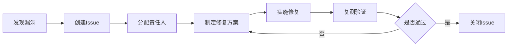

# 安全审计流程文档

> **文档版本**: 1.0
> **最后更新**: 2026-01-26
> **负责团队**: 安全团队 + 运维团队

---

## 目录

1. [审计概述](#审计概述)
2. [审计范围](#审计范围)
3. [审计频率](#审计频率)
4. [审计流程](#审计流程)
5. [审计检查清单](#审计检查清单)
6. [漏洞评级标准](#漏洞评级标准)
7. [审计工具](#审计工具)
8. [报告模板](#报告模板)
9. [整改跟踪](#整改跟踪)

---

## 审计概述

### 目的

安全审计旨在：
- 识别系统中的安全漏洞和风险
- 验证安全控制措施的有效性
- 确保符合安全合规要求
- 持续改进安全态势

### 审计原则

1. **全面性**: 覆盖所有关键系统和组件
2. **定期性**: 按计划定期执行
3. **独立性**: 由独立团队或第三方执行
4. **可追溯**: 所有审计活动有完整记录
5. **闭环管理**: 发现问题必须跟踪整改

---

## 审计范围

### 1. 应用层安全

#### 1.1 认证与授权
- JWT令牌安全性
- 密码策略合规性
- RBAC权限配置
- Session管理
- API密钥管理

#### 1.2 输入验证
- SQL注入防护
- XSS防护
- CSRF防护
- 文件上传安全
- 参数验证

#### 1.3 数据安全
- 敏感数据加密
- 数据传输安全（HTTPS）
- 数据存储安全
- 日志脱敏
- 备份加密

### 2. 基础设施安全

#### 2.1 网络安全
- 防火墙规则
- 网络隔离
- VPN配置
- DDoS防护
- 端口暴露检查

#### 2.2 服务器安全
- 操作系统补丁
- 服务配置安全
- 文件权限
- 用户权限
- SSH密钥管理

#### 2.3 容器安全
- Docker镜像扫描
- 容器运行时安全
- Kubernetes安全配置
- 镜像仓库安全
- 资源限制

### 3. 数据库安全

- 数据库访问控制
- 数据库加密
- 备份安全
- 审计日志
- 敏感数据保护

### 4. 第三方依赖

- NPM包漏洞扫描
- Python包漏洞扫描
- 依赖版本管理
- 许可证合规
- 供应链安全

### 5. 代码安全

- 静态代码分析（SAST）
- 动态应用安全测试（DAST）
- 代码审查记录
- 安全编码规范遵守
- 敏感信息泄露检查

### 6. 运维安全

- 访问日志审计
- 异常行为检测
- 权限变更记录
- 配置变更审计
- 事件响应记录

---

## 审计频率

### 定期审计

| 审计类型 | 频率 | 执行者 | 输出 |
|---------|------|--------|------|
| 全面安全审计 | 每季度 | 安全团队 + 外部审计 | 完整审计报告 |
| 代码安全审计 | 每月 | 安全团队 | 代码审计报告 |
| 依赖漏洞扫描 | 每周 | 自动化工具 | 漏洞清单 |
| 访问日志审计 | 每周 | 运维团队 | 异常访问报告 |
| 配置审计 | 每月 | 运维团队 | 配置合规报告 |

### 触发式审计

以下情况需要立即执行审计：
- 发生安全事件后
- 重大系统变更前后
- 新功能上线前
- 第三方集成前
- 合规要求变更后

---

## 审计流程

### 阶段1: 审计准备（1-2天）

#### 1.1 制定审计计划
```markdown
- 确定审计范围
- 分配审计人员
- 准备审计工具
- 通知相关团队
- 设定审计时间表
```

#### 1.2 收集基线信息
```bash
# 收集系统信息
./scripts/collect-system-info.sh

# 导出配置
./scripts/export-configs.sh

# 收集日志
./scripts/collect-audit-logs.sh
```

### 阶段2: 执行审计（3-5天）

#### 2.1 自动化扫描

**依赖漏洞扫描**
```bash
# Backend (Node.js)
cd backend
npm audit --json > audit-report.json
npm audit fix --dry-run

# AgentScope (Python)
cd agentscope-service
pip-audit --format json > audit-report.json
```

**代码安全扫描**
```bash
# 使用SonarQube
sonar-scanner \
  -Dsonar.projectKey=after-sales \
  -Dsonar.sources=. \
  -Dsonar.host.url=http://sonarqube:9000

# 使用Semgrep
semgrep --config=auto --json > semgrep-report.json
```

**容器镜像扫描**
```bash
# 使用Trivy
trivy image after-sales-backend:latest --format json > trivy-backend.json
trivy image after-sales-agentscope:latest --format json > trivy-agentscope.json
```

#### 2.2 手动审计

**认证授权审计**
```markdown
1. 检查JWT配置
   - 密钥强度
   - 过期时间
   - 刷新机制

2. 检查RBAC配置
   - 角色定义
   - 权限分配
   - 最小权限原则

3. 检查API安全
   - 认证中间件
   - 授权检查
   - 速率限制
```

**数据安全审计**
```markdown
1. 检查敏感数据加密
   - 密码哈希算法（bcrypt）
   - 数据库字段加密
   - 传输加密（TLS）

2. 检查日志脱敏
   - 密码不记录
   - 令牌不记录
   - 个人信息脱敏

3. 检查备份安全
   - 备份加密
   - 备份访问控制
   - 备份存储位置
```

**网络安全审计**
```bash
# 检查开放端口
nmap -sV -p- localhost

# 检查防火墙规则
iptables -L -n -v

# 检查SSL/TLS配置
testssl.sh https://your-domain.com
```

#### 2.3 渗透测试（可选）

```markdown
1. 信息收集
   - 域名信息
   - 子域名枚举
   - 端口扫描

2. 漏洞扫描
   - OWASP Top 10
   - 已知CVE
   - 配置错误

3. 漏洞利用（授权）
   - SQL注入测试
   - XSS测试
   - CSRF测试
   - 权限提升测试
```

### 阶段3: 分析与报告（2-3天）

#### 3.1 漏洞分析
```markdown
1. 漏洞分类
   - 按严重程度
   - 按影响范围
   - 按修复难度

2. 风险评估
   - 利用可能性
   - 影响程度
   - 综合风险评分

3. 修复建议
   - 短期缓解措施
   - 长期解决方案
   - 修复优先级
```

#### 3.2 生成审计报告

使用报告模板（见下文）生成完整报告。

### 阶段4: 整改跟踪（持续）

#### 4.1 创建整改任务
```markdown
- 在项目管理系统中创建Issue
- 分配责任人
- 设定截止日期
- 标记优先级
```

#### 4.2 验证整改
```markdown
- 复测漏洞
- 验证修复效果
- 更新审计记录
- 关闭整改任务
```

---

## 审计检查清单

### 应用安全检查清单

#### 认证与授权
- [ ] JWT密钥强度 >= 256位
- [ ] JWT过期时间 <= 24小时
- [ ] 密码最小长度 >= 8位
- [ ] 密码包含大小写字母、数字、特殊字符
- [ ] 密码使用bcrypt哈希（cost >= 10）
- [ ] 实施账户锁定策略（5次失败）
- [ ] 实施RBAC权限控制
- [ ] API端点都有认证保护
- [ ] 敏感操作需要二次验证

#### 输入验证
- [ ] 所有用户输入都经过验证
- [ ] 使用参数化查询防止SQL注入
- [ ] 输出编码防止XSS
- [ ] 实施CSRF令牌保护
- [ ] 文件上传类型白名单
- [ ] 文件上传大小限制
- [ ] 文件名安全处理

#### 数据安全
- [ ] 敏感数据加密存储
- [ ] 使用HTTPS传输
- [ ] 日志中敏感信息脱敏
- [ ] 数据库连接加密
- [ ] 备份文件加密
- [ ] 定期删除过期数据

#### API安全
- [ ] 实施速率限制
- [ ] API版本控制
- [ ] 错误信息不泄露敏感信息
- [ ] 实施CORS策略
- [ ] API密钥定期轮换

### 基础设施检查清单

#### 服务器安全
- [ ] 操作系统补丁最新
- [ ] 禁用不必要的服务
- [ ] SSH密钥认证
- [ ] 禁用root远程登录
- [ ] 配置防火墙规则
- [ ] 文件权限正确设置
- [ ] 定期安全扫描

#### 容器安全
- [ ] 使用官方基础镜像
- [ ] 镜像定期更新
- [ ] 容器以非root用户运行
- [ ] 资源限制配置
- [ ] 镜像签名验证
- [ ] 私有镜像仓库

#### 数据库安全
- [ ] 数据库访问白名单
- [ ] 使用强密码
- [ ] 启用审计日志
- [ ] 定期备份
- [ ] 备份加密
- [ ] 最小权限原则

### 代码安全检查清单

- [ ] 无硬编码密码/密钥
- [ ] 无敏感信息提交到Git
- [ ] 依赖包无已知高危漏洞
- [ ] 代码通过静态分析
- [ ] 关键功能有安全测试
- [ ] 代码审查包含安全检查

---

## 漏洞评级标准

### 严重程度分级

#### P0 - 严重（Critical）
**定义**: 可直接导致系统完全失陷或大规模数据泄露

**示例**:
- 未授权的远程代码执行
- SQL注入导致数据库完全泄露
- 认证绕过
- 硬编码的管理员密码

**修复时间**: 24小时内

#### P1 - 高危（High）
**定义**: 可导致重要数据泄露或系统部分失陷

**示例**:
- XSS漏洞
- CSRF漏洞
- 敏感信息泄露
- 权限提升漏洞

**修复时间**: 7天内

#### P2 - 中危（Medium）
**定义**: 可能导致有限的信息泄露或服务降级

**示例**:
- 信息泄露（非敏感）
- 拒绝服务（DoS）
- 配置错误
- 弱密码策略

**修复时间**: 30天内

#### P3 - 低危（Low）
**定义**: 对系统安全影响较小

**示例**:
- 信息泄露（公开信息）
- 最佳实践建议
- 代码质量问题

**修复时间**: 下个版本

---

## 审计工具

### 自动化工具

#### 依赖扫描
```bash
# Node.js
npm audit
npm audit fix

# Python
pip-audit
safety check

# 综合工具
snyk test
```

#### 代码扫描
```bash
# 静态分析
sonar-scanner
semgrep --config=auto

# TypeScript/JavaScript
eslint --ext .ts,.js src/
tsc --noEmit

# Python
bandit -r src/
pylint src/
```

#### 容器扫描
```bash
# Trivy
trivy image <image-name>

# Clair
clairctl analyze <image-name>

# Docker Bench
docker run --rm --net host --pid host --userns host --cap-add audit_control \
  -v /var/lib:/var/lib \
  -v /var/run/docker.sock:/var/run/docker.sock \
  docker/docker-bench-security
```

#### 网络扫描
```bash
# Nmap
nmap -sV -p- <target>

# SSL/TLS测试
testssl.sh <target>

# OWASP ZAP
zap-cli quick-scan <target>
```

### 手动工具

- **Burp Suite**: Web应用渗透测试
- **Postman**: API安全测试
- **Wireshark**: 网络流量分析
- **Metasploit**: 漏洞利用框架

---

## 报告模板

### 审计报告结构

```markdown
# 安全审计报告

## 1. 执行摘要
- 审计时间: YYYY-MM-DD
- 审计范围: [列出审计范围]
- 审计人员: [列出审计人员]
- 总体评分: [A/B/C/D]

## 2. 审计发现汇总
| 严重程度 | 数量 | 已修复 | 待修复 |
|---------|------|--------|--------|
| P0 严重 | 0    | 0      | 0      |
| P1 高危 | 2    | 1      | 1      |
| P2 中危 | 5    | 3      | 2      |
| P3 低危 | 8    | 5      | 3      |

## 3. 详细发现

### 3.1 [漏洞标题]
- **严重程度**: P1
- **影响范围**: [描述影响]
- **漏洞描述**: [详细描述]
- **复现步骤**: [步骤]
- **修复建议**: [建议]
- **责任人**: [姓名]
- **截止日期**: YYYY-MM-DD

## 4. 合规性检查
- [ ] OWASP Top 10
- [ ] 数据保护法规
- [ ] 行业标准

## 5. 改进建议
[列出长期改进建议]

## 6. 附录
- 扫描报告
- 测试证据
- 配置文件
```

---

## 整改跟踪

### 整改流程



### 整改跟踪表

| Issue ID | 漏洞描述 | 严重程度 | 责任人 | 截止日期 | 状态 | 验证结果 |
|----------|---------|---------|--------|---------|------|---------|
| SEC-001  | SQL注入  | P0      | 张三   | 2026-01-27 | 已修复 | 通过 |
| SEC-002  | XSS漏洞  | P1      | 李四   | 2026-02-03 | 进行中 | - |

### 整改验证

```bash
# 1. 复测漏洞
./scripts/verify-fix.sh SEC-001

# 2. 运行安全测试
npm run test:security

# 3. 重新扫描
npm audit
trivy image <image-name>

# 4. 更新审计记录
./scripts/update-audit-log.sh SEC-001 VERIFIED
```

---

## 审计记录归档

### 归档要求

- 所有审计报告保存至少3年
- 审计证据（截图、日志）保存至少1年
- 整改记录永久保存
- 定期审查历史审计发现

### 归档位置

```
docs/security/audits/
├── 2026/
│   ├── Q1/
│   │   ├── audit-report-2026-01.md
│   │   ├── scan-results/
│   │   └── remediation-tracking.xlsx
│   └── Q2/
└── 2025/
```

---

## 持续改进

### 审计流程优化

- 每季度回顾审计流程
- 更新审计检查清单
- 引入新的审计工具
- 培训审计人员

### 安全文化建设

- 定期安全培训
- 安全意识宣传
- 安全编码规范
- 安全最佳实践分享

---

## 联系方式

**安全团队**
- 邮箱: security@company.com
- 应急热线: 400-XXX-XXXX
- Slack: #security-team

**审计负责人**
- 姓名: [负责人姓名]
- 邮箱: [邮箱]
- 电话: [电话]
