# After-Sales 技术架构与事件格式（统一版）

**文档版本**：v2.0  
**最后更新**：2026-02-02  
**适用范围**：后端/AgentScope/前端整体架构 + IM 事件链路（统一文档，避免分散管理）

---

## 0. 文档合并说明

- 本文件已合并并覆盖：`docs/TECH_ARCHITECTURE.md` + 原 `tests/backend/事件格式.md` 的事件链路内容。
- 后续以本文件为**唯一权威入口**，其他文档仅保留引用与目录索引。

---

## 1. 技术架构摘要（当前实现）

### 1.1 技术栈

- **前端**：Vanilla JS（ES Modules）+ Vite + Chart.js + Vitest/Playwright  
- **后端**：Fastify + TypeScript + TypeORM + PostgreSQL + Redis  
- **AgentScope**：FastAPI + AgentScope + DeepSeek v3.1  
- **运维**：Docker Compose + Nginx + Prometheus + Grafana

### 1.2 逻辑架构图（ASCII）

```
┌──────────────────────────────────────────────────────────────┐
│                         Frontend Workbench                   │
│  - 对话中心 / 任务中心 / 知识库 / 客户画像 / 质检面板          │
│  - HTTP（SSE: ReviewRequest 订阅可用）                        │
└──────────────────────────────┬───────────────────────────────┘
                               │
                               │ HTTP / SSE（可选）
                               ▼
┌──────────────────────────────────────────────────────────────┐
│                         Backend (Fastify)                     │
│  - Application / Domain / Infrastructure / Presentation       │
│  - EventBus + Outbox + WebSocket（未接入）                     │
└──────────────────────────────┬───────────────────────────────┘
                               │ HTTP
                               ▼
┌──────────────────────────────────────────────────────────────┐
│                     AgentScope Service (FastAPI)              │
│  OrchestratorAgent + Assistant/Engineer/Inspector Agents       │
│  /api/chat  /api/agents  /api/events/bridge                   │
└──────────────────────────────┬───────────────────────────────┘
                               │
                               ▼
┌──────────────────────────────────────────────────────────────┐
│                         LLM Provider                          │
│  DeepSeek v3.1                                                  │
└──────────────────────────────────────────────────────────────┘
```

### 1.3 部署拓扑（Docker/Compose 视角）

```
[Browser]
    │
    ▼
[Frontend (Vite build/Static)] ---HTTP---> [Backend: :8080]
                                      │
                                      ├──HTTP--> [AgentScope: :5000]
                                      │
                                      ├──TCP--> [PostgreSQL: :5432]
                                      │
                                      └──TCP--> [Redis: :6379]

可选：
  [Prometheus: :9090]  <---scrape---  [Backend Metrics]
  [Grafana: :3001]     <---read-----  [Prometheus]
  [Nginx] 作为统一入口反向代理
```

### 1.4 端口与健康检查

- Backend：`http://localhost:8080`，健康检查 `GET /health`  
- AgentScope：`http://localhost:5000`，健康检查 `GET /health`  
- 前端本地：`http://localhost:5173`（Docker 映射 `http://localhost:3002`）
- MCP：`POST /mcp`（tools/list, tools/call），工具列表 `GET /mcp` 或 `GET /mcp/tools`

---

## 2. PRODUCT_ANALYSIS_REPORT 审计（真实性与更新情况）

**结论**：`docs/_archived/prd/PRODUCT_ANALYSIS_REPORT.md` 为 2026-01-14 的归档分析报告，包含大量“规划/建议”内容，**不等同当前实现**。需要明确区分“历史分析/规划”与“当前实现”。

### 2.1 明确需校正项（与当前实现不一致）

- **版本号**：报告写 `v0.9 Alpha`，当前仓库标注 `v0.1.0`（开发阶段）。  
- **端口描述**：报告写运行环境 3000（Docker 映射），当前 Docker 映射为 **3002**；本地开发端口仍为 5173。  

### 2.2 可疑或不可验证项（需标注“历史评估/非当前”）

- “整体完成度 73% / 前端 90%+ / 后端 54~60%” 为历史估算，**无法通过代码直接验证**。  
- 多处“规划”内容（React/React Query/Zustand 重构、NestJS 迁移、Redis Streams/RabbitMQ 等）属于路线建议，非实现现状。  

### 2.3 报告内与当前实现一致的点（无需更正）

- 报告已标注“前端当前为 Vanilla JS + Vite，React 为规划建议”。  
- 报告已标注“后端当前为 Fastify，NestJS 为规划建议”。  
- 报告示例配置中已出现 `deepseek-v3.1`，与当前配置一致。  

### 2.4 已更新/已补齐的问题（代码已落实）

- **MCP 工具已实现并有 E2E 覆盖**：`tests/backend/e2e/mcp.e2e.spec.ts`  
- **MCP 允许工具注册日志**：`backend/src/infrastructure/agentscope/MCPServer.ts`  
- **AgentScope 网关健康检查/配置暴露**：`/agentscope/health`、`/agentscope/status`、`/agentscope/config`  
- **降级策略与告警**：`ConversationTaskCoordinator` 与 `OutboxProcessor` 均有日志与告警入口

**建议**：将该报告视为历史分析材料，仅用于“路线图/建议”参考，避免作为“当前实现依据”。

---

## 3. IM 消息进入系统后的联动流程梳理
> 接口前缀说明：  
> - **业务通用接口**（Conversation/Task/Requirement/Knowledge/AI 等）完整前缀为 `/api/v1/api`（路由内自带 `/api`）。  
> - **IM/质量/客户画像接口**（imRoutes.ts 内注册）完整前缀为 `/api/v1`。  
> - **健康检查/监控/MCP/AgentScope 网关**不加 `/api/v1` 前缀（如 `/health`、`/metrics`、`/mcp`、`/agentscope/*`）。  
> 文内若未写前缀，默认省略这些前缀说明。

---

## 4. 事件格式规范（代码对齐版）

本节以当前代码为准，给出**统一事件结构**、**库表字段映射**与**事件桥接格式**，用于测试、排错与跨服务联动。

### 4.1 统一领域事件结构（内存事件）

**领域事件基类**：`backend/src/domain/shared/DomainEvent.ts`

字段定义：
- `eventId`：uuid
- `eventType`：事件类型（字符串）
- `aggregateId`：聚合根 ID
- `occurredAt`：发生时间（Date）
- `version`：事件版本（默认 1）
- `payload`：事件载荷（object）

**内存事件示例（伪结构）**：

```json
{
  "eventId": "uuid",
  "eventType": "ConversationClosed",
  "aggregateId": "conv-123",
  "occurredAt": "2026-02-02T10:00:00.000Z",
  "version": 1,
  "payload": {
    "summary": "resolved"
  }
}
```

### 4.2 domain_events 表字段映射（事件溯源）

**表实体**：`backend/src/infrastructure/database/entities/DomainEventEntity.ts`

| 字段 | 说明 | 映射来源 |
|------|------|----------|
| id | 事件ID | eventId |
| aggregate_id | 聚合根ID | aggregateId |
| aggregate_type | 聚合类型 | 由保存逻辑传入 |
| event_type | 事件类型 | eventType |
| event_data | 事件载荷 | payload |
| occurred_at | 发生时间 | occurredAt |
| version | 事件版本 | version |

### 4.3 outbox_events 表字段映射（Outbox）

**表实体**：`backend/src/infrastructure/database/entities/OutboxEventEntity.ts`

| 字段 | 说明 | 映射来源 |
|------|------|----------|
| id | 事件ID | eventId |
| aggregate_id | 聚合根ID | aggregateId |
| aggregate_type | 聚合类型 | 由保存逻辑传入 |
| event_type | 事件类型 | eventType |
| event_data | 事件载荷 | payload |
| version | 事件版本 | version |
| status | pending/published/failed/dead_letter | Outbox 处理状态 |
| retry_count / max_retries | 重试信息 | OutboxProcessor |
| error_message | 错误信息 | OutboxProcessor |
| next_retry_at / published_at | 重试/发布 | OutboxProcessor |
| created_at / updated_at | 记录时间 | 数据库自动 |
| occurred_at | 业务发生时间 | occurredAt |

### 4.4 AgentScope 事件桥接格式（Node → Agent）

**发送路径**：Backend `EventBridge` → AgentScope

**配置**：
- `AGENTSCOPE_NODE_TO_AGENT_PATH`（默认 `/api/events/bridge`）
- 代码位置：`backend/src/config/agentscope.config.ts`、`backend/src/infrastructure/agentscope/EventBridge.ts`

**请求结构（与 AgentScope 接收一致）**：

```json
{
  "eventId": "evt-123",
  "eventType": "ConversationClosed",
  "aggregateId": "conv-123",
  "payload": { "summary": "resolved" },
  "occurredAt": "2026-02-02T10:00:00.000Z",
  "version": 1
}
```

### 4.5 AgentScope 事件回流格式（Agent → Node）

**接收路径**：Backend `EventBridge` 反向入口  
**默认路径**：`/agentscope/events`

**必要字段**（缺少会返回 400）：`eventType`、`aggregateId`

```json
{
  "eventType": "AgentReviewRequested",
  "aggregateId": "review-123",
  "payload": { "reason": "low_confidence" },
  "occurredAt": "2026-02-02T10:00:00.000Z",
  "version": 1
}
```

### 4.6 MCP 工具调用事件格式（HTTP JSON）

**调用入口**：`POST /mcp`

```json
{
  "method": "tools/call",
  "params": {
    "name": "searchKnowledge",
    "arguments": {
      "query": "退款多久到账",
      "mode": "semantic"
    }
  }
}
```

**工具列表**：

```json
{
  "method": "tools/list"
}
```

## ⚠️ IM渠道的本质特性（核心设计理念）

**IM对话永久存在，不支持关闭操作**

这不是设计选择，而是IM的本质特性：
- **IM对话永久存在**：就像微信、企业微信、钉钉等IM工具，对话永远存在，不会"关闭"
- **业务流程驱动方式**：通过问题生命周期管理来驱动业务流程（问题提出 → 处理 → 解决）
- **质检触发机制**：质检由 `ProblemResolvedEvent`（问题解决）触发，而非 `ConversationClosedEvent`（会话关闭）
- **多问题并行管理**：一个IM对话内可以并行处理多个问题，每个问题独立状态流转

**与传统工单系统的区别**：
- 传统工单：创建 → 处理 → 关闭（工单有明确的关闭状态）
- IM对话：永久存在 → 问题提出 → 问题解决 → 质检（对话本身不关闭）

---

## ✅ 问题 resolved 触发条件（代码对齐）

**核心入口**：`ConversationTaskCoordinator.updateProblemLifecycle()`  
**判定方法**：`AiService.detectProblemResolution()`（LLM + 关键词兜底）

**触发逻辑（简化）**：
- 当存在 `activeProblem` 且 `resolution.resolved === true` → 更新为 `resolved`
- 当不存在 `activeProblem` 且存在 `latestResolved` 且 `resolution.reopened === true` → 更新为 `reopened`
- 若无法判断（resolved/reopened 均为 false）→ 状态不变

**LLM 判断规则（摘要）**：
- `resolved=true`：已解决/感谢/确认问题消失  
- `reopened=true`：仍未解决/再次复发/仍有问题  
- 无法判断 → 均为 false

**关键词兜底**：
- resolved：`问题.*解决|解决.*问题|已.*解决|感谢.*解决|已恢复|已修复`
- reopened：`没解决|未解决|还是.*问题|仍然.*(报错|错误|异常)|依旧.*(失败|无法)`

**影响链路**：
- `resolved` → 触发 `ProblemResolvedEvent` → `ProblemResolvedEventHandler` → 调用 `/api/agents/inspect` 生成质检报告

**注意**：只有在“问题状态”被判定为 resolved 时才会触发质检，因此“实时质检”并非每条消息都会发生。

---

## ✅ 质检触发与落库可观测点（代码对齐）

**触发入口（IM）**：
- `ProblemResolvedEventHandler` 触发 `/api/agents/inspect`
  - 日志：`[ProblemResolvedEventHandler] Triggering quality inspection...`
  - 失败日志：`[ProblemResolvedEventHandler] Failed to trigger quality inspection...`

**触发入口（非IM）**：
- `ConversationTaskCoordinator.handleConversationClosed`
  - 日志：`[ConversationTaskCoordinator] Triggering quality inspection for non-IM conversation...`
  - 失败日志：`[ConversationTaskCoordinator] Failed to trigger quality inspection...`

**落库位置**：
- `QualityReportRepository.save(...)`（保存到 `quality_reports`）
  - 上游确认：`result.quality_score` 与 `report` 会在 handler 中写入

**数据读取入口**：
- `GET /api/v1/quality/:conversationId`（若无报告则回退 AI 分析）
- `GET /api/v1/quality/:conversationId/reports`
- `GET /api/v1/quality/reports`

**建议排查顺序**：
1. `ProblemResolvedEvent` 是否产生（域事件/Outbox）
2. Handler 是否触发 `/api/agents/inspect`（日志）
3. AgentScope 是否返回 `success`（API 响应）
4. `quality_reports` 是否落库
5. 前端是否拉取到质检报告

---

## ✅ 实时推送方案（当前路径与限制）

**当前可用：SSE（ReviewRequest）**
- `GET /api/v1/im/reviews/stream`：SSE 订阅复核事件
- `GET /api/v1/im/reviews/pending`：查询待复核列表
- `POST /api/v1/im/reviews/submit`：人工复核回写

**当前不可用：WebSocket**
- `WebSocketService` 存在但未注册到 app（无 WS 推送）
- 结论：实时推送仅覆盖“复核事件”，**质检结果不通过 WS 推送**，需前端主动拉取

**影响范围**
- “实时质检展示”依赖前端轮询或刷新
- “复核通知”可通过 SSE 达到准实时

---

## ✅ 前端质检面板刷新机制（代码对齐）

**数据来源**：`GET /api/v1/quality/:conversationId`（`assets/js/api.js` → `fetchQualityProfile`）

**触发时机**：
- 任务侧质检面板：进入面板或切换会话时触发加载（`assets/js/tasks/index.js`）
- 对话侧故障报告：打开面板时并行拉取质量数据与 AI 分析（`assets/js/chat/index.js`）

**刷新方式**：
- 无 WebSocket 推送；页面内只在“打开/切换/手动操作”时请求
- 若无质检报告，后端会回退到 AI 分析（`ImController.getConversationQuality`）

**前端依赖**：
- 依赖 `API_BASE`（`public/runtime-config.js` → `apiBaseUrl`）
- API 未启用时，面板会提示“API 未启用，无法加载质检数据”

---

## ⚠️ 实现状态说明（2026-01-26 审计结果）

本文档描述的是**当前实际实现状态**，而非理想规划。各功能实现状态如下：

### ✅ 已完整实现（100%）
- IM 入站核心链路（`/api/v1/im/incoming-message` → ImController → ConversationTaskCoordinator）
- 事件溯源与 Outbox 机制（`domain_events` + `outbox_events` 双写，事务保证）
- 需求识别与任务创建联动（置信度 > 配置阈值创建需求，高优先级自动创建任务）
- AI 情绪分析（两处：Coordinator 内部 + Controller 组装响应）
- 知识库检索与推荐（支持 LLM 意图提取优化查询）
- 问题生命周期管理（LLM 驱动状态流转：new → in_progress → resolved → reopened）
- 人工复核链路（ReviewRequest 创建 + SSE 订阅 + 人工回写）
- RequirementRepository 和 TaskRepository 事务处理（✅ 已修复：完整的事务处理和事件持久化）
- 降级逻辑监控（✅ 已添加：降级触发时记录详细日志和原因）
- 死信队列告警（✅ 已集成：支持 Webhook 告警，可对接钉钉/Slack）

### ⚠️ 部分实现（60-90%）
- **质检闭环（90%）**：由 `ProblemResolvedEvent` 触发，质检结果写入 `quality_reports` 表。✅ 时序图已更新，正确反映实际触发机制。
- **AgentScope 回复生成（80%）**：优先调用 AgentScope `/api/chat/message`，失败时降级到 LLM 或固定文案（`"已收到您的问题，我们会尽快回复。如需加急，请在消息中说明紧急事项。"`）。**注意**：文档声称"失败时重试"，但代码实际为"失败时降级"，无自动重试逻辑。
- **MCP 工具注册（✅ 已实现）**：工具文件存在（`backend/src/infrastructure/agentscope/tools/*.ts`），MCP Server 入口已接入，并已补齐调用日志与 E2E 用例验证可用性。

### ❌ 未实现（0-30%）
- **无**（所有核心功能已实现）

### 🔧 可选能力 / 未接入主链路
- **Workflow/ReAct Loop（可选能力，未接入 IM 主链路）**：Workflow 引擎与执行器已实现，`workflows/*.yaml` 也已存在；当前 IM 主链路未调用 `WorkflowEngine.execute(...)`。配置默认 `false`（Docker Compose 示例可开启），但未接入主链路因此不影响主流程。
  - **启用方法**：设置 `WORKFLOW_ENGINE_ENABLED=true`，并在业务链路中显式触发对应 workflow。
- **IM 回执/送达状态**：当前代码未提供 `/api/v1/im/messages/receipt` 路由实现；如需支持送达/已读/超时等场景，需要补齐接口与业务逻辑。

### 🚫 不适用于IM渠道的功能
- **会话关闭（CloseConversation）**：IM对话永久存在，不支持关闭操作。这是IM的本质特性，而非设计选择。
  - `CloseConversationUseCase` 保留用于非IM渠道（如工单系统）
  - MCP工具 `closeConversation` 已从 MCP 注册清单移除（避免误用关闭逻辑）
  - Workflow动作 `close_conversation` 对IM渠道自动跳过
  - 禁止通过 `/api/v1/im/conversations/:id/status` 或 `/api/v1/api/conversations/:id/close` 将 IM Conversation 置为 `closed`（UI 窗口关闭不影响业务状态）

### 🔧 降级策略说明

**回复生成降级链路**（优先级从高到低）：
1. **AgentScope 路径**：`AgentScopeChatClient.sendMessage()` → 失败时进入步骤 2
2. **LLM 路径**：`LLMClient.generateReply()` → 失败时进入步骤 3
3. **降级文案**：返回固定文案 `"已收到您的问题，我们会尽快回复。如需加急，请在消息中说明紧急事项。"`

**降级触发条件**：
- AgentScope 服务不可用或超时（`config.agentscope.timeout`）
- LLM 服务不可用或 API 调用失败

**降级影响**：
- 降级到 LLM 或固定文案时，回复置信度降低（0.4-0.6），自动触发人工复核
- 降级过程不阻塞主流程，用户仍能收到响应

---

基于当前代码实现（`ImController` → `ConversationTaskCoordinator` 等），IM 消息进入系统后触发的主要联动包含：
- 会话创建/复用与消息落库（Conversation + Message）。
- 领域事件记录（`domain_events`）与 Outbox 事件持久化（`outbox_events`）。
- 需求识别 → 需求创建 → 高优先级任务创建。
- AI 情绪分析（两处：Coordinator 内部生成回复时一次；Controller 组装响应时一次）。
- 知识库检索与推荐（Controller 侧 + Coordinator 生成回复时）。
- 任务关联查询（Controller 侧）。
- 自动回复建议生成与人工复核触发（创建 ReviewRequest，推送渠道依赖外部 AgentScope/前端实现；本仓库未见 WebSocket 推送实现）。
- 问题解决事件触发异步质检（当问题判定已解决时）。

---

## IM 接口清单（以路由实现为准）

> 说明：以下接口均在 `imRoutes.ts` 中注册，完整前缀为 `/api/v1`。

### 1) IM 会话与消息

- `GET /api/v1/im/conversations`：查询会话列表
- `GET /api/v1/im/conversations/stats`：会话统计
- `GET /api/v1/im/conversations/:id/messages`：拉取会话消息
- `POST /api/v1/im/conversations/:id/messages`：发送消息（人工/系统）
- `GET /api/v1/im/conversations/:id/problems`：会话问题列表
- `PATCH /api/v1/im/conversations/:id/status`：更新会话状态（IM 不允许 closed）
- `PATCH /api/v1/im/conversations/:id/mode`：设置会话模式

### 2) IM 测试/联调

- `POST /api/v1/im/wecom/mock/sync`：同步企微 mock 群聊数据

### 3) AI 与情绪分析

- `GET /api/v1/im/conversations/:id/ai-analysis`：AI 分析结果
- `GET /api/v1/im/conversations/:id/sentiment`：情绪分析结果

### 4) 质检接口（质量前缀）

- `GET /api/v1/quality/:conversationId`：会话质检概览
- `GET /api/v1/quality/:conversationId/reports`：会话质检报告列表
- `GET /api/v1/quality/reports`：质检报告查询

### 5) 客户画像接口

- `GET /api/v1/profiles/:customerId`：客户画像
- `GET /api/v1/profiles/:customerId/interactions`：客户互动记录

---

## 权限要求（与路由权限一致）

> 以下为最小权限需求（`config.permissions`），缺少权限将返回 403。

- IM 读权限：`im.read`
- IM 写权限：`im.write`
- 客户画像权限：`customers.read`
- 质检权限：`tasks.read`
- AI 能力权限：`ai.use`

## 备注：当前对话入口策略（2026-01-26）

为保证客服侧交互稳定，当前约定如下：

1. **客服主动发送的对话**  
   - 入口：`/api/v1/api/conversations/:id/messages`  
   - 行为：仅落库与事件记录，不通过 Agent 生成回复（不走 AgentScope 路由）。

2. **外部 IM 入站消息**  
   - 入口：`/api/v1/im/incoming-message`  
   - 行为：走 Agent 辅助链路（情绪/意图分析、知识推荐、回复建议等），由 `ConversationTaskCoordinator` 驱动。

该策略仅用于阶段性稳定性考虑，后续可按需再调整调用链路与自动化程度。

以下为完整的时序图与服务调用链路图（Mermaid）。

## 时序图（IM 入站处理）

**中文备注**
- 入口：外部 IM 消息通过 `/api/v1/im/incoming-message` 入站。
- 核心编排：`ImController` 调用 `ConversationTaskCoordinator` 完成会话创建/复用、需求识别、任务创建与回复建议生成。
- 数据落库：对话与消息落在 `conversations/messages`，事件溯源写入 `domain_events`，同时写入 `outbox_events` 保障最终一致性。
- AI 联动：情绪分析在 Coordinator 内部（生成回复）与 Controller 组装响应各执行一次。
- 结果返回：包含情绪、需求、知识推荐、工单关联与回复建议。
- AgentScope 调用：回复建议通过 `/api/chat/message` 获取（AgentScope 服务内完成 Orchestrator/Assistant/Engineer 流转）。

```mermaid
sequenceDiagram
  autonumber
  actor IM as 外部IM/客户
  participant API as Fastify API (/api/v1/im/incoming-message)
  participant IMC as ImController
  participant CTC as ConversationTaskCoordinator
  participant AGS as AgentScope Service (Orchestrator/Assistant/Engineer)
  participant CR as ConversationRepository
  participant DB as PostgreSQL
  participant EB as EventBus(内存)
  participant OB as OutboxEventBus
  participant RDS as RequirementDetectorService
  participant CCU as CreateConversationUseCase
  participant SMU as SendMessageUseCase
  participant CRU as CreateRequirementUseCase
  participant RR as RequirementRepository
  participant CTU as CreateTaskUseCase
  participant TR as TaskRepository
  participant AIS as AiService
  participant LLM as LLMClient/外部AI
  participant SKU as SearchKnowledgeUseCase
  participant TKB as TaxKB/本地KnowledgeRepo

  IM->>API: POST /api/v1/im/incoming-message
  API->>IMC: handleIncomingMessage()

  IMC->>CTC: processCustomerMessage()
  CTC->>AGS: /api/chat/message 生成回复建议
  CTC->>CR: findByFilters(customerId,status=open)
  CR->>DB: 查询 Conversation + Messages
  alt 无活跃会话
    CTC->>CCU: execute(CreateConversation)
    CCU->>CR: save(conversation)
    CR->>DB: 保存 Conversation + Message
    CR->>DB: 写入 domain_events
    CR->>OB: 写入 outbox_events
    CCU->>EB: publishAll(ConversationCreated, MessageSent)
  else 有活跃会话
    CTC->>SMU: execute(SendMessage)
    SMU->>CR: findById + save
    CR->>DB: 保存 Message
    CR->>DB: 写入 domain_events
    CR->>OB: 写入 outbox_events
    SMU->>EB: publish(MessageSent)
  end

  CTC->>RDS: detect(content)
  alt 需求置信度 > 0.7
    CTC->>CRU: execute(CreateRequirement)
    CRU->>RR: save(requirement)
    RR->>DB: 保存 Requirement + domain_events
    CRU->>EB: publish(RequirementCreated...)
    alt high/urgent
      CTC->>CTU: execute(CreateTask)
      CTU->>TR: save(task)
      TR->>DB: 保存 Task
    else medium/low
      CTC-->>IMC: recommendedTasks (待人工确认)
    end
  end

  CTC->>AIS: analyzeSentiment(userMessage, history)
  AIS->>LLM: analyzeSentiment()
  CTC->>AIS: generateReply(...) (AgentScope 或 LLM/不可用时提示客服侧处理)

  CTC-->>IMC: ProcessingResult(agentSuggestion)

  IMC->>CR: findById(conversationId)
  CR->>DB: 拉取最近消息用于情绪分析
  IMC->>AIS: analyzeSentiment(content, last5Messages)
  AIS->>LLM: analyzeSentiment()

  IMC->>SKU: execute(query)
  SKU->>TKB: 关键词/语义/QA检索

  IMC->>TR: findByFilters(conversationId)
  TR->>DB: 拉取关联 Task

  IMC-->>API: 组装 response (sentiment/requirements/knowledge/tasks/suggestion)
  API-->>IM: 200 OK + 分析结果
```

## 服务调用链路图（含事件与异步链路）

**中文备注**
- 展示 IM 入站后的核心服务编排与事件链路（同步 + 异步）。
- 主链路：IM → API → Controller → Coordinator → UseCase → Repository → DB。
- 事件链路：领域事件进入 `domain_events`，同时进入 `outbox_events`，由 `OutboxProcessor` 异步投递（仅 `config.outbox.enabled` 为 true 时）。
- 异步链路用于触发质检/告警等非阻塞流程；与会话是否关闭无关，可由“问题解决事件”驱动。

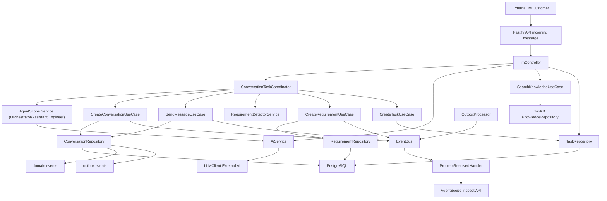

## 关键联动点说明（与代码对应）

1. **消息入站与对话复用/创建**
   - `ImController.handleIncomingMessage` → `ConversationTaskCoordinator.processCustomerMessage`。
   - `CreateConversationUseCase` / `SendMessageUseCase` 会调用 `ConversationRepository.save`，同步写入：
     - `conversations` + `messages`（对话与消息）  
     - `domain_events`（事件溯源）
     - `outbox_events`（Outbox 最终一致性）

2. **需求识别与任务联动**
   - `RequirementDetectorService.detect` → `CreateRequirementUseCase.execute` → `RequirementRepository.save`
   - 高优先级需求触发 `CreateTaskUseCase.execute` → `TaskRepository.save`

3. **AI 联动（情绪 + 回复建议）**
   - `ConversationTaskCoordinator.generateAgentReply` 内部调用 `AiService.analyzeSentiment`，回复生成采用多级降级策略：AgentScope → LLM → 降级文案。**注意**：失败时为"降级"而非"重试"，无自动重试逻辑；Workflow 未接入该链路。
   - `ImController` 在返回前再次调用 `AiService.analyzeSentiment` 生成响应里的情绪字段。
- **降级文案**：`"已收到您的问题，我们会尽快回复。如需加急，请在消息中说明紧急事项。"`（默认置信度 0.6；异常兜底时可能为 0.4，自动触发人工复核）

4. **知识库与任务关联**
   - `SearchKnowledgeUseCase` 组合 TaxKB + 本地知识库检索（Controller 侧用于推荐）。
   - Coordinator 生成回复建议时也会查询知识库（用于回复构造）。
   - `TaskRepository.findByFilters` 关联当前对话的任务列表。

5. **事件与异步链路**
   - “问题解决事件”由 Problem 状态更新触发（`ProblemResolved` 领域事件）。
   - OutboxProcessor 仅在 `config.outbox.enabled` 开启时启动，负责轮询并投递事件到内存 EventBus。
   - 处理器通过 `AgentScope /api/agents/inspect` 触发质检（异步，不阻塞主流程）。

---

## AgentScope 支持能力补充（全量更新，基于现有代码）

**⚠️ 实现状态说明**
- 下述能力以"当前代码是否可用/是否默认启用/是否缺口"为基准汇总，覆盖 AgentScope（外部服务）与本仓库 MCP 接入情况。
- 启动方式统一为 Docker Compose，默认启用 MCP 自动注册（见下方"默认启用状态"）。
- **⚠️ Workflow 未接入主链路**：Workflow 规划能力代码完整，`workflows/*.yaml` 已存在，但当前 IM 主链路未调用 Workflow；配置默认 `false`（Docker Compose 示例可开启）。
- 默认链路：`ConversationTaskCoordinator -> AgentScope(/api/chat/message) -> LLM/降级`。
- MCP Server 在后端启动时默认注册（`AgentScopeGateway.initialize()`），无开关；是否调用取决于 AgentScope 侧编排。
- **✅ MCP 工具可用性已补齐**：已增加工具调用日志与E2E冒烟测试，用于验证核心工具可用性与稳定性。

**能力对照表（中文）**

| Agent | 已实现能力（默认可用） | 规划能力（代码存在/可用，需在Workflow/Agent侧编排启用） |
|---|---|---|
| Orchestrator Agent | 规则/启发式路由决策；执行模式选择；人工介入触发；可调用 MCP 工具（`analyzeConversation` / `getCustomerProfile` / `searchKnowledge`） | 规划能力主要在 AgentScope 侧（如意图/路由/升级人工），后端仅提供可被调用的 MCP 工具 |
| AssistantAgent | 情绪/意图分析、知识推荐、回复建议（AgentScope 侧完成；本仓库接收结果） | 推理型能力由 AgentScope 模型侧完成，不单独暴露 MCP 工具 |
| EngineerAgent | 知识检索、工单创建（`searchKnowledge` / `createTask` / `searchTickets` / `getSystemStatus`） | 复杂诊断/方案生成由 AgentScope 模型侧完成，不单独暴露 MCP 工具 |
| InspectorAgent | 质检评分、改进建议输出（AgentScope 侧生成），并通过 `saveQualityReport` / `createSurvey` 落库 | 质检报告生成由 `inspectConversation` / `generateQualityReport` 支撑 |

**AgentScope MCP 工具清单（本仓库提供给 AgentScope，基于当前 Agent 实际调用做了精简）**
- Conversation：`getConversationHistory`
- Customer：`getCustomerProfile` / `getCustomerHistory`
- Knowledge：`searchKnowledge`
- Task：`createTask` / `searchTickets`
- AI：`analyzeConversation` / `saveQualityReport` / `createSurvey` / `getSystemStatus` / `inspectConversation` / `generateQualityReport`
- MCP 接口：`/mcp`（tools/list, tools/call），`/mcp/tools`（工具列表）
- 工具实现文件：
  - Conversation：`backend/src/infrastructure/agentscope/tools/ConversationTools.ts`
  - Customer：`backend/src/infrastructure/agentscope/tools/CustomerTools.ts`
  - Knowledge：`backend/src/infrastructure/agentscope/tools/KnowledgeTools.ts`
  - Requirement：`backend/src/infrastructure/agentscope/tools/RequirementTools.ts`（当前未在 MCP allowlist 中开放）
  - Task：`backend/src/infrastructure/agentscope/tools/TaskTools.ts`
  - AI：`backend/src/infrastructure/agentscope/tools/AITools.ts`
- 注册入口：`backend/src/infrastructure/agentscope/MCPServer.ts`、`backend/src/infrastructure/agentscope/AgentScopeGateway.ts`
- 参考：ReAct/Workflow 入口（用于规划能力的代码落点）
  - AgentScope ReAct Agents：`agentscope-service/src/agents/assistant_agent.py`、`agentscope-service/src/agents/engineer_agent.py`、`agentscope-service/src/agents/inspector_agent.py`
  - Orchestrator 路由与模式：`agentscope-service/src/router/orchestrator_agent.py`
  - Workflow 入口（可接入点）：`backend/src/application/services/ConversationTaskCoordinator.ts`
  - Workflow 执行器（保留但未使用）：`backend/src/infrastructure/workflow/executors/ActionStepExecutor.ts`
- Workflow 定义：`workflows/*.yaml` 已存在；是否启用由 `WORKFLOW_ENGINE_ENABLED` 控制（主链路未调用，启用也不影响 IM 主流程）

**默认启用状态（关键配置与影响）**
- Workflow 规划能力默认关闭（配置默认 `false`；Docker Compose 示例中可开启）：Workflow 仅保留为可选能力，避免影响主链路稳定性。如需启用，需显式打开配置并接通主链路。
- Workflow 动作能力（保留但未使用）：内置动作已覆盖意图识别、上下文获取、升级人工、故障诊断、质检等（详见 `ActionStepExecutor`），可按需扩展自定义动作。
- MCP Server 在后端启动时默认注册（无显式开关）；是否被 AgentScope 调用取决于 AgentScope 侧编排与提示词/策略。

**模型/LLM 统一配置（DeepSeek）**
- 所有依赖大模型的调用统一使用 DeepSeek，配置由环境变量注入：
  - 后端：`AI_SERVICE_PROVIDER=deepseek`、`AI_SERVICE_URL`、`AI_SERVICE_API_KEY`、`AI_MODEL=deepseek-v3.1`
  - AgentScope：读取 `AI_SERVICE_URL` / `AI_SERVICE_API_KEY`，并使用 `deepseek-v3.1`
- Docker Compose 已为后端与 AgentScope 注入上述变量，默认即走 DeepSeek。

**MCP 工具说明（定义与调用场景）**

| 工具 | 定义 | 调用场景 |
|---|---|---|
| getConversationHistory | 获取对话历史消息 | 质检/Agent 需要完整对话上下文 |
| getCustomerProfile | 获取客户画像 | 路由/风险评估/个性化回复 |
| getCustomerHistory | 获取客户历史对话列表 | 风险评估/背景补全 |
| searchKnowledge | 知识库检索 | 回复建议/故障排查 |
| createTask | 创建任务/工单 | 高优先级需求或故障需建单 |
| searchTickets | 检索历史工单 | EngineerAgent 故障诊断参考 |
| analyzeConversation | 情绪/质量分析 | 情绪、质检或风险评估 |
| inspectConversation | 会话质检 | InspectorAgent 质检评估 |
| generateQualityReport | 生成质检报告 | 质检报告生成（不落库） |
| saveQualityReport | 保存质检报告 | InspectorAgent 质检输出落库 |
| createSurvey | 创建回访问卷 | 质检建议回访时触发 |
| getSystemStatus | 获取系统状态与服务可用性 | 诊断/自检/告警 |

**MCP 调用示例（tools/list / tools/call）**

```json
POST /mcp
{
  "method": "tools/list"
}
```

```json
POST /mcp
{
  "method": "tools/call",
  "params": {
    "name": "searchKnowledge",
    "arguments": {
      "query": "退款多久到账",
      "mode": "semantic"
    }
  }
}
```

**关键工具参数摘要（仅列必填/关键项）**

| 工具 | 必填参数 | 关键说明 |
|---|---|---|
| getConversationHistory | conversationId | includeMetadata/limit 可选 |
| getCustomerProfile | customerId | 读取画像 |
| getCustomerHistory | customerId | limit/page 可选 |
| searchKnowledge | query | mode/filters 可选 |
| createTask | title | conversationId/requirementId 可选 |
| searchTickets | query | limit/offset 可选 |
| analyzeConversation | conversationId | includeHistory 可选 |
| inspectConversation | conversationId | 质检分析（含历史） |
| generateQualityReport | conversationId | 不落库 |
| saveQualityReport | conversationId, report | qualityScore/problemId 可选 |
| createSurvey | customerId, questions | conversationId/metadata 可选 |
| getSystemStatus |  | includeStats 可选 |

---

**MCP 可用性检查清单（建议冒烟项）**
- `GET /mcp/tools` 返回工具列表
- `tools/call: getSystemStatus` 返回 status 与 components
- `tools/call: searchKnowledge` 返回数组
- `tools/call: getConversationHistory` 返回历史消息列表

---

**MCP 错误与异常（接口级）**

| 场景 | HTTP | 说明 |
|---|---|---|
| 缺少 method | 200 | 返回工具列表（兼容探测请求） |
| method 非法 | 400 | `unsupported method` |
| tools/call 缺少 name | 400 | `tool name is required` |
| 工具不存在 | 404 | `tool {name} not found` |
| 工具执行异常 | 500 | `tool execution failed` 或错误消息 |

---

**AgentScope 网关自检接口**

- `GET /agentscope/status`：返回服务状态与当前 `serviceUrl`
- `GET /agentscope/config`：返回当前 AgentScope 配置
- `GET /agentscope/health`：返回健康状态与熔断器统计

**工具缺口清单**
- MCP 工具清单以本文件为准；是否实际被调用取决于 AgentScope 侧编排与运行策略

**工具落地位置（已实现）**
- Conversation 历史：`backend/src/infrastructure/agentscope/tools/ConversationTools.ts`
- Customer 历史：`backend/src/infrastructure/agentscope/tools/CustomerTools.ts`
- 质检报告/回访：`backend/src/infrastructure/agentscope/tools/AITools.ts`
- 工单检索/系统状态：`backend/src/infrastructure/agentscope/tools/TaskTools.ts`、`backend/src/infrastructure/agentscope/tools/AITools.ts`
- 注册入口：`backend/src/infrastructure/agentscope/MCPServer.ts`

1. **Orchestrator Agent（路由编排）**
   - 当前实现位置：`agentscope-service/src/router/orchestrator_agent.py`
   - 作用：基于规则/启发式进行执行模式与路由决策（`simple/parallel/agent_supervised/human_first`）。
   - 已接入工具：`analyzeConversation` / `getCustomerProfile` / `searchKnowledge`（Agent 内手工调用 MCP）。
   - 与本链路关系：位于 AgentScope 外部服务中，本仓库通过 `/api/chat/message` 调用触发。
   - 规划能力备注（中文说明）：`classifyIntent/getConversationContext/escalateToHuman` 在 Workflow 执行器中有动作定义，但 Workflow 未接入主链路，且相关 MCP 工具未注册。

2. **AssistantAgent（对话辅助）**
   - 当前实现位置：`agentscope-service/src/agents/assistant_agent.py`
   - 已接入工具：`analyzeConversation` / `getCustomerProfile` / `searchKnowledge`（手工调用 MCP）。
   - 与本链路关系：位于 AgentScope 外部服务中，本仓库仅接收回复建议结果。
   - 规划能力备注（中文说明）：`extractRequirement/assessRisk/recommendNextAction` 不再注册为 MCP 工具，由 AgentScope 模型侧推理完成。

3. **EngineerAgent（故障诊断）**
   - 当前实现位置：`agentscope-service/src/agents/engineer_agent.py`
   - 已接入工具：`searchKnowledge` / `createTask` / `searchTickets`（手工调用 MCP）。
   - 与本链路关系：位于 AgentScope 外部服务中，本仓库未直接实现诊断流程。
   - 规划能力备注（中文说明）：`classifyIssue/analyzeLogs/recommendSolution/estimateResolutionTime/createTechnicalTicket` 不再注册为 MCP 工具，由 AgentScope 模型侧推理完成；`getSystemStatus` 保留供健康预检使用。

4. **InspectorAgent（质检评分）**
   - 当前实现位置：`agentscope-service/src/agents/inspector_agent.py`
   - 已实现能力：基于对话文本输出质检评分与改进建议（支持 `saveQualityReport` / `createSurvey`）。
   - 与本链路关系：由“问题解决事件”异步触发质检，不依赖会话关闭。
   - 规划能力备注（中文说明）：`checkCompliance/detectViolations/compareTeamPerformance` 不再注册为 MCP 工具，由 AgentScope 模型侧推理完成。

**完备性检查**
- MCP 工具已注册；是否生效取决于 AgentScope 侧编排调用。Workflow 未接入主链路。

---

## Agent 交互链路（系统视角）

**交互链路概要**
- IM 入站 → `ImController` → `ConversationTaskCoordinator`
- Coordinator 调用 AgentScope `/api/chat/message` 获取回复建议（优先）
- AgentScope 内部 Orchestrator 路由 → Assistant/Engineer/Inspector（按需）
- AgentScope 通过 MCP 调用本仓库 `/mcp` 工具（知识检索/工单/客户画像/风控等）
- 本仓库返回工具结果 → AgentScope 聚合 → Coordinator 形成 `agentSuggestion`
- 需要人工复核：创建 `ReviewRequest` → 领域事件 `AgentReviewRequested` → Outbox → EventBus → `ReviewRequestStream` → SSE 推送
- 质检链路：`ProblemResolvedEvent` → AgentScope `/api/agents/inspect` → `quality_reports`

**中文说明（对应时序图）**
- 入口：客户消息通过 `/api/v1/im/incoming-message` 进入系统，Controller 交给 Coordinator 编排。
- AgentScope 主链路：Coordinator 调用 `/api/chat/message`，由 Orchestrator 路由到 Assistant/Engineer，必要时通过 MCP 工具取数/建单。
- MCP 回写：工具调用落在本仓库，由后端访问 DB/知识库等资源后返回结果。
- 结果汇总：AgentScope 产出回复建议 + 置信度，Coordinator 生成 `agentSuggestion`。
- 人工复核：当需要审核时创建 ReviewRequest，通过 Outbox/EventBus 推送到 SSE（`/api/v1/im/reviews/stream`）；依赖 `OutboxProcessor` 启动。
- 质检链路：问题解决事件触发 `/api/agents/inspect`，结果写入 `quality_reports`，与“会话关闭”无关。

```mermaid
sequenceDiagram
  autonumber
  actor IM as 外部IM/客户
  participant API as Fastify API (/api/v1/im/incoming-message)
  participant CTC as ConversationTaskCoordinator
  participant AGS as AgentScope Service
  participant ORC as OrchestratorAgent
  participant AST as AssistantAgent
  participant ENG as EngineerAgent
  participant MCP as Backend MCP Server (/mcp)
  participant DB as PostgreSQL
  participant RR as ReviewRequest
  participant EB as EventBus
  participant SSE as /api/v1/im/reviews/stream

  IM->>API: POST /api/v1/im/incoming-message
  API->>CTC: processCustomerMessage()
  CTC->>AGS: /api/chat/message
  AGS->>ORC: route & mode select
  ORC->>AST: reply draft
  ORC->>ENG: optional tools
  AST->>MCP: tools/call (searchKnowledge/getCustomerProfile/...)
  ENG->>MCP: tools/call (createTask/searchTickets/...)
  MCP->>DB: query/command
  DB-->>MCP: data
  MCP-->>AGS: tool results
  AGS-->>CTC: suggestion + confidence
  CTC->>RR: create review request (if needed)
  RR-->>EB: AgentReviewRequested
  EB-->>SSE: push review event
```

---

以下为“业务时序图 / 技术时序图”的拆分版本，已按当前实现补充关键接口与配置说明。

---

# 业务时序图（面向产品/流程，IM 方式）

**说明**
- 以 IM 对话为载体，不存在“关闭会话”的业务逻辑。
- 采用人机协同：Agent 辅助售后工程师服务客户，不涉及传统坐席/转接逻辑。
- 以“问题发现 → 工单驱动 → 工单结束视为问题解决”的方式闭环。
- 一个 IM 对话内可并行处理多个问题（多个工单），并支持各自状态流转。

```mermaid
sequenceDiagram
  autonumber
  actor U as 客户
  participant IM as 外部IM渠道
  participant API as 后端API
  participant AGS as AgentScope Service (Orchestrator/Assistant/Engineer)
  participant KB as 知识库
  participant CS as 售后工程师
  participant TS as 工单系统

  U->>IM: 发送消息(可能包含多个问题)
  IM->>API: IM消息入站
  API->>AGS: 调用外部 AgentScope 生成建议
  AGS->>KB: 检索知识推荐(外部服务内部)
  AGS-->>CS: 需要人工复核(可选)

  AGS->>TS: 创建工单(必要时/并行)

  CS-->>IM: 售后答复(基于建议/知识)
  IM-->>U: 客户收到回复

  loop 工单驱动处理
    CS->>TS: 更新工单状态(处理中/待客户/已解决)
    TS-->>CS: 状态变更回执
  end

  Note over TS,IM: 工单结束视为该问题解决
  Note over IM,API: 同一对话中可并行处理多个问题\n每个问题对应独立工单与状态流转
```

# 技术时序图（系统实现细节）

**说明**
- 关注真实代码路径：Controller → Coordinator → UseCase → Repository。
- 体现事件溯源与 Outbox 的“双写”机制，便于排查一致性问题。
- 展示 AI/知识库/任务等外部/内部依赖的调用顺序。

## 技术时序图 A：消息入站核心链路

**中文备注**
- 该链路展示“入站消息 → 会话创建/复用 → 调用 AgentScope 生成建议 → 响应返回”。
- `ConversationRepository.save` 同步写入 `domain_events` 与 `outbox_events`，确保事件可追溯与最终一致性。
- AI 情绪分析与回复建议由 Coordinator 触发（优先 AgentScope，失败时提示客服侧处理并重试），Controller 侧补充响应字段。
- 关键接口：`/api/v1/im/incoming-message`（入站）、`/api/chat/message`（AgentScope）、`/api/agents/inspect`（质检）。
- 关键配置：`config.agentscope.serviceUrl`、`config.agentscope.timeout`、`config.outbox.enabled`。
- 源码入口（本仓库）：`backend/src/presentation/http/routes/imRoutes.ts`、`backend/src/presentation/http/controllers/ImController.ts`、`backend/src/application/services/ConversationTaskCoordinator.ts`、`backend/src/application/use-cases/CreateConversationUseCase.ts`、`backend/src/application/use-cases/SendMessageUseCase.ts`、`backend/src/application/use-cases/requirement/CreateRequirementUseCase.ts`、`backend/src/application/use-cases/task/CreateTaskUseCase.ts`、`backend/src/application/use-cases/knowledge/SearchKnowledgeUseCase.ts`、`backend/src/infrastructure/repositories/ConversationRepository.ts`

```mermaid
sequenceDiagram
  autonumber
  actor IM as 外部IM/客户
  participant API as Fastify API
  participant IMC as ImController
  participant CTC as ConversationTaskCoordinator
  participant CCU as CreateConversationUseCase
  participant SMU as SendMessageUseCase
  participant CR as ConversationRepository
  participant DB as PostgreSQL
  participant DE as domain_events
  participant OB as outbox_events
  participant EB as EventBus(内存)
  participant RDS as RequirementDetectorService
  participant CRU as CreateRequirementUseCase
  participant RR as RequirementRepository
  participant CTU as CreateTaskUseCase
  participant TR as TaskRepository
  participant AIS as AiService
  participant AGS as AgentScope /api/chat/message
  participant LLM as LLMClient/外部AI
  participant SKU as SearchKnowledgeUseCase
  participant KB as TaxKB/KnowledgeRepository

  IM->>API: POST /api/v1/im/incoming-message
  API->>IMC: handleIncomingMessage()
  IMC->>CTC: processCustomerMessage()

  CTC->>CR: findByFilters(customerId,status=open)
  CR->>DB: 查找会话
  alt 新会话
    CTC->>CCU: execute(CreateConversation)
    CCU->>CR: save(conversation)
    CR->>DB: 保存 Conversation + Message
    CR->>DE: 写入事件溯源
    CR->>OB: 写入 Outbox
    CCU->>EB: publishAll(ConversationCreated, MessageSent)
  else 复用会话
    CTC->>SMU: execute(SendMessage)
    SMU->>CR: findById + save
    CR->>DB: 保存 Message
    CR->>DE: 写入事件溯源
    CR->>OB: 写入 Outbox
    SMU->>EB: publish(MessageSent)
  end

  CTC->>RDS: detect(content)
  alt 需求成立
    CTC->>CRU: execute(CreateRequirement)
    CRU->>RR: save(requirement)
    RR->>DB: 保存 Requirement + domain_events
    CRU->>EB: publish(RequirementCreated...)
    alt high/urgent
      CTC->>CTU: execute(CreateTask)
      CTU->>TR: save(task)
      TR->>DB: 保存 Task
    end
  end

  CTC->>AIS: analyzeSentiment(userMessage, history)
  AIS->>LLM: analyzeSentiment()
  CTC->>AGS: 生成回复建议
  AGS-->>CTC: 回复建议/置信度

  IMC->>AIS: analyzeSentiment(content, last5Messages)
  IMC->>SKU: execute(query)
  SKU->>KB: 查询知识库
  IMC->>TR: findByFilters(conversationId)
  IMC-->>API: 组装响应
  API-->>IM: 返回结果
```

**说明**
- 覆盖“消息入站到响应”的主链路，重点在：对话创建/复用、消息持久化、事件发布、AI/知识库/任务联动。
- 适合定位 IM 入站问题（如消息未落库、任务未创建、知识未推荐等）。

## 技术时序图 B：IM 对话内"问题生命周期 + 质检"链路（异步）

**⚠️ IM渠道的本质特性**
- **IM对话永久存在**：不支持关闭操作，这是IM的本质特性（如微信、企业微信、钉钉）
- **质检触发机制**：质检由 `ProblemResolvedEvent`（问题解决）触发，而非 `ConversationClosedEvent`（会话关闭）
- **代码位置**：`ProblemResolvedEventHandler.handle()` (backend/src/application/event-handlers/ProblemResolvedEventHandler.ts:8)
- **多问题并行**：一个IM对话可能有多个问题，每个问题解决时都会触发一次质检

**中文备注**
- IM对话永久存在，所有问题在同一对话内流转
- 大模型判断"问题提出/已解决"，驱动问题状态管理与质检触发
- 质检为异步，不阻塞问题处理或工单流转
- 质检入口：`/api/agents/inspect`，由 `ProblemResolved` 事件触发
- 源码入口（本仓库）：`backend/src/application/services/ConversationTaskCoordinator.ts`、`backend/src/application/use-cases/problem/CreateProblemUseCase.ts`、`backend/src/application/use-cases/problem/UpdateProblemStatusUseCase.ts`、`backend/src/infrastructure/repositories/ProblemRepository.ts`、`backend/src/infrastructure/events/OutboxProcessor.ts`、`backend/src/application/event-handlers/ProblemResolvedEventHandler.ts`

```mermaid
sequenceDiagram
  autonumber
  participant IMC as ImController
  participant CTC as ConversationTaskCoordinator
  participant AIS as AiService/LLMClient
  participant CPU as CreateProblemUseCase
  participant UPS as UpdateProblemStatusUseCase
  participant PR as ProblemRepository
  participant DE as domain_events
  participant OB as outbox_events
  participant OP as OutboxProcessor
  participant EB as EventBus(内存)
  participant PRH as ProblemResolvedEventHandler
  participant AGS as AgentScope /api/agents/inspect

  IMC->>CTC: processCustomerMessage()
  CTC->>AIS: LLM 判断“是否提出问题”
  alt 判断为新问题
    CTC->>CPU: execute(CreateProblem)
    CPU->>PR: save(problem)
    PR->>DE: 写入 Problem 事件
    PR->>OB: 写入 Outbox
  else 非问题/闲聊
    CTC-->>IMC: 不创建问题
  end

  CTC->>AIS: LLM 判断“是否已解决”
  alt 判断为已解决
    CTC->>UPS: execute(UpdateProblemStatus resolved)
    UPS->>PR: save(problem)
    PR->>DE: 写入 ProblemResolved
    PR->>OB: 写入 Outbox
    OP->>OB: 轮询待投递事件
    OP->>EB: publish(ProblemResolved)
    EB->>PRH: handle(ProblemResolved)
    PRH->>AGS: 触发质检 /api/agents/inspect
  else 未解决
    CTC-->>IMC: 问题状态保持处理中/待客户
  end
```

**说明**
- IM 对话内“问题状态”与“工单状态”保持一致，用于并行问题管理。
- LLM 负责判定“新问题/已解决”，售后工程师可辅助确认与修正。
- 质检在问题解决后触发，避免影响 IM 对话的实时响应。

---

# 问题状态机（IM 对话内）

**状态说明**
- `new`: 大模型识别到新问题，待确认/待创建工单
- `in_progress`: 已创建工单，处理中
- `waiting_customer`: 等待客户补充信息
- `resolved`: 大模型判定已解决，待质检
- `reopened`: 客户反馈未解决或新问题复开

```mermaid
stateDiagram-v2
  [*] --> new: LLM识别新问题
  new --> in_progress: 售后工程师确认/创建工单
  in_progress --> waiting_customer: 请求客户补充
  waiting_customer --> in_progress: 客户补充后继续处理
  in_progress --> resolved: LLM判定已解决/工单完成
  resolved --> reopened: 客户反馈未解决
  reopened --> in_progress: 重新处理/补充工单
```

**中文备注**
- 状态与工单保持一致，便于在同一 IM 对话中并行管理多个问题。
- “已解决”并不关闭会话，仅用于标记问题生命周期结束。

---

# 问题并行管理示意图（同一 IM 对话）

**说明**
- IM对话永久存在，所有问题在同一对话内流转
- IM对话是"承载容器"，问题与工单是"并行单元"
- LLM 负责判定"新问题/已解决"，售后工程师可修正与复开

```mermaid
flowchart TD
  IM[IM 对话] --> P1[问题 A<br/>状态: in_progress]
  IM --> P2[问题 B<br/>状态: waiting_customer]
  IM --> P3[问题 C<br/>状态: resolved]

  P1 --> T1[工单 A]
  P2 --> T2[工单 B]
  P3 --> T3[工单 C]
```

**中文备注**
- IM对话永久存在，每个问题与工单一一对应，状态同步
- 问题解决不影响对话持续（对话永远存在）
- LLM 负责判定"新问题/已解决"，售后工程师可修正与复开

# WebSocket 联动（未接入）与 IM 回执（未实现）

**✅ 实现状态**
- **WebSocket 推送（未接入）**：`backend/src/infrastructure/websocket/WebSocketService.ts` 存在，但未在 `app` 中注册，当前不可用。
- **当前功能**：人工复核通知仅通过 SSE 订阅（`/api/v1/im/reviews/stream`）推送，未接入 WebSocket。
- **IM 回执接口（未实现）**：当前代码未提供 `/api/v1/im/messages/receipt` 路由；如需送达/已读/超时等能力，需要补齐接口与业务逻辑。

**规划说明**
- WebSocket 推送未接入，需实现服务注册与前端订阅
- 相关配置：`config.agentscope.events`（事件桥接路径与超时）
- 告警配置：`DEAD_LETTER_ALERT_WEBHOOK_URL`（死信队列 Webhook 告警）
- 质检配置：`QUALITY_LOW_SCORE_THRESHOLD`（质检低分阈值，默认 70）
- 需求配置：`REQUIREMENT_CONFIDENCE_THRESHOLD`（需求置信度阈值，默认 0.7）
- Outbox 配置：`OUTBOX_PROCESSOR_CONCURRENCY`（配置项存在，但当前处理并发在 `OutboxProcessor` 内硬编码为 10，尚未接入该配置）

**中文备注**
- 下方时序图为"规划示意"，非当前实现。
- 复核审核结果回写后可触发工单创建与状态刷新（需外部服务/前端联动）。

```mermaid
sequenceDiagram
  autonumber
  participant FE as 售后工作台
  participant WS as WebSocket/通知服务
  participant API as Fastify API
  participant CTC as ConversationTaskCoordinator

  Note over CTC,WS: ⚠️ 该链路为规划示意，当前仓库未实现 WebSocket 推送
  Note over CTC,WS: 实际使用 SSE 订阅（/api/v1/im/reviews/stream）或前端轮询
  CTC-->>WS: emit("agent:review_request", suggestion)
  WS-->>FE: 推送复核任务
  FE->>API: 人工审核/确认创建任务
  API-->>FE: 更新会话状态/任务列表

  Note over API,FE: 如接入IM回执/送达状态
  FE->>API: 回执状态更新(送达/已读)
  API-->>FE: 更新消息状态
```

# 外部依赖与配置开关标注

1. **LLM/AI 能力**
   - 入口：`AiService` -> `LLMClient`
   - 开关：`LLMClient.isEnabled()`；外部 AI 服务通过 `config.ai.serviceUrl`。
   - 影响路径：情绪分析、回复建议生成、对话总结。

2. **知识库检索**
   - 入口：`SearchKnowledgeUseCase`
   - 开关：`TaxKBAdapter.isEnabled()`（默认 true）
   - 影响路径：IM 入站后的知识推荐。

3. **AgentScope 质检**
   - 入口：问题解决事件处理器（ProblemResolvedEventHandler）
   - 配置：`config.agentscope.serviceUrl` + `config.agentscope.timeout`
   - 触发：问题判定已解决后异步调用 `/api/agents/inspect`
   - 持久化：质检结果写入 `quality_reports`（conversationId/problemId/score/report）
   - 查询：`GET /api/v1/quality/:conversationId` 优先读取 `quality_reports`
   - 列表：`GET /api/v1/quality/:conversationId/reports`（会话内历史）
   - 全量：`GET /api/v1/quality/reports`（最近质检记录）

4. **Outbox 异步投递**
   - 入口：`ConversationRepository.save` -> `OutboxEventBus.publishInTransaction`
   - 处理器：`OutboxProcessor`（定时轮询 outbox_events，仅 `config.outbox.enabled` 为 true 时启动）
   - 触发链路：EventBus -> 订阅者（用于“问题解决事件”触发质检）

5. **AgentScope MCP 工具**
   - 入口：`/mcp`（tools/list, tools/call）、`/mcp/tools`（工具列表）
   - 依赖：`AgentScopeGateway` + `MCPServer` 注册工具集
  - 影响路径：AgentScope 调用本仓库的 Conversation/Customer/Knowledge/Task/AI 工具（Requirement 工具当前未在 MCP allowlist 中开放）

6. **AgentScope 事件桥接**
   - 入口：`EventBridge`（将内存 EventBus 事件转发至 AgentScope）
   - 配置：`config.agentscope.events.nodeToAgentPath`、`config.agentscope.events.agentToNodePath`、`config.agentscope.events.outboundTimeoutMs`
   - 影响路径：Outbox → EventBus → AgentScope（事件上报/回流）

7. **Workflow/ReAct Loop（可选能力，未接入主链路）**
   - 入口：`WorkflowEngine` + `ActionStepExecutor`
   - 配置：`config.workflow.*`（enabled/mode/workflowsDir/timeout/parallel/logging）
   - 影响路径：当前 IM 主链路未触发 Workflow；如需使用需显式接入 `WorkflowEngine.execute(...)`
   - 说明：`workflows/*.yaml` 已存在，但默认不开启；如启用可输出可解释的 action/trace 信息

---

# AgentScope 事件桥接子链路（技术细分）

**说明**
- 展示 EventBus 事件向 AgentScope 上报与回流的桥接过程。
- 入口由 `EventBridge` 注册，路径由 `config.agentscope.events` 控制。

```mermaid
sequenceDiagram
  autonumber
  participant EB as EventBus(内存)
  participant BR as EventBridge
  participant AGS as AgentScope Service
  participant API as Fastify API (agentscope/events)

  EB->>BR: publish(domainEvent)
  BR->>AGS: POST nodeToAgentPath (event payload)

  AGS-->>API: POST agentToNodePath (event inbound)
  API->>BR: publishInboundEvent()
  BR->>EB: publish(bridge event)
```

# 需求识别子链路（技术细分）

**说明**
- 聚焦“文本 → 需求 → 任务”的联动，适合排查需求识别与自动建单问题。
- 低置信度或非紧急需求只会推荐，不会自动创建任务。

**中文备注**
- 需求识别为“并行问题管理”的入口，建议在此处打点统计识别准确率与误报率。
- 高优先级任务自动创建；中低优先级建议由售后工程师确认。

```mermaid
sequenceDiagram
  autonumber
  participant CTC as ConversationTaskCoordinator
  participant RDS as RequirementDetectorService
  participant CRU as CreateRequirementUseCase
  participant RR as RequirementRepository
  participant DB as PostgreSQL
  participant EB as EventBus
  participant CTU as CreateTaskUseCase
  participant TR as TaskRepository

  CTC->>RDS: detect(content)
  alt 需求成立(置信度>0.7)
    CTC->>CRU: execute(CreateRequirement)
    CRU->>RR: save(requirement)
    RR->>DB: 保存 Requirement + domain_events
    CRU->>EB: publish(RequirementCreated)
    alt high/urgent
      CTC->>CTU: execute(CreateTask)
      CTU->>TR: save(task)
      TR->>DB: 保存 Task
    else medium/low
      CTC-->>CTC: recommendedTasks(人工确认)
    end
  else 无需求
    CTC-->>CTC: 跳过建单
  end
```

# 知识库检索子链路（技术细分）

**说明**
- 聚焦“关键词/意图 → 知识检索 → 推荐列表”。
- TaxKB 可关闭；本地知识库作为唯一来源，若知识库不可用需提示客服侧处理。

**中文备注**
- 若未启用 TaxKB，返回结果来自本地知识库。
- 推荐列表会做相关性筛选与排序，避免低相关内容干扰回复。

```mermaid
sequenceDiagram
  autonumber
  participant IMC as ImController
  participant AIS as AiService/LLMClient
  participant SKU as SearchKnowledgeUseCase
  participant TKB as TaxKB/KnowledgeRepository

  IMC->>AIS: extractIntent(content) (可选)
  IMC->>SKU: execute(query)
  SKU->>TKB: keyword/semantic/qa 搜索
  TKB-->>SKU: 返回候选知识
  SKU-->>IMC: 合并去重+排序
  IMC-->>IMC: 过滤低相关性
```

# 人工复核子链路（技术细分，待接入）

**说明**
- 当前仓库已创建 ReviewRequest（由 `ConversationTaskCoordinator` 触发），并可通过 `/api/v1/im/reviews/submit` 回写以继续流程。
- 提供 SSE 订阅：`/api/v1/im/reviews/stream`（事件类型 review），查询接口：`/api/v1/im/reviews/pending`。
- 未接入 WebSocket 推送与前端通知。
- 复核提交后自动创建任务/回写状态需由前端或外部服务联动完成。

**中文备注**
- 该链路为“人机协同关键点”，当前以 ReviewRequest + 人工回写为主。
- 复核动作需配合外部服务/前端才能回写任务状态与建议处理结果。

```mermaid
sequenceDiagram
  autonumber
  participant CTC as ConversationTaskCoordinator
  participant WS as WebSocket/通知服务
  participant FE as 售后前端
  participant API as Fastify API

  Note over CTC,WS: ⚠️ 该链路为规划示意，当前仓库未实现 WebSocket 推送
  Note over CTC,WS: 实际使用 SSE 订阅（/api/v1/im/reviews/stream）或前端轮询
  CTC-->>WS: emit("agent:review_request", suggestion)
  WS-->>FE: 推送复核任务
  FE->>API: 确认/驳回建议，创建任务
  API-->>FE: 返回最新任务/状态
```

---

# 投产落地计划（ReAct Loop / Workflow 可选）

**⚠️ 当前状态说明**
- **Workflow 未接入主链路**：Workflow 引擎与 YAML 已存在，但当前 IM 主链路未触发 Workflow。
- **当前实现路径**：AgentScope ReActAgent → LLM → 降级文案
- **以下计划为可选方案**：如未来需要确定性流程控制，可参考此计划接入 Workflow。

**目标**
- 以 ReAct Loop 实现"可解释、可回溯、可控"的 Agent 辅助能力，服务于人工客服场景。
- 保障入站链路稳定、可观测、可回退，并具备灰度与降级策略。

**阶段与验收**
1. **阶段 0：文档与链路一致化**
   - 内容：校准文档与当前实现，明确"已实现/待接入"与真实链路。
   - 验收：文档与代码一致，关键链路都有准确描述。

2. **阶段 1：WorkflowEngine 接入主链路（可选）**
   - 内容：IM 入站触发 `customer_service_workflow`；提供触发数据（message、conversation、history、profile）。
   - 验收：`/api/v1/im/incoming-message` 触发 workflow 且能产出结构化结果（建议/置信度/风险/下一步动作）。
   - 备注：当前未接入主链路。

3. **阶段 2：ActionStepExecutor 实际化（可选）**
   - 内容：`classify/send_message/create_task/create_requirement/close_conversation` 对接真实 UseCase 或服务。
   - 验收：workflow 执行可落库并触发 EventBus/Outbox；人工复核写入 ReviewRequest。
   - 备注：当前未接入主链路。

4. **阶段 3：ParallelStepExecutor 真执行（可选）**
   - 内容：并行子步骤走真实执行路径与错误策略；输出可用于回复建议。
   - 验收：并行步骤可输出有效结果，且失败不阻断主链路（可配置）。
   - 备注：当前未接入主链路。

5. **阶段 4：ReAct Loop（规划能力补齐）**
   - 内容：Orchestrator/Assistant/Engineer ReAct Loop；输出"建议/置信度/风险/行动项"（AgentScope ReActAgent 已实现）。
   - 验收：低置信度触发人工复核；建议可解释、可回溯。仍需补齐工具与配置。

6. **阶段 5：人工复核闭环**
   - 内容：ReviewRequest → 通知 → 决策回写；支持修改建议与创建任务。
   - 验收：复核全链路可跑通；超时策略可控（auto_approve）。

7. **阶段 6：质检闭环**
   - 内容：ProblemResolved → 质检 → 质检结果落库与可视化。
   - 验收：质检结果可追踪并关联对话/任务。

**灰度与降级**
- 当前降级链路：AgentScope → LLM → 降级文案
- 若接入 Workflow：可在 Workflow 失败时降级回 Coordinator/AgentScope/LLM
- 分阶段启用：先只读建议，再逐步放开自动动作（建单/回复）。

---

# 流程阶段与服务可用性管控（落地清单）

**目标**
- 确保各阶段关键服务“可用即用、不可用可降级、缺口有补齐路径”。
- 将“阶段 → 依赖服务 → 可用性检查 → 降级策略 → 补齐项”闭环化。

## 阶段清单与服务依赖

1. **阶段 0：文档与链路一致化**
   - 依赖服务：无（文档一致性）
   - 可用性检查：关键链路描述与真实实现一致；规划能力现状标注为“已有雏形/默认未启用/工具缺口”
   - 降级策略：不适用
   - 补齐项：补齐规划能力落点与工具缺口（本文件已补充）

2. **阶段 1：WorkflowEngine 接入主链路（可选）**
   - 依赖服务：WorkflowEngine（`WORKFLOW_ENGINE_ENABLED=true`）、workflows YAML
   - 可用性检查：`customer_service_workflow` 能执行并输出 `suggested_reply`
   - 降级策略：Workflow 失败自动降级到 Coordinator/AgentScope/LLM
   - 补齐项：完善 workflow 执行器对关键 action 的真实落地（非 dry-run）
   - 备注：当前未接入主链路。

3. **阶段 2：ActionStepExecutor 实际化（可选）**
   - 依赖服务：UseCase/Repository（Conversation/Requirement/Task/AI）
   - 可用性检查：`create_requirement`/`send_message` 等动作可落库与回写
   - 降级策略：缺依赖时返回 dry-run 并记录 trace
   - 补齐项：补齐 MCP 工具缺口与动作执行路径
   - 备注：当前未接入主链路。

4. **阶段 3：ParallelStepExecutor 真执行（可选）**
   - 依赖服务：并行步骤执行器、超时/错误策略
   - 可用性检查：并行步骤可返回有效结果且可观测
   - 降级策略：单步失败不阻断主链路
   - 补齐项：完善错误归因与指标埋点
   - 备注：当前未接入主链路。

5. **阶段 4：ReAct Loop（规划能力补齐）**
   - 依赖服务：AgentScope ReActAgent + MCP 工具
   - 可用性检查：结构化输出可用、低置信度可触发人工复核
   - 降级策略：AgentScope 不可用 → LLM → 降级文案
   - 补齐项：MCP 工具能力全量接通

6. **阶段 5：人工复核闭环**
   - 依赖服务：ReviewRequest/SSE/回写接口
   - 可用性检查：ReviewRequest 可创建/查询/回写
   - 降级策略：超时 auto_approve 或人工优先
   - 补齐项：通知侧（WebSocket/前端）落地

7. **阶段 6：质检闭环**
   - 依赖服务：质检报告存储、质检触发器、回访/改进任务
   - 可用性检查：`ProblemResolved` 可触发质检并落库
   - 降级策略：质检失败不阻塞主链路
   - 补齐项：质检报告/回访工具完善与可视化

## 服务可用性检查（建议最小保障项）

- **核心 API**：`/api/v1/im/incoming-message` 入站可处理；响应包含建议/情绪/任务等字段
- **DB 与事件**：`conversations/messages/domain_events/outbox_events` 可写；OutboxProcessor 可跑通
- **AgentScope**：`/api/chat/message` 可返回建议；不可用时提示客服侧处理并记录失败原因
- **Workflow（可选）**：当前未接入主链路；如接入则需检查 `WorkflowEngine.execute(...)` 可用性
- **AI 服务**：情绪分析与回复生成可用；不可用时提示客服侧处理并在前端标记异常
- **知识库**：`searchKnowledge` 可返回结果；不可用时提示客服侧处理
- **Review**：ReviewRequest 创建/回写可用；不可用时走 auto_approve
- **质检**：质量报告可落库；不可用时记录失败并重试

## 不可用服务完善（已补齐方向）

- MCP 工具缺口已补齐并注册到 MCP Server（对话历史/客户历史/质检报告/回访/工单检索/系统状态）。
- 质检回访支持已落地到 `surveys` 表（新增 SurveyRepository 与迁移）。

---

# 失败提示规范（面向用户体感）

**原则**
- 不返回兜底模板、示意文本或虚假数据。
- 失败时给出明确、礼貌、可执行的提示，并走人工/重试路径。

**建议提示文案（示例，面向客服侧）**
- AI 分析/回复不可用：
  "智能分析不可用，请人工处理当前会话并记录异常。"
- AgentScope 服务不可用：
  "Agent 服务不可用，请人工处理并稍后重试。"
- 知识库检索不可用：
  "知识库检索不可用，请人工补充答复。"
- Workflow 执行失败（可选）：如接入 Workflow，需要提供清晰的失败提示与降级路径

**用户侧提示原则（对外话术）**
- 用户侧不暴露系统/模型异常，不出现"智能/模型/服务不可用"等表述。
- 统一使用业务型提示，例如：
  "已收到您的问题，我们会尽快回复。"
  "问题已记录，稍后给您反馈。"

---

# 已知问题与改进建议（2026-02-02 更新）

## 🔴 高优先级问题

暂无（截至 2026-02-02 已补齐 MCP 工具可用性验证与 AgentScope 健康检查/熔断）

## 🟡 中优先级问题

### 1. WebSocket 推送未接入
**问题描述**：`WebSocketService` 存在，但未在 `app` 中注册，实际链路不可用。
**影响范围**：人工复核通知依赖 SSE 订阅或前端轮询，实时性较差。
**改进建议**：
- 明确 WebSocket 推送的优先级和实现计划
- 如短期不实现，在文档中明确标注"未实现"并说明替代方案（SSE 订阅）
- 如需实现，补充 WebSocket 服务器实现和前端集成方案

## 🟢 低优先级问题

### 2. 文档过度承诺
**问题描述**：文档描述的是"理想状态"而非"当前实际状态"，容易误导开发人员。
**影响范围**：开发人员可能基于文档做出错误假设，导致功能实现偏差。
**改进建议**：
- ✅ 已修正：在文档开头添加"实现状态说明"章节，明确标注各功能的实现状态
- 定期审计文档与代码的一致性，确保文档描述的是"当前实际状态"
- 对于规划中的功能，明确标注"规划示意"或"待实现"

### 3. 测试覆盖率不足
**问题描述**：缺少端到端测试用例验证关键流程（如 IM 入站 → 需求识别 → 任务创建 → 质检）。
**影响范围**：无法保证关键流程的稳定性，回归测试成本高。
**改进建议**：
- 补充端到端测试用例，覆盖核心流程（IM 入站、需求识别、任务创建、质检）
- 补充降级路径测试用例（如 AgentScope 不可用时的降级行为）
- 补充边界条件测试用例（如"一个会话多个问题"、"问题解决后重新打开"）

### 4. Outbox 并发配置未生效
**问题描述**：`OUTBOX_PROCESSOR_CONCURRENCY` 配置项存在，但 `OutboxProcessor` 内部并发仍硬编码为 10。
**影响范围**：配置调整无法生效，性能调优依赖改代码。
**改进建议**：
- 读取 `config.outbox.concurrency` 并替换硬编码值
- 为高并发场景添加负载测试与监控指标

### 5. IM 回执未实现
**问题描述**：未提供 `/api/v1/im/messages/receipt` 路由与业务逻辑。
**影响范围**：无法记录送达/已读/超时等消息状态。
**改进建议**：
- 明确业务场景与需求优先级
- 补齐路由、数据结构与状态流转逻辑

## ✅ 已确认实现（非问题）

### IM 渠道本质特性已正确实现
**说明**：IM 对话永久存在，不支持关闭操作。这是 IM 的本质特性，代码已正确实现。
**实现位置**：
- `ConversationTaskCoordinator.completeConversation()` 不关闭 IM 对话
- MCP 工具 `closeConversation` 已从 MCP 注册清单移除（避免误用关闭逻辑）
- Workflow 动作 `close_conversation` 对 IM 渠道自动跳过
**质检触发**：质检由 `ProblemResolvedEvent` 触发，而非 `ConversationClosedEvent`

### MCP 工具可用性已验证
**说明**：已补齐 MCP 工具端到端调用测试与调用日志；启动时会提示缺失的允许工具。
**实现位置**：
- `tests/backend/e2e/mcp.e2e.spec.ts` 覆盖全部允许工具
- `backend/src/infrastructure/agentscope/MCPServer.ts` 记录调用日志并校验允许工具注册情况

### AgentScope 服务健康检查与熔断已实现
**说明**：提供健康检查端点与熔断器，避免服务不可用导致的雪崩。
**实现位置**：
- 健康检查：`/agentscope/health`（`AgentScopeGateway`）
- 熔断器：`AgentScopeChatClient`（失败阈值与恢复时间由配置控制）

---

## 📋 改进优先级总结

| 优先级 | 问题 | 影响 | 改进建议 |
|--------|------|------|----------|
| 🟡 中 | WebSocket 推送未接入 | 实时性较差 | 补充服务注册与前端订阅 |
| 🟢 低 | 文档过度承诺 | 误导实现与沟通 | 持续审计与标注规划 |
| 🟢 低 | 测试覆盖率不足 | 回归测试成本高 | 补充端到端测试用例 |
| 🟢 低 | Outbox 并发配置未生效 | 性能调优受限 | 读取配置并替换硬编码 |
| 🟢 低 | IM 回执未实现 | 功能缺口 | 如需支持补齐路由与业务逻辑 |
| ✅ 已处理 | RequirementRepository 事务处理 | 数据一致性风险 | ✅ 已修复：完整的事务处理和事件持久化 |
| ✅ 已处理 | TaskRepository 事务处理 | 数据一致性风险 | ✅ 已修复：完整的事务处理和事件持久化 |
| ✅ 已处理 | 降级逻辑缺少监控 | 无法及时发现服务异常 | ✅ 已添加：降级触发时记录详细日志和原因 |
| ✅ 已处理 | 死信队列告警缺失 | 事件处理失败无法及时发现 | ✅ 已集成：支持 Webhook 告警 |
| ✅ 已处理 | 硬编码参数 | 配置管理不灵活 | ✅ 已配置化：质检阈值、需求置信度、并发数等 |
| ✅ 已处理 | Workflow 未接入主链路 | 无影响（默认未启用） | ✅ 文档已标注为可选能力 |
| ✅ 已处理 | MCP 工具可用性未验证 | AgentScope 规划能力风险 | ✅ 已补齐 MCP 工具 E2E + 调用日志 |
| ✅ 已处理 | AgentScope 可用性风险 | 服务不可用影响稳定性 | ✅ 已实现健康检查 + 熔断机制 |

---

**文档修订记录**
- 2026-01-26（初版）：
  - 添加"IM渠道的本质特性"章节，明确 IM 对话永久存在的本质特性
  - 添加"实现状态说明"章节，修正质检触发机制描述（由 ProblemResolvedEvent 触发）
  - 补充降级逻辑说明，标注未实现功能
  - 添加"已知问题与改进建议"章节
  - 标注 Workflow/ReAct Loop 为可选能力（工作流 YAML 已存在，但未接入主链路）
  - 标注 IM 回执/送达状态未实现（缺少路由与业务逻辑）
  - 更新降级策略说明，反映实际执行路径（AgentScope → LLM → 降级文案）
  - 更新所有文档章节，确保 Workflow 与 IM 回执状态描述准确
  - 修正"投产落地计划"章节，标注 Workflow 为可选阶段
  - 更新"服务可用性检查"和"失败提示规范"，补充 Workflow 可选检查项
- 2026-01-26（修复版）：
  - ✅ 修复 RequirementRepository 事务处理和事件持久化
  - ✅ 修复 TaskRepository 事务处理和事件持久化
  - ✅ 添加降级监控和日志记录（AgentScope/LLM 降级时记录详细原因）
  - ✅ 集成死信队列告警系统（支持 Webhook 告警，可对接钉钉/Slack）
  - ✅ 配置化硬编码参数（质检阈值、需求置信度、并发数等）
  - 修正 WebSocket 推送状态为"未接入"
  - ✅ 更新改进优先级总结，标注已处理问题
- 2026-01-30（更新）：
  - ✅ 补齐 MCP 工具 E2E 覆盖与调用日志说明
  - ✅ 增补 MCP 允许工具注册缺失提示
  - ✅ 标注 AgentScope 健康检查与熔断机制已实现
  - 更新“已知问题与改进建议”排序与状态
- 2026-02-02（更新）：
  - 更新“已知问题与改进建议”日期与内容
  - 新增 Outbox 并发配置未生效的低优先级问题
  - 将 IM 回执未实现调整为低优先级问题（不再标为已处理）
