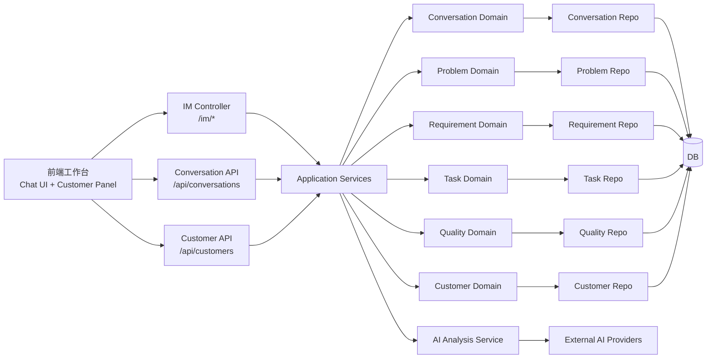
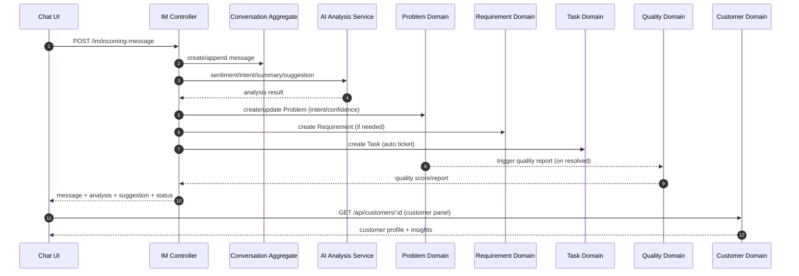

# 阶段一领域范围与架构/时序图

> 生成时间：2026-02-05  
> 对齐基准：`docs/里程碑驱动/里程碑.md`（阶段一条目）  
> 说明：基于 `docs/domain` 现有领域模型与接口描述整理，仅覆盖阶段一目标相关领域。

**相关文档**
- 阶段一对比报告（代码实现）：[阶段一对比报告_代码实现.md](./阶段一对比报告_代码实现.md)

## 1. 阶段一覆盖领域（来自 docs/domain）

**当前真实 Agent（以实现为准）**
- OrchestratorAgent：多 Agent 编排与路由
- AssistantAgent：情绪/意图/需求抽取 + 基础回复建议
- EngineerAgent：故障判断/解决方案 + 知识检索辅助
- InspectorAgent：质检与质量评分
- HumanAgent（HumanAgentAdapter）：人工审核/人机协同

**与阶段一目标直接匹配的领域**
- Conversation：对话生命周期、消息集合、会话分配、SLA/等级计算
- AI Analysis：情绪/意图/摘要/建议等 AI 能力调用（由 Assistant/Engineer/Orchestrator 协作产出）
- Customer：客户画像、互动记录、健康度/风险评估
- Problem：问题识别与状态流转（问题状态 Agent）
- Requirement：需求识别与状态流转（需求抽取）
- Task：自动工单/任务创建与流转
- Quality：质检评分与报告（质量管控 Agent）
- Review：人工审核流（HumanAgent 参与的人机协同）

**阶段一未纳入的领域（对应后续阶段）**
- Knowledge：阶段二知识管理
- System：监控/告警/系统工具（阶段二基础能力）

## 2. 关键领域模型摘要（阶段一）

- Conversation：`Conversation`, `Message`
- AI Analysis：AI 能力编排与输出 DTO（不做业务持久化）
- Customer：`CustomerProfile`
- Problem：`Problem`
- Requirement：`Requirement`
- Task：`Task`
- Quality：`QualityReport`

## 3. 阶段一架构图（领域协作视角）

## 4. 阶段一主链路时序图（对话闭环 + AI + 任务/质检）

## 5. 备注（阶段一范围内的关键耦合点）

- Conversation 不持久化 AI 结果，AI Analysis 仅提供能力输出，业务结果由 Problem/Requirement/Task/Quality 领域落库。
- Customer 与 Conversation 通过 `customerId` 关联，群聊画像需明确映射规则（阶段一对比报告已有缺口记录）。
- Quality 与 Problem 通过“问题解决事件”触发，形成质量管控 Agent 的落库闭环。

## 6. 领域与代码路径映射表（阶段一）

> 覆盖“领域模型 + 用例/服务 + 路由/控制器 + 基础前端呈现/仓储”关键路径。

| 领域 | 后端领域模型 | 后端应用/服务 | 路由/控制器 | 基础前端呈现/仓储 |
| --- | --- | --- | --- | --- |
| Conversation | [`backend/src/domain/conversation`](../../../backend/src/domain/conversation) | [`backend/src/application/services/ConversationTaskCoordinator.ts`](../../../backend/src/application/services/ConversationTaskCoordinator.ts) | [`backend/src/presentation/http/routes/conversationRoutes.ts`](../../../backend/src/presentation/http/routes/conversationRoutes.ts) / [`backend/src/presentation/http/controllers/ConversationController.ts`](../../../backend/src/presentation/http/controllers/ConversationController.ts) / [`backend/src/presentation/http/routes/imRoutes.ts`](../../../backend/src/presentation/http/routes/imRoutes.ts) / [`backend/src/presentation/http/controllers/ImController.ts`](../../../backend/src/presentation/http/controllers/ImController.ts) | [`assets/js/presentation/chat/UnifiedChatController.js`](../../../assets/js/presentation/chat/UnifiedChatController.js) / [`assets/js/presentation/conversation/ConversationController.js`](../../../assets/js/presentation/conversation/ConversationController.js) / [`assets/js/infrastructure/repositories/ConversationRepository.js`](../../../assets/js/infrastructure/repositories/ConversationRepository.js) |
| AI Analysis | 以服务能力为主（无独立聚合） | [`backend/src/application/services/AiService.ts`](../../../backend/src/application/services/AiService.ts) | [`backend/src/presentation/http/routes/aiRoutes.ts`](../../../backend/src/presentation/http/routes/aiRoutes.ts) / [`backend/src/presentation/http/controllers/AiController.ts`](../../../backend/src/presentation/http/controllers/AiController.ts) / [`backend/src/presentation/http/routes/imRoutes.ts`](../../../backend/src/presentation/http/routes/imRoutes.ts) | [`assets/js/presentation/chat/AiAssistantPanel.js`](../../../assets/js/presentation/chat/AiAssistantPanel.js) / [`assets/js/infrastructure/cache/AiAnalysisCache.js`](../../../assets/js/infrastructure/cache/AiAnalysisCache.js) |
| Customer | [`backend/src/domain/customer`](../../../backend/src/domain/customer) | [`backend/src/application/use-cases/customer`](../../../backend/src/application/use-cases/customer) | [`backend/src/presentation/http/routes/customerRoutes.ts`](../../../backend/src/presentation/http/routes/customerRoutes.ts) / [`backend/src/presentation/http/controllers/CustomerProfileController.ts`](../../../backend/src/presentation/http/controllers/CustomerProfileController.ts) / [`backend/src/presentation/http/controllers/CustomerActionController.ts`](../../../backend/src/presentation/http/controllers/CustomerActionController.ts) | [`assets/js/presentation/customer/CustomerProfileController.js`](../../../assets/js/presentation/customer/CustomerProfileController.js) / [`assets/js/infrastructure/repositories/CustomerProfileRepository.js`](../../../assets/js/infrastructure/repositories/CustomerProfileRepository.js) |
| Problem | [`backend/src/domain/problem`](../../../backend/src/domain/problem) | [`backend/src/application/use-cases/problem`](../../../backend/src/application/use-cases/problem) | [`backend/src/presentation/http/routes/problemRoutes.ts`](../../../backend/src/presentation/http/routes/problemRoutes.ts) / [`backend/src/presentation/http/controllers/ProblemController.ts`](../../../backend/src/presentation/http/controllers/ProblemController.ts) / [`backend/src/presentation/http/routes/imRoutes.ts`](../../../backend/src/presentation/http/routes/imRoutes.ts) | [`assets/js/domains/problem/models/Problem.js`](../../../assets/js/domains/problem/models/Problem.js) / [`assets/js/infrastructure/repositories/ProblemRepository.js`](../../../assets/js/infrastructure/repositories/ProblemRepository.js) |
| Requirement | [`backend/src/domain/requirement`](../../../backend/src/domain/requirement) | [`backend/src/application/use-cases/requirement`](../../../backend/src/application/use-cases/requirement) | [`backend/src/presentation/http/routes/requirementRoutes.ts`](../../../backend/src/presentation/http/routes/requirementRoutes.ts) / [`backend/src/presentation/http/controllers/RequirementController.ts`](../../../backend/src/presentation/http/controllers/RequirementController.ts) | [`assets/js/presentation/requirement/RequirementController.js`](../../../assets/js/presentation/requirement/RequirementController.js) / [`assets/js/infrastructure/repositories/RequirementRepository.js`](../../../assets/js/infrastructure/repositories/RequirementRepository.js) |
| Task | [`backend/src/domain/task`](../../../backend/src/domain/task) | [`backend/src/application/use-cases/task`](../../../backend/src/application/use-cases/task) | [`backend/src/presentation/http/routes/taskRoutes.ts`](../../../backend/src/presentation/http/routes/taskRoutes.ts) / [`backend/src/presentation/http/controllers/TaskController.ts`](../../../backend/src/presentation/http/controllers/TaskController.ts) | [`assets/js/presentation/task/TaskController.js`](../../../assets/js/presentation/task/TaskController.js) / [`assets/js/infrastructure/repositories/TaskRepository.js`](../../../assets/js/infrastructure/repositories/TaskRepository.js) |
| Quality | 基础模型与仓储为主（非独立 Domain 目录） | [`backend/src/application/event-handlers/ProblemResolvedEventHandler.ts`](../../../backend/src/application/event-handlers/ProblemResolvedEventHandler.ts) | [`backend/src/presentation/http/routes/qualityRoutes.ts`](../../../backend/src/presentation/http/routes/qualityRoutes.ts) / [`backend/src/presentation/http/controllers/QualityController.ts`](../../../backend/src/presentation/http/controllers/QualityController.ts) / [`backend/src/presentation/http/routes/imRoutes.ts`](../../../backend/src/presentation/http/routes/imRoutes.ts) | [`assets/js/domains/quality/models/QualityReport.js`](../../../assets/js/domains/quality/models/QualityReport.js) / [`assets/js/infrastructure/repositories/QualityRepository.js`](../../../assets/js/infrastructure/repositories/QualityRepository.js) |
