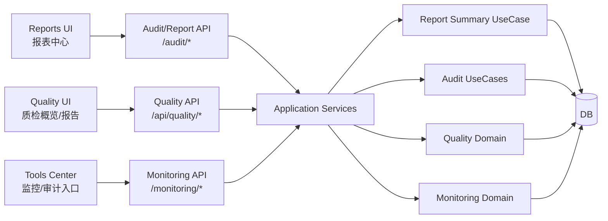
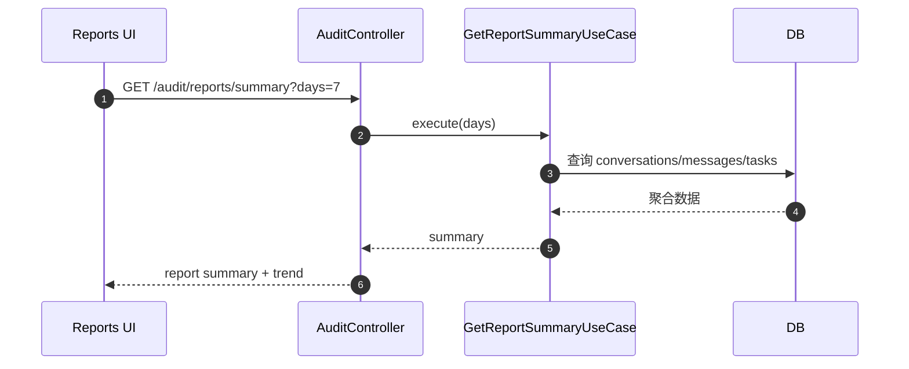

# 阶段三领域范围与架构/时序图

> 生成时间：2026-02-05  
> 对齐基准：`docs/里程碑驱动/里程碑.md`（阶段三条目）  
> 说明：基于 `docs/domain` 现有领域模型与接口描述整理，仅覆盖阶段三目标相关领域。

**相关文档**
- 阶段三对比报告（代码实现）：[阶段三对比报告_代码实现.md](./阶段三对比报告_代码实现.md)

## 1. 阶段三覆盖领域（来自 docs/domain）

**当前真实 Agent（以实现为准）**
- OrchestratorAgent：多 Agent 编排与路由
- AssistantAgent：情绪/意图/需求抽取 + 基础回复建议
- EngineerAgent：故障诊断 + 故障报告输出 + 知识检索
- InspectorAgent：过程质检/质量评分与报告
- HumanAgent（HumanAgentAdapter）：人工审核/人机协同

**与阶段三目标直接匹配的领域**
- Report/Audit：报表聚合、审计事件、运营数据摘要
- Quality：质检报告、质量数据沉淀
- System/Monitoring：监控与告警
- AI Analysis：AI 智能分析能力（数据解读/自动化建议）

**阶段三未纳入的领域（对应后续阶段）**
- 无明确后续阶段条目（当前聚焦运营闭环）

## 2. 关键领域模型摘要（阶段三）

- Report：`ReportSummary`（报表摘要 + 趋势）
- Audit：`AuditEvent`（审计事件）
- Quality：`QualityReport`
- System/Monitoring：`MonitoringAlert`

## 3. 阶段三架构图（报表/审计/质检协作视角）

## 4. 阶段三主链路时序图（报表摘要 + 审计采集）

## 5. 备注（阶段三范围内的关键耦合点）

- 报表中心目前以审计/汇总接口为主，统计口径来自会话/任务/消息数据。
- 质检与报表通过 `QualityReport` 与报表摘要形成间接联动，尚未形成“闭环动作”（如自动化运营策略）。
- AI 托管模式暂无明确实现路径，需在编排层与 IM 渠道层补齐“自动回复/托管策略”能力。

## 6. 领域与代码路径映射表（阶段三）

> 覆盖“领域模型 + 用例/服务 + 路由/控制器 + 基础前端呈现/仓储”关键路径。

| 领域 | 后端领域模型 | 后端应用/服务 | 路由/控制器 | 基础前端呈现/仓储 |
| --- | --- | --- | --- | --- |
| Report/Audit | [`backend/src/infrastructure/database/entities/AuditEventEntity.ts`](../../../backend/src/infrastructure/database/entities/AuditEventEntity.ts) | [`backend/src/application/use-cases/report/GetReportSummaryUseCase.ts`](../../../backend/src/application/use-cases/report/GetReportSummaryUseCase.ts) / [`backend/src/application/use-cases/audit`](../../../backend/src/application/use-cases/audit) | [`backend/src/presentation/http/routes/auditRoutes.ts`](../../../backend/src/presentation/http/routes/auditRoutes.ts) / [`backend/src/presentation/http/controllers/AuditController.ts`](../../../backend/src/presentation/http/controllers/AuditController.ts) | [`assets/js/reports/index.js`](../../../assets/js/reports/index.js) / [`assets/js/api.js`](../../../assets/js/api.js) |
| Quality | 以报告模型为主（非独立 Domain 目录） | [`backend/src/application/event-handlers/ProblemResolvedEventHandler.ts`](../../../backend/src/application/event-handlers/ProblemResolvedEventHandler.ts) | [`backend/src/presentation/http/routes/qualityRoutes.ts`](../../../backend/src/presentation/http/routes/qualityRoutes.ts) / [`backend/src/presentation/http/controllers/QualityController.ts`](../../../backend/src/presentation/http/controllers/QualityController.ts) | [`assets/js/tasks/index.js`](../../../assets/js/tasks/index.js) / [`assets/js/infrastructure/repositories/QualityRepository.js`](../../../assets/js/infrastructure/repositories/QualityRepository.js) |
| System/Monitoring | [`backend/src/infrastructure/database/entities/MonitoringAlertEntity.ts`](../../../backend/src/infrastructure/database/entities/MonitoringAlertEntity.ts) | [`backend/src/application/use-cases/monitoring`](../../../backend/src/application/use-cases/monitoring) | [`backend/src/presentation/http/routes/monitoringRoutes.ts`](../../../backend/src/presentation/http/routes/monitoringRoutes.ts) / [`backend/src/presentation/http/controllers/MonitoringController.ts`](../../../backend/src/presentation/http/controllers/MonitoringController.ts) | [`assets/js/tools/index.js`](../../../assets/js/tools/index.js) / [`assets/js/api.js`](../../../assets/js/api.js) |
| AI Agent（Orchestrator/Assistant/Engineer/Inspector/Human） | — | [`agentscope-service/src/router/orchestrator_agent.py`](../../../agentscope-service/src/router/orchestrator_agent.py) / [`agentscope-service/src/agents/assistant_agent.py`](../../../agentscope-service/src/agents/assistant_agent.py) / [`agentscope-service/src/agents/engineer_agent.py`](../../../agentscope-service/src/agents/engineer_agent.py) / [`agentscope-service/src/agents/inspector_agent.py`](../../../agentscope-service/src/agents/inspector_agent.py) / [`agentscope-service/src/agents/human_agent_adapter.py`](../../../agentscope-service/src/agents/human_agent_adapter.py) | [`agentscope-service/src/api/routes/agents.py`](../../../agentscope-service/src/api/routes/agents.py) | [`assets/js/chat/index.js`](../../../assets/js/chat/index.js) |
