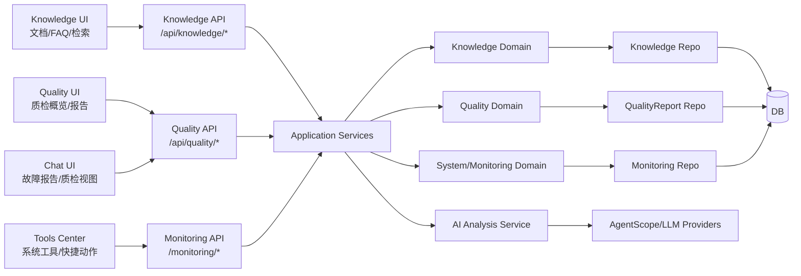
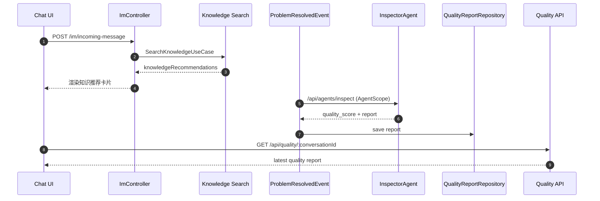

# 阶段二领域范围与架构/时序图

> 生成时间：2026-02-05  
> 对齐基准：`docs/里程碑驱动/里程碑.md`（阶段二条目）  
> 说明：基于 `docs/domain` 现有领域模型与接口描述整理，仅覆盖阶段二目标相关领域。

**相关文档**
- 阶段二对比报告（代码实现）：[阶段二对比报告_代码实现.md](./阶段二对比报告_代码实现.md)

## 1. 阶段二覆盖领域（来自 docs/domain）

**当前真实 Agent（以实现为准）**
- OrchestratorAgent：多 Agent 编排与路由
- AssistantAgent：情绪/意图/需求抽取 + 基础回复建议
- EngineerAgent：故障诊断 + 故障报告输出 + 知识检索
- InspectorAgent：过程质检/质量评分与报告
- HumanAgent（HumanAgentAdapter）：人工审核/人机协同

**与阶段二目标直接匹配的领域**
- Knowledge：知识条目/FAQ 生命周期、检索与推荐
- Quality：质检报告、评分、改进建议
- System：监控与告警（基础能力）
- AI Analysis：故障报告与质检生成能力（AI 能力域）
- Tools（前端工具中心）：系统工具入口/快捷动作（UI 侧）

**阶段二未纳入的领域（对应后续阶段）**
- Data/Reports：阶段三数据报表与运营闭环
- Operations：阶段三运营联动与审计闭环

## 2. 关键领域模型摘要（阶段二）

- Knowledge：`KnowledgeItem`, `KnowledgeCategory`
- Quality：`QualityReport`
- System/Monitoring：`MonitoringAlert`（实体层）
- AI Analysis：能力输出 DTO（不做业务持久化）

## 3. 阶段二架构图（知识/质检/监控协作视角）

## 4. 阶段二主链路时序图（知识检索 + 质检报告）

## 5. 备注（阶段二范围内的关键耦合点）

- Knowledge 既服务于对话建议（IM 侧推荐），也服务于独立知识管理工作台。
- Quality 由问题解决事件触发质检；质检报告作为独立可查询资源。
- Tools Center 依赖 Monitoring API 与 System 能力，但目前偏 UI 入口形态。

## 6. 领域与代码路径映射表（阶段二）

> 覆盖“领域模型 + 用例/服务 + 路由/控制器 + 基础前端呈现/仓储”关键路径。

| 领域 | 后端领域模型 | 后端应用/服务 | 路由/控制器 | 基础前端呈现/仓储 |
| --- | --- | --- | --- | --- |
| Knowledge | [`backend/src/domain/knowledge`](../../../backend/src/domain/knowledge) | [`backend/src/application/use-cases/knowledge`](../../../backend/src/application/use-cases/knowledge) | [`backend/src/presentation/http/routes/knowledgeRoutes.ts`](../../../backend/src/presentation/http/routes/knowledgeRoutes.ts) / [`backend/src/presentation/http/controllers/KnowledgeController.ts`](../../../backend/src/presentation/http/controllers/KnowledgeController.ts) | [`assets/js/knowledge/index.js`](../../../assets/js/knowledge/index.js) / [`assets/js/infrastructure/repositories/KnowledgeRepository.js`](../../../assets/js/infrastructure/repositories/KnowledgeRepository.js) |
| Quality | 以报告模型为主（非独立 Domain 目录） | [`backend/src/application/event-handlers/ProblemResolvedEventHandler.ts`](../../../backend/src/application/event-handlers/ProblemResolvedEventHandler.ts) | [`backend/src/presentation/http/routes/qualityRoutes.ts`](../../../backend/src/presentation/http/routes/qualityRoutes.ts) / [`backend/src/presentation/http/controllers/QualityController.ts`](../../../backend/src/presentation/http/controllers/QualityController.ts) | [`assets/js/tasks/index.js`](../../../assets/js/tasks/index.js) / [`assets/js/infrastructure/repositories/QualityRepository.js`](../../../assets/js/infrastructure/repositories/QualityRepository.js) |
| System/Monitoring | [`backend/src/infrastructure/database/entities/MonitoringAlertEntity.ts`](../../../backend/src/infrastructure/database/entities/MonitoringAlertEntity.ts) | [`backend/src/application/use-cases/monitoring`](../../../backend/src/application/use-cases/monitoring) | [`backend/src/presentation/http/routes/monitoringRoutes.ts`](../../../backend/src/presentation/http/routes/monitoringRoutes.ts) / [`backend/src/presentation/http/controllers/MonitoringController.ts`](../../../backend/src/presentation/http/controllers/MonitoringController.ts) | [`assets/js/tools/index.js`](../../../assets/js/tools/index.js) / [`assets/js/api.js`](../../../assets/js/api.js) |
| Tools Center | （UI 侧为主） | — | — | [`assets/js/tools/index.js`](../../../assets/js/tools/index.js) / [`assets/js/ui/dock.js`](../../../assets/js/ui/dock.js) |
| AI Agent（Orchestrator/Assistant/Engineer/Inspector/Human） | — | [`agentscope-service/src/router/orchestrator_agent.py`](../../../agentscope-service/src/router/orchestrator_agent.py) / [`agentscope-service/src/agents/assistant_agent.py`](../../../agentscope-service/src/agents/assistant_agent.py) / [`agentscope-service/src/agents/engineer_agent.py`](../../../agentscope-service/src/agents/engineer_agent.py) / [`agentscope-service/src/agents/inspector_agent.py`](../../../agentscope-service/src/agents/inspector_agent.py) / [`agentscope-service/src/agents/human_agent_adapter.py`](../../../agentscope-service/src/agents/human_agent_adapter.py) | [`agentscope-service/src/api/routes/agents.py`](../../../agentscope-service/src/api/routes/agents.py) | [`assets/js/chat/index.js`](../../../assets/js/chat/index.js) |
