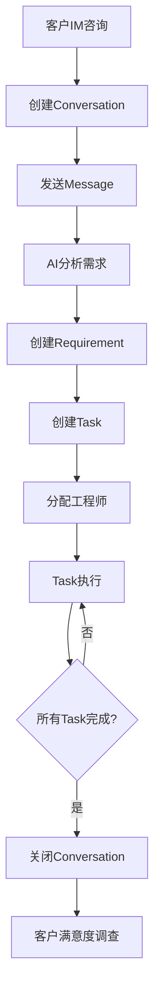
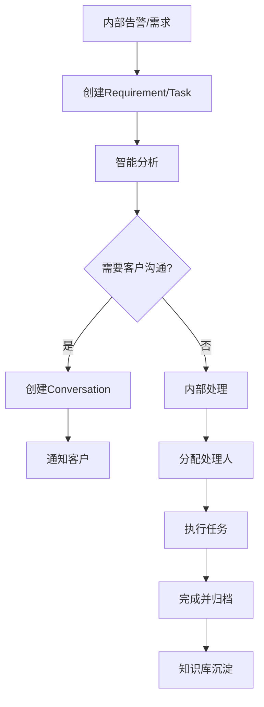

# 售后服务系统Agent驱动改造方案 - 差距分析与实施计划

> **项目**: 智能售后工作台 (After-sales Intelligence Platform)
> **分析日期**: 2025-12-18
> **改造目标**: 从传统DDD架构向Agent驱动架构升级
> **自动化程度**: 初期半自动化 → 逐步完全自动化

---

## 一、项目现状与预期方案差距总览

### 1.1 整体差距评估

| 维度 | 现状评分 | 预期评分 | 差距 | 影响程度 |
|------|----------|----------|------|---------|
| **Agent专业化** | 3/10 | 9/10 | ⭐⭐⭐⭐⭐⭐ | 关键 🔴 |
| **Agent协作能力** | 2/10 | 9/10 | ⭐⭐⭐⭐⭐⭐⭐ | 严重 🔴 |
| **工作流编排** | 2/10 | 9/10 | ⭐⭐⭐⭐⭐⭐⭐ | 严重 🔴 |
| **外部系统集成** | 3/10 | 8/10 | ⭐⭐⭐⭐⭐ | 阻塞 🔴 |
| **事件驱动架构** | 7/10 | 9/10 | ⭐⭐ | 可优化 🟡 |
| **DDD领域模型** | 8/10 | 8/10 | 无差距 ✅ | 优秀 ✅ |
| **知识库能力** | 6/10 | 9/10 | ⭐⭐⭐ | 中等 🟡 |
| **人机协同界面** | 4/10 | 8/10 | ⭐⭐⭐⭐ | 重要 🟡 |

**总体差距**: **59% → 需要中到大规模重构**

---

## 二、核心差距详细分析

### 2.1 Agent架构差距 ⭐⭐⭐⭐⭐⭐⭐

#### 现状
```
实现：5个基础Agent（客服、情感分析、需求采集、质检、知识管理）
协作：AdaptiveRouter - 简单路由（4种模式）
编排：无Agent Chain/Team机制
```

#### 预期
```
实现：10+专业Agent（故障、咨询、通知、告警、需求、质检、话术、知识等）
协作：MsgHub完整协作 + Agent Team编排
编排：基于SOP的工作流引擎
```

#### 具体差距
| 预期Agent | 现状 | 缺失度 |
|-----------|------|--------|
| **FaultAgent** (故障处理) | ❌ 无 | 100% |
| **ConsultAgent** (业务咨询) | ⚠️ 基础客服Agent部分覆盖 | 60% |
| **NoticeAgent** (故障通知) | ❌ 无 | 100% |
| **AlertAgent** (告警处理) | ❌ 无 | 100% |
| **RequirementAgent** (需求管理) | ✅ 有RequirementCollector | 30% |
| **CommunicationAgent** (话术优化) | ❌ 无 | 100% |
| **QualityAgent** (质量检测) | ⚠️ 有QualityInspector | 40% |
| **KnowledgeAgent** (知识检索) | ⚠️ 有KnowledgeManager | 50% |
| **Orchestrator Agent** (协调层) | ⚠️ 有AdaptiveRouter但能力不足 | 70% |

**关键问题**：
- 5个现有Agent**相互独立**，无协作机制
- AdaptiveRouter只做路由，不做编排
- 没有Agent Chain（链式调用）和Agent Team（团队协作）
- AgentScope的MsgHub能力**未真正使用**

---

### 2.2 工作流编排差距 ⭐⭐⭐⭐⭐⭐⭐

#### 现状
```
流程管理：散落在EventHandler中
流程定义：硬编码在业务逻辑中
流程可视化：无
流程配置：无
```

**实际问题示例**：
```typescript
// 现状：流程隐藏在事件处理器中
MessageSentEventHandler → 检测需求 → 创建Requirement
TaskCompletedEventHandler → 质量评分 → 无后续流程

// 问题：
// 1. Task完成后应该关闭Conversation - 缺失
// 2. 所有Task完成才关闭Conversation - 无此逻辑
// 3. 跨域协调需要手动编码
```

#### 预期
```
SOP流程编排引擎：
  ├── 客户咨询流程 (5步)
  ├── 故障处理流程 (8步)
  ├── 需求管理流程 (6步)
  ├── 告警响应流程 (4步)
  └── 质检流程 (3步)

特性：
  ✓ YAML/JSON定义流程
  ✓ 可视化流程图
  ✓ 条件分支（if/else）
  ✓ 并行执行（parallel）
  ✓ 人工干预点（human-in-loop）
  ✓ 错误重试和补偿
```

#### 具体差距
| 功能 | 现状 | 预期 | 差距 |
|------|------|------|------|
| 流程定义 | 代码硬编码 | YAML配置化 | 100% |
| 流程编排 | 事件驱动分散 | 统一编排引擎 | 90% |
| 条件分支 | if/else分散 | 声明式规则 | 80% |
| 并行执行 | 手动Promise.all | 自动并行 | 70% |
| 人工审核点 | 无标准机制 | 标准human-in-loop | 100% |
| 流程可视化 | 无 | Mermaid/图形化 | 100% |
| 流程监控 | 无 | 实时状态追踪 | 100% |

---

### 2.3 工单生命周期串联流程分析

#### Q1: 客户触发场景能否通过工单生命周期串联全流程？

**现状评估**: ⚠️ **部分可行，但存在断点**

**完整流程应该是**：


**当前实现的断点**：
| 流程节点 | 实现情况 | 问题 |
|---------|---------|------|
| A→B | ❌ **断点** | IM集成缺失，无法接收外部消息 |
| B→C | ✅ 完整 | SendMessageUseCase |
| C→D | ⚠️ 半自动 | 需求检测有但不自动触发 |
| D→E | ✅ 完整 | CreateRequirementUseCase |
| E→F | ❌ **断点** | 无自动创建Task的事件处理器 |
| F→G | ⚠️ 半自动 | TaskAssignmentService存在但未集成 |
| G→H | ✅ 完整 | CompleteTaskUseCase |
| H→I | ❌ **断点** | 无检查所有Task完成的逻辑 |
| I→J | ❌ **断点** | Task完成不会自动关闭Conversation |
| J→K | ❌ **断点** | 无满意度调查机制 |

**关键技术债务**：
```typescript
// 文件：backend/src/domain/task/models/Task.ts
// 问题：Task有conversationId但无反向通知机制

export class Task extends AggregateRoot<TaskProps> {
  complete(score?: QualityScore): void {
    this.props.status = TaskStatus.COMPLETED;
    this.addDomainEvent(new TaskCompletedEvent({
      // ❌ 事件中没有conversationId！
      taskId: this.id,
      qualityScore: score?.toPlainObject(),
    }));
  }
}

// 需要：TaskCompletedEventHandler监听并检查Conversation状态
```

**答案**: ❌ **当前无法完整串联**，存在5个主要断点，需要补齐：
1. IM集成（外部触发）
2. 自动创建Task的事件处理
3. 所有Task完成检查逻辑
4. Task完成→Conversation关闭联动
5. 满意度调查流程

---

#### Q2: 内部发起问题能否通过"事物"串联流程？

**现状评估**: ⚠️ **可行性更高，但缺少协调层**

**完整流程应该是**：


**当前实现情况**：
| 流程节点 | 实现情况 | 问题 |
|---------|---------|------|
| A→B | ✅ 完整 | CreateRequirementUseCase / CreateTaskUseCase |
| B→C | ⚠️ 基础 | RequirementDetectorService有但简单 |
| C→D | ❌ **断点** | 无决策逻辑 |
| D→E | ❌ **断点** | 无从Requirement/Task自动创建Conversation的机制 |
| D→F | ✅ 可手动 | 现有Task流程 |
| E→G | ❌ **断点** | IM集成缺失 |
| F→H→I | ✅ 完整 | AssignTaskUseCase + CompleteTaskUseCase |
| I→J | ⚠️ 半自动 | 完成有，但无自动归档 |
| J→K | ❌ **断点** | 无知识库自动沉淀机制 |

**核心问题**：
```typescript
// 问题1：Requirement/Task无法触发Conversation创建
// 文件：backend/src/domain/requirement/models/Requirement.ts
// 缺少：当Requirement需要客户确认时，自动创建Conversation

// 问题2：Task独立于Conversation
// 文件：backend/src/domain/task/models/Task.ts
// Task.create()时有conversationId但是optional
// 内部Task不会主动创建Conversation

// 需要：应用层协调服务
class TaskConversationCoordinator {
  async createTaskWithConversation(params) {
    // 1. 创建Task
    // 2. 判断是否需要客户沟通
    // 3. 如需要，创建Conversation并关联
    // 4. 通知客户（IM）
  }
}
```

**答案**: ⚠️ **可以通过Task串联内部流程**，但需要：
1. 应用层协调服务（Saga模式）
2. Task→Conversation的触发机制
3. 智能决策"是否需要客户沟通"
4. 知识库自动沉淀

---

### 2.4 外部系统集成差距 ⭐⭐⭐⭐⭐

#### 关键集成缺失

| 集成项 | 重要性 | 现状 | 阻塞影响 |
|--------|--------|------|---------|
| **飞书IM** | 🔴 必须 | ❌ 仅配置预留 | 无法客户触发、无法主动通知 |
| **TaxKB知识库** | 🟡 重要 | ⚠️ 已集成但未启用 | AI回答质量受限 |
| **监控告警** | 🟡 重要 | ⚠️ Prometheus配置但未埋点 | 无法监控Agent表现 |
| **外部工单系统** | 🟢 可选 | ❌ 无 | 无影响（内部Task足够） |
| **权限认证** | 🔴 必须 | ❌ 设计了但未实现 | 安全风险 |

**IM集成缺失的严重性**：
```
影响范围：
  ✗ 客户无法通过飞书/企微发起咨询
  ✗ Agent无法主动推送消息给客户
  ✗ 无法实现"客户触发的完整流程"
  ✗ 整个外部场景无法运作

技术债务：
  文件：backend/.env.example - 仅占位配置
  缺失：Feishu/Wecom Adapter（~500行）
  缺失：Webhook处理器（~200行）
  缺失：消息队列（避免消息丢失）
```

---

### 2.5 事件驱动架构差距 ⭐⭐

#### 现状优势
✅ 完整的DDD事件模型（23个事件）
✅ EventBus实现（前后端双端）
✅ 聚合根标准事件发布

#### 差距点
❌ 事件处理器不完整（23个事件仅8个有Handler）
❌ 跨域事件协调缺失（Task↔Conversation）
❌ 事件链路追踪缺失
❌ 事件重播/补偿机制缺失

**具体问题**：
```typescript
// 文件：backend/src/domain/conversation/events/ConversationClosedEvent.ts
export class ConversationClosedEvent extends DomainEvent {
  constructor(public payload: {
    conversationId: string;
    closedAt: Date;
    resolution?: string;
  }) {}
}

// ❌ 问题：没有Handler监听此事件去：
// 1. 检查是否有未完成的Task
// 2. 如有，阻止关闭或自动取消Task
// 3. 刷新客户画像统计
// 4. 触发满意度调查

// 需要：ConversationClosedEventHandler
```

---

## 三、改造实施计划

### 阶段目标
```
Phase 1 (MVP)：    修复断点 + 基础Agent协作（4周）
Phase 2 (增强)：   工作流引擎 + 完整外部集成（6周）
Phase 3 (完善)：   全自动化 + 性能优化（4周）
```

---

## Phase 1: MVP - 修复核心断点（4周，重构核心流程）

### 目标
✅ 打通客户触发和内部发起的完整流程
✅ 实现半自动化（Agent建议，人工审核）
✅ 建立Agent协作基础

### 1.1 IM集成（Week 1，阻塞项）

**实施内容**：
```typescript
// 新增文件：/backend/src/infrastructure/adapters/FeishuAdapter.ts
export class FeishuAdapter {
  // 发送消息
  async sendMessage(userId: string, content: string): Promise<void>
  async sendCard(userId: string, card: FeishuCard): Promise<void>

  // 接收消息（Webhook）
  async handleWebhook(req: FastifyRequest): Promise<void>

  // 事件处理
  async onMessage(callback: (msg: FeishuMessage) => void): void
}

// 新增文件：/backend/src/application/services/IMGatewayService.ts
export class IMGatewayService {
  async routeIncomingMessage(msg: IncomingMessage): Promise<void> {
    // 1. 创建或获取Conversation
    // 2. 添加Message
    // 3. 触发Agent分析
  }

  async sendOutgoingMessage(conversationId: string, content: string): Promise<void> {
    // 1. 获取Conversation的channel
    // 2. 调用对应的IM Adapter
    // 3. 记录发送状态
  }
}
```

**关键文件修改**：
- `/backend/src/config/im.config.ts` - 新增IM配置
- `/backend/src/presentation/http/routes/webhookRoutes.ts` - 新增Webhook路由
- `/backend/.env.example` - 补充真实配置

**验证标准**：
- [ ] 飞书消息能触发Conversation创建
- [ ] Agent能推送消息到飞书
- [ ] Webhook稳定接收消息（无丢失）

---

### 1.2 事件处理器补全（Week 1-2）

**补齐缺失的Handler**：

```typescript
// 新增：/backend/src/application/event-handlers/TaskCompletedEventHandler.ts
export class TaskCompletedEventHandler implements IEventHandler<TaskCompletedEvent> {
  async handle(event: TaskCompletedEvent): Promise<void> {
    // 1. 获取Task的conversationId
    const task = await taskRepo.findById(event.payload.taskId);
    if (!task.conversationId) return;

    // 2. 检查该Conversation的所有Task是否都完成
    const allTasks = await taskRepo.findByConversationId(task.conversationId);
    const allCompleted = allTasks.every(t => t.status === 'completed');

    // 3. 如果全部完成，发布ConversationReadyToCloseEvent
    if (allCompleted) {
      eventBus.publish(new ConversationReadyToCloseEvent({
        conversationId: task.conversationId,
        reason: 'All tasks completed'
      }));
    }
  }
}

// 新增：/backend/src/application/event-handlers/ConversationReadyToCloseEventHandler.ts
export class ConversationReadyToCloseEventHandler {
  async handle(event: ConversationReadyToCloseEvent): Promise<void> {
    // 1. 通知Agent生成总结
    const summary = await aiService.summarizeConversation(event.conversationId);

    // 2. 发送给客户确认
    await imGateway.sendMessage(conversationId, `问题已解决，总结：${summary}`);

    // 3. 等待客户确认或超时后自动关闭
    // （后续增强点）
  }
}

// 新增：/backend/src/application/event-handlers/RequirementCreatedEventHandler.ts
export class RequirementCreatedEventHandler {
  async handle(event: RequirementCreatedEvent): Promise<void> {
    // 1. 智能判断是否需要创建Task
    if (event.payload.priority === 'urgent' || event.payload.source === 'customer') {
      await taskService.createTaskForRequirement(event.payload.requirementId);
    }

    // 2. 如果是客户需求且无Conversation，创建之
    if (event.payload.source === 'customer' && !event.payload.conversationId) {
      await conversationService.createForRequirement(event.payload.requirementId);
    }
  }
}
```

**需要修改的现有事件**：
```typescript
// 修改：backend/src/domain/task/events/TaskCompletedEvent.ts
export class TaskCompletedEvent extends DomainEvent {
  constructor(public payload: {
    taskId: string;
    conversationId?: string;  // ✅ 增加此字段
    qualityScore?: QualityScoreData;
    completedAt: Date;
  }) {
    super('task.completed');
  }
}
```

---

### 1.3 应用层协调服务（Week 2，关键）

**新增Saga协调器**：

```typescript
// 新增：/backend/src/application/services/ConversationTaskCoordinator.ts
export class ConversationTaskCoordinator {
  /**
   * 完整流程：从客户消息到Task完成
   */
  async processCustomerMessage(msg: IncomingMessage): Promise<void> {
    // Step 1: 创建或获取Conversation
    let conversation = await conversationRepo.findByCustomerId(msg.customerId);
    if (!conversation) {
      conversation = await createConversationUseCase.execute({
        customerId: msg.customerId,
        channel: msg.channel,
        initialMessage: msg.content
      });
    }

    // Step 2: AI分析需求
    const requirements = await requirementDetector.detect(msg.content);

    // Step 3: 如果检测到需求，创建Requirement和Task
    for (const req of requirements) {
      if (req.confidence > 0.7) {
        const requirement = await createRequirementUseCase.execute({
          ...req,
          conversationId: conversation.id
        });

        // Step 4: 根据优先级决定是否立即创建Task
        if (req.priority === 'urgent' || req.priority === 'high') {
          await createTaskUseCase.execute({
            title: requirement.title,
            conversationId: conversation.id,
            requirementId: requirement.id,
            priority: req.priority
          });
        }
      }
    }

    // Step 5: Agent生成回复建议
    const reply = await customerServiceAgent.generateReply(conversation);

    // Step 6: 半自动化：推送给人工审核
    await this.notifyHumanReview({
      conversationId: conversation.id,
      suggestedReply: reply,
      detectedRequirements: requirements
    });
  }

  /**
   * 完成所有Task并关闭Conversation
   */
  async completeConversation(conversationId: string): Promise<void> {
    // 1. 检查所有Task是否完成
    const incompleteTasks = await taskRepo.findIncompleteByConversationId(conversationId);
    if (incompleteTasks.length > 0) {
      throw new Error(`Cannot close: ${incompleteTasks.length} tasks incomplete`);
    }

    // 2. AI生成总结
    const summary = await aiService.summarizeConversation(conversationId);

    // 3. 关闭Conversation
    await closeConversationUseCase.execute({
      conversationId,
      resolution: summary
    });

    // 4. 通知客户
    await imGateway.sendMessage(conversationId, `您的问题已全部解决。${summary}`);

    // 5. 知识库沉淀
    await knowledgeService.extractFromConversation(conversationId);
  }
}
```

---

### 1.4 Agent协作框架（Week 3，基础）

**升级AdaptiveRouter为完整的OrchestratorAgent**：

```python
# 修改：/agentscope-service/src/router/orchestrator_agent.py
class OrchestratorAgent(ReActAgent):
    """
    协调Agent，负责：
    1. 请求分类
    2. Agent选择和调度
    3. Agent Chain编排
    4. 结果聚合
    """

    def __init__(self):
        super().__init__(name="Orchestrator")
        self.agents = {
            'customer_service': CustomerServiceAgent(),
            'sentiment': SentimentAnalyzerAgent(),
            'requirement': RequirementCollectorAgent(),
            'quality': QualityInspectorAgent(),
            'knowledge': KnowledgeManagerAgent(),
        }

    async def route_request(self, message: Msg) -> Msg:
        """智能路由到合适的Agent或Agent Chain"""

        # 1. 分析请求类型和复杂度
        analysis = await self.analyze_message(message)

        # 2. 简单请求：单Agent处理
        if analysis.complexity == 'simple':
            agent = self.select_single_agent(analysis.intent)
            return await agent.reply(message)

        # 3. 复杂请求：Agent Chain处理
        if analysis.complexity == 'medium':
            return await self.execute_agent_chain(message, analysis)

        # 4. 很复杂：Agent Team协作
        if analysis.complexity == 'complex':
            return await self.execute_agent_team(message, analysis)

    async def execute_agent_chain(self, message: Msg, analysis: Analysis) -> Msg:
        """链式Agent处理"""
        # 示例：客户咨询 → 情感分析 → 需求检测 → 知识检索 → 回复生成

        result = message

        # Step 1: 情感分析
        sentiment = await self.agents['sentiment'].reply(result)
        result.metadata['sentiment'] = sentiment.content

        # Step 2: 需求检测
        if analysis.has_requirement:
            requirements = await self.agents['requirement'].reply(result)
            result.metadata['requirements'] = requirements.content

        # Step 3: 知识检索
        knowledge = await self.agents['knowledge'].search_knowledge(result.content)
        result.metadata['knowledge'] = knowledge

        # Step 4: 生成回复
        reply = await self.agents['customer_service'].reply(result)

        return reply

    async def execute_agent_team(self, message: Msg, analysis: Analysis) -> Msg:
        """Agent Team协作（使用MsgHub）"""

        # 创建MsgHub
        hub = msghub()

        # 添加参与者
        participants = [
            self.agents['customer_service'],
            self.agents['sentiment'],
            self.agents['requirement'],
            self.agents['knowledge']
        ]

        # 启动协作
        with hub(participants=participants):
            # 发送初始消息
            hub.broadcast(message)

            # 等待所有Agent回复
            responses = []
            for agent in participants:
                response = await agent.reply(message)
                responses.append(response)

            # 聚合结果
            aggregated = self.aggregate_responses(responses)

            return aggregated
```

**新增专业Agent**：

```python
# 新增：/agentscope-service/src/agents/fault_agent.py
class FaultAgent(ReActAgent):
    """故障处理专业Agent"""

    def __init__(self):
        super().__init__(
            name="FaultAgent",
            sys_prompt="""
            你是故障处理专家。你的任务：
            1. 收集故障信息（时间、实例、错误、影响）
            2. 搜索知识库找相似案例
            3. 生成诊断分析和解决方案
            4. 优化话术并提供人工审核
            """
        )
        self.tools = [
            'searchKnowledge',
            'createTask',
            'getCustomerProfile'
        ]

    async def handle_fault(self, fault_info: dict) -> dict:
        """完整的故障处理流程"""
        # 1. 信息收集
        missing_info = self.check_missing_info(fault_info)
        if missing_info:
            return {'status': 'need_more_info', 'questions': missing_info}

        # 2. 知识库检索
        similar_cases = await self.search_similar_cases(fault_info)

        # 3. 诊断分析
        diagnosis = await self.diagnose(fault_info, similar_cases)

        # 4. 生成解决方案
        solution = await self.generate_solution(diagnosis)

        # 5. 优化话术
        optimized_reply = await self.optimize_communication(solution)

        return {
            'status': 'ready_for_review',
            'diagnosis': diagnosis,
            'solution': solution,
            'reply': optimized_reply,
            'confidence': solution.get('confidence', 0.8)
        }
```

---

### 1.5 人工审核界面（Week 4）

**前端新增审核面板**：

```typescript
// 新增：/assets/js/presentation/review/AgentReviewPanel.js
export class AgentReviewPanel {
  constructor(containerId) {
    this.container = document.getElementById(containerId);
    this.setupEventListeners();
  }

  /**
   * 显示Agent建议，等待人工审核
   */
  async displaySuggestion(suggestion) {
    const html = `
      <div class="agent-suggestion">
        <div class="suggestion-header">
          <span class="agent-name">${suggestion.agent}</span>
          <span class="confidence">置信度: ${suggestion.confidence * 100}%</span>
        </div>

        <div class="suggestion-content">
          <h4>建议回复：</h4>
          <textarea id="reply-editor">${suggestion.reply}</textarea>

          ${suggestion.detectedRequirements ? `
            <h4>检测到的需求：</h4>
            <ul>
              ${suggestion.detectedRequirements.map(req => `
                <li>${req.title} (${req.priority})</li>
              `).join('')}
            </ul>
          ` : ''}

          ${suggestion.tasks ? `
            <h4>建议创建的任务：</h4>
            <ul>
              ${suggestion.tasks.map(task => `
                <li>${task.title}</li>
              `).join('')}
            </ul>
          ` : ''}
        </div>

        <div class="suggestion-actions">
          <button class="btn-approve" onclick="this.approve()">批准并发送</button>
          <button class="btn-edit" onclick="this.edit()">编辑后发送</button>
          <button class="btn-reject" onclick="this.reject()">拒绝</button>
        </div>
      </div>
    `;

    this.container.innerHTML = html;
  }

  async approve() {
    // 1. 发送回复到客户
    await api.conversations.sendMessage(this.conversationId, this.reply);

    // 2. 创建建议的Task和Requirement
    if (this.suggestion.tasks) {
      for (const task of this.suggestion.tasks) {
        await api.tasks.create(task);
      }
    }

    // 3. 记录审核结果（用于Agent学习）
    await api.agent.recordFeedback({
      suggestionId: this.suggestion.id,
      action: 'approved',
      modified: false
    });

    this.showSuccess('已发送');
  }
}
```

---

### 1.6 TaxKB激活（Week 4）

**配置启用**：
```bash
# 修改：/backend/.env
TAXKB_ENABLED=true
TAXKB_BASE_URL=<实际TaxKB地址>
TAXKB_API_KEY=<实际API密钥>
```

**初始化脚本**：
```typescript
// 新增：/backend/scripts/init-taxkb.ts
async function initializeTaxKB() {
  // 1. 上传初始文档
  const docsDir = './docs/knowledge-base';
  const files = fs.readdirSync(docsDir);

  for (const file of files) {
    console.log(`Uploading ${file}...`);
    await taxkbAdapter.uploadDocument({
      title: file,
      content: fs.readFileSync(path.join(docsDir, file)),
      category: 'general'
    });
  }

  // 2. 验证检索能力
  const testQuery = '如何退款';
  const results = await taxkbAdapter.semanticSearch(testQuery);
  console.log(`Test query returned ${results.length} results`);
}
```

---

### Phase 1 验收标准

- [ ] **IM集成**: 飞书消息能触发完整流程
- [ ] **事件链路**: Task完成能自动检查并关闭Conversation
- [ ] **应用协调**: ConversationTaskCoordinator正常工作
- [ ] **Agent协作**: OrchestratorAgent能调度多个Agent协作
- [ ] **人工审核**: 工程师能在界面审核Agent建议
- [ ] **知识库**: TaxKB搜索正常工作
- [ ] **流程完整性**:
  - 客户咨询→Conversation→Requirement→Task→完成→关闭 ✅
  - 内部需求→Requirement→Task→（可选）通知客户→完成 ✅

---

## Phase 2: 工作流引擎 + 完整外部集成（6周）

### 2.1 SOP工作流引擎（Week 5-7）

**引入AgentScope Pipeline**：

```yaml
# 新增：/workflows/customer_service.yaml
workflow:
  name: customer_service_workflow
  description: 客户咨询完整流程

  trigger:
    type: im_message
    channel: feishu

  steps:
    - name: receive_message
      agent: orchestrator
      action: classify
      output: message_type, priority, sentiment

    - name: parallel_analysis
      type: parallel
      steps:
        - name: sentiment_analysis
          agent: sentiment_analyzer
        - name: requirement_detection
          agent: requirement_collector
        - name: knowledge_search
          agent: knowledge_manager
          input: $message.content

    - name: generate_reply
      agent: customer_service
      input:
        - $parallel_analysis.sentiment
        - $parallel_analysis.requirements
        - $parallel_analysis.knowledge
      condition: $message_type != 'urgent'

    - name: human_review
      type: human_in_loop
      timeout: 300  # 5分钟
      fallback: auto_approve  # 超时自动批准
      condition: $confidence < 0.9

    - name: send_reply
      action: send_message
      channel: $trigger.channel
      content: $human_review.approved_reply

    - name: create_tasks
      condition: $parallel_analysis.requirements.length > 0
      loop: $parallel_analysis.requirements
      action: create_task
      input:
        title: $item.title
        priority: $item.priority
        conversationId: $conversation.id
```

**实现工作流引擎**：

```typescript
// 新增：/backend/src/infrastructure/workflow/WorkflowEngine.ts
export class WorkflowEngine {
  private workflows: Map<string, Workflow> = new Map();

  async loadWorkflow(yamlPath: string): Promise<void> {
    const yaml = fs.readFileSync(yamlPath, 'utf-8');
    const workflow = YAML.parse(yaml);
    this.workflows.set(workflow.name, workflow);
  }

  async execute(workflowName: string, context: WorkflowContext): Promise<WorkflowResult> {
    const workflow = this.workflows.get(workflowName);
    if (!workflow) throw new Error(`Workflow ${workflowName} not found`);

    const state = new WorkflowState(context);

    for (const step of workflow.steps) {
      // 检查条件
      if (step.condition && !this.evaluateCondition(step.condition, state)) {
        continue;
      }

      // 执行步骤
      const result = await this.executeStep(step, state);
      state.set(step.name, result);

      // 处理人工干预
      if (step.type === 'human_in_loop') {
        await this.waitForHumanApproval(step, state);
      }

      // 并行执行
      if (step.type === 'parallel') {
        const parallelResults = await Promise.all(
          step.steps.map(s => this.executeStep(s, state))
        );
        state.set(step.name, parallelResults);
      }
    }

    return state.getResult();
  }

  private async executeStep(step: WorkflowStep, state: WorkflowState): Promise<any> {
    switch (step.action) {
      case 'classify':
        return await orchestratorAgent.classify(state.get(step.input));
      case 'send_message':
        return await imGateway.sendMessage(step.channel, step.content);
      case 'create_task':
        return await taskService.create(step.input);
      // ... 其他action
    }
  }
}
```

---

### 2.2 完整的10个专业Agent（Week 7-8）

**补齐缺失的Agent**：

```python
# 新增：/agentscope-service/src/agents/
├── fault_agent.py          # 故障处理（已实现）
├── consult_agent.py        # 业务咨询
├── notice_agent.py         # 故障通知
├── alert_agent.py          # 告警处理
├── requirement_agent.py    # 需求管理（升级现有）
├── communication_agent.py  # 话术优化
├── quality_agent.py        # 质量检测（升级现有）
├── knowledge_agent.py      # 知识管理（升级现有）
└── orchestrator_agent.py   # 协调器（已升级）
```

**每个Agent实现标准**：
- 清晰的职责和系统提示词
- 完整的工具集（MCP Tools）
- 标准的输入/输出格式
- 错误处理和降级策略
- 测试用例覆盖

---

### 2.3 监控告警激活（Week 9）

**Prometheus埋点**：

```typescript
// 新增：/backend/src/infrastructure/monitoring/MetricsCollector.ts
import { register, Counter, Histogram, Gauge } from 'prom-client';

export class MetricsCollector {
  // Agent调用指标
  private agentCalls = new Counter({
    name: 'agent_calls_total',
    help: 'Total agent calls',
    labelNames: ['agent_name', 'status']
  });

  // Agent响应时间
  private agentDuration = new Histogram({
    name: 'agent_duration_seconds',
    help: 'Agent response duration',
    labelNames: ['agent_name'],
    buckets: [0.1, 0.5, 1, 2, 5, 10]
  });

  // 工作流执行
  private workflowExecutions = new Counter({
    name: 'workflow_executions_total',
    help: 'Total workflow executions',
    labelNames: ['workflow_name', 'status']
  });

  // Task状态
  private taskGauge = new Gauge({
    name: 'tasks_by_status',
    help: 'Tasks grouped by status',
    labelNames: ['status']
  });

  async recordAgentCall(agentName: string, duration: number, status: string) {
    this.agentCalls.inc({ agent_name: agentName, status });
    this.agentDuration.observe({ agent_name: agentName }, duration);
  }
}
```

**Grafana Dashboard**：
- Agent性能监控（调用量、响应时间、成功率）
- 工作流监控（执行次数、成功率、平均时长）
- Task监控（待办、进行中、完成、超期）
- Conversation监控（活跃、关闭、SLA违规）

---

### 2.4 企业微信集成（Week 10，可选）

类似飞书实现，新增：
- `/backend/src/infrastructure/adapters/WecomAdapter.ts`
- 企业微信Webhook处理
- 消息格式适配

---

### Phase 2 验收标准

- [ ] **工作流引擎**: 能从YAML加载并执行工作流
- [ ] **10个Agent**: 所有专业Agent实现并通过测试
- [ ] **监控面板**: Grafana显示完整指标
- [ ] **工作流可视化**: 能看到工作流执行过程
- [ ] **并行执行**: 支持Agent并行调用
- [ ] **条件分支**: 支持if/else逻辑

---

## Phase 3: 完全自动化 + 性能优化（4周）

### 3.1 自动化提升（Week 11-12）

**从半自动→全自动的策略**：

```typescript
// 新增：/backend/src/application/services/AutomationService.ts
export class AutomationService {
  /**
   * 决定是否需要人工审核
   */
  shouldRequireHumanReview(context: AutomationContext): boolean {
    // 1. 高置信度 + 低风险 → 自动执行
    if (context.confidence > 0.95 && context.risk === 'low') {
      return false;
    }

    // 2. VIP客户 → 人工审核
    if (context.customer?.isVIP) {
      return true;
    }

    // 3. 高优先级 + 中等置信度 → 人工审核
    if (context.priority === 'urgent' && context.confidence < 0.9) {
      return true;
    }

    // 4. 其他中等场景 → 根据历史准确率决定
    const historicalAccuracy = await this.getAgentAccuracy(context.agent);
    return historicalAccuracy < 0.85;
  }

  /**
   * Agent学习机制
   */
  async recordFeedback(feedback: AgentFeedback) {
    // 1. 记录人工修改
    await db.agentFeedback.insert({
      agentName: feedback.agent,
      suggestionId: feedback.suggestionId,
      humanAction: feedback.action,  // approved/modified/rejected
      originalSuggestion: feedback.original,
      finalVersion: feedback.final,
      timestamp: new Date()
    });

    // 2. 更新Agent准确率
    await this.updateAgentAccuracy(feedback.agent);

    // 3. 如果修改多，触发Agent重训练
    if (await this.shouldRetrain(feedback.agent)) {
      await this.scheduleRetraining(feedback.agent);
    }
  }
}
```

**自动化规则配置**：

```yaml
# 新增：/config/automation-rules.yaml
rules:
  # 简单咨询自动回复
  - name: simple_consultation
    condition:
      - message_type: consultation
      - complexity: simple
      - confidence: ">= 0.9"
    action: auto_reply
    review: false

  # 故障处理需审核
  - name: fault_handling
    condition:
      - message_type: fault
    action: create_task
    review: true
    timeout: 600  # 10分钟内必须审核

  # VIP客户全流程审核
  - name: vip_customer
    condition:
      - customer.isVIP: true
    action: any
    review: true
```

---

### 3.2 性能优化（Week 13）

**优化点**：

1. **Agent调用并行化**
   ```typescript
   // 并行调用多个Agent
   const [sentiment, requirements, knowledge] = await Promise.all([
     sentimentAgent.analyze(message),
     requirementAgent.detect(message),
     knowledgeAgent.search(message)
   ]);
   ```

2. **知识库缓存**
   ```typescript
   // Redis缓存常见查询
   const cacheKey = `kb:${queryHash}`;
   let results = await redis.get(cacheKey);
   if (!results) {
     results = await taxkbAdapter.search(query);
     await redis.setex(cacheKey, 3600, JSON.stringify(results));
   }
   ```

3. **LLM调用优化**
   - 简单任务用GPT-3.5/Haiku（降成本）
   - 复杂任务用GPT-4/Sonnet
   - 批量请求合并

4. **数据库查询优化**
   - 增加索引（conversationId, taskId, customerId）
   - 分页查询优化
   - 连接池配置

---

### 3.3 知识库自动沉淀（Week 14）

```typescript
// 新增：/backend/src/application/services/KnowledgeExtractionService.ts
export class KnowledgeExtractionService {
  /**
   * 从对话中提取知识
   */
  async extractFromConversation(conversationId: string): Promise<void> {
    // 1. 获取对话记录
    const conversation = await conversationRepo.findById(conversationId);
    const messages = conversation.messages;

    // 2. AI提取QA对
    const qaPairs = await aiService.extractQAPairs(messages);

    // 3. 过滤高质量QA
    const highQuality = qaPairs.filter(qa =>
      qa.confidence > 0.8 &&
      qa.isGeneralizable &&
      !qa.containsSensitiveInfo
    );

    // 4. 保存到知识库
    for (const qa of highQuality) {
      await knowledgeService.create({
        title: qa.question,
        content: qa.answer,
        category: qa.category,
        tags: qa.tags,
        source: 'conversation',
        metadata: {
          conversationId,
          extractedAt: new Date()
        }
      });
    }

    // 5. 同步到TaxKB
    if (taxkbConfig.enabled) {
      await taxkbAdapter.uploadDocument({
        title: `会话提取-${conversationId}`,
        content: this.formatQAPairs(highQuality),
        category: 'extracted'
      });
    }
  }
}
```

---

### Phase 3 验收标准

- [ ] **自动化率**: >60%的简单咨询自动处理
- [ ] **响应时间**: Agent平均响应 <2秒
- [ ] **Agent准确率**: >90%
- [ ] **知识库增长**: 每周自动沉淀10+条知识
- [ ] **人工干预率**: <30%
- [ ] **客户满意度**: >85%

---

## 四、关键文件修改清单

### 需要新增的文件（核心）

```
后端新增（~40个文件）：
├── /backend/src/infrastructure/adapters/
│   ├── FeishuAdapter.ts                    # 飞书集成
│   └── WecomAdapter.ts                     # 企业微信集成
├── /backend/src/application/services/
│   ├── IMGatewayService.ts                 # IM网关
│   ├── ConversationTaskCoordinator.ts      # 流程协调
│   ├── AutomationService.ts                # 自动化决策
│   └── KnowledgeExtractionService.ts       # 知识提取
├── /backend/src/application/event-handlers/
│   ├── TaskCompletedEventHandler.ts        # Task完成处理
│   ├── ConversationReadyToCloseEventHandler.ts
│   └── RequirementCreatedEventHandler.ts   # 需求创建处理
├── /backend/src/infrastructure/workflow/
│   ├── WorkflowEngine.ts                   # 工作流引擎
│   ├── WorkflowState.ts                    # 状态管理
│   └── WorkflowStep.ts                     # 步骤执行器
├── /backend/src/infrastructure/monitoring/
│   └── MetricsCollector.ts                 # 指标收集
└── /backend/src/config/
    ├── im.config.ts                        # IM配置
    └── automation.config.ts                # 自动化配置

前端新增（~15个文件）：
├── /assets/js/presentation/review/
│   ├── AgentReviewPanel.js                 # 审核面板
│   ├── SuggestionCard.js                   # 建议卡片
│   └── FeedbackCollector.js                # 反馈收集
├── /assets/js/presentation/workflow/
│   ├── WorkflowVisualizer.js               # 工作流可视化
│   └── WorkflowMonitor.js                  # 实时监控
└── /assets/css/
    └── agent-review.css                    # 审核界面样式

AgentScope新增（~10个文件）：
├── /agentscope-service/src/agents/
│   ├── fault_agent.py                      # 故障Agent
│   ├── consult_agent.py                    # 咨询Agent
│   ├── notice_agent.py                     # 通知Agent
│   ├── alert_agent.py                      # 告警Agent
│   └── communication_agent.py              # 话术Agent
├── /agentscope-service/src/router/
│   └── orchestrator_agent.py               # 协调器升级
└── /agentscope-service/src/workflow/
    └── workflow_executor.py                # 工作流执行

配置文件（~5个）：
├── /workflows/
│   ├── customer_service.yaml               # 客服工作流
│   ├── fault_handling.yaml                 # 故障处理流程
│   └── requirement_management.yaml         # 需求管理流程
└── /config/
    └── automation-rules.yaml               # 自动化规则
```

### 需要修改的现有文件（关键）

```
后端修改（~15个文件）：
├── /backend/src/domain/task/events/TaskCompletedEvent.ts
│   └── 增加 conversationId 字段
├── /backend/src/domain/conversation/models/Conversation.ts
│   └── 增加 getTasks() 方法
├── /backend/src/infrastructure/events/EventBus.ts
│   └── 增加事件链路追踪
├── /backend/src/infrastructure/repositories/TaskRepository.ts
│   └── 增加 findByConversationId() 方法
├── /backend/.env.example
│   └── 补充 IM、TaxKB、监控配置
└── /backend/src/app.ts
    └── 注册新的事件处理器和服务

前端修改（~10个文件）：
├── /assets/js/application/container/bootstrap.js
│   └── 初始化新的应用服务
├── /assets/js/application/eventHandlers/EventSubscriptionManager.js
│   └── 注册新的事件处理器
├── /assets/js/chat/index.js
│   └── 集成Agent审核面板
└── /index.html
    └── 增加审核面板容器
```

---

## 五、风险与缓解措施

### 5.1 技术风险

| 风险 | 影响 | 概率 | 缓解措施 |
|------|------|------|---------|
| IM集成调试困难 | 高 | 中 | 使用Mock服务先开发，并行申请测试账号 |
| 工作流引擎复杂度高 | 中 | 高 | 先实现最简版本（顺序执行），逐步增加功能 |
| Agent响应速度慢 | 高 | 中 | 并行化、缓存、使用快速模型 |
| LLM成本过高 | 中 | 中 | 合理选择模型、缓存结果、批量调用 |
| 事件顺序不一致 | 中 | 低 | 使用消息队列保证顺序、增加幂等性检查 |

### 5.2 业务风险

| 风险 | 影响 | 概率 | 缓解措施 |
|------|------|------|---------|
| 用户不信任Agent | 高 | 中 | 半自动化，充分展示Agent推理过程 |
| 工程师抵触 | 中 | 中 | 强调辅助而非替代，收集反馈持续优化 |
| Agent错误回复 | 高 | 中 | 人工审核机制、置信度阈值、快速纠错通道 |
| 改造周期过长 | 中 | 高 | 分阶段上线，MVP优先验证核心价值 |

### 5.3 数据风险

| 风险 | 影响 | 概率 | 缓解措施 |
|------|------|------|---------|
| 知识库数据不足 | 中 | 高 | 先手动整理核心知识，逐步自动沉淀 |
| 客户隐私泄露 | 高 | 低 | 敏感信息脱敏、权限控制、审计日志 |
| TaxKB不稳定 | 中 | 中 | 实现降级机制，使用本地知识库 |

---

## 六、资源需求

### 6.1 人力需求

| 角色 | 人数 | 时间 | 主要职责 |
|------|------|------|---------|
| 后端工程师 | 2人 | 14周 | Agent集成、工作流引擎、IM集成 |
| 前端工程师 | 1人 | 10周 | 审核界面、工作流可视化 |
| Agent工程师 | 1人 | 14周 | Agent开发、提示词优化 |
| 测试工程师 | 1人 | 8周 | 集成测试、性能测试 |
| 产品经理 | 0.5人 | 14周 | 需求澄清、用户反馈 |

### 6.2 技术资源

- **服务器**: 增加2台（AgentScope服务、监控）
- **LLM API**: GPT-4/Claude（预算¥2-5万/月）
- **TaxKB**: 激活现有服务
- **飞书/企微**: 企业账号开通

### 6.3 预算估算

| 项目 | 成本 |
|------|------|
| 人力成本 | ¥80万（14周 × 5.5人） |
| LLM调用 | ¥5-10万（3个月） |
| 服务器 | ¥1万/月 × 3月 = ¥3万 |
| 测试环境 | ¥2万 |
| **总计** | **约¥90-100万** |

---

## 七、验收标准

### 7.1 核心指标

| 指标 | MVP目标 | 最终目标 |
|------|---------|---------|
| **流程完整率** | 80% | 95% |
| **自动化率** | 30% | 60% |
| **Agent准确率** | 85% | 92% |
| **平均响应时间** | <5秒 | <2秒 |
| **人工干预率** | 70% | 30% |
| **客户满意度** | 75% | 85% |
| **知识库覆盖率** | 60% | 85% |

### 7.2 功能验收

**Phase 1验收**：
- [ ] 飞书消息能触发完整客户服务流程
- [ ] Task完成能自动关闭Conversation
- [ ] Agent能协作处理复杂问题
- [ ] 人工审核界面正常工作
- [ ] TaxKB知识检索正常

**Phase 2验收**：
- [ ] 工作流引擎能执行YAML定义的流程
- [ ] 10个专业Agent全部上线
- [ ] Grafana监控面板完整显示指标
- [ ] 支持并行Agent调用
- [ ] 支持条件分支和人工干预点

**Phase 3验收**：
- [ ] 简单咨询>60%自动处理
- [ ] Agent平均响应<2秒
- [ ] 知识库每周自动增长
- [ ] 人工干预率<30%
- [ ] 整体客户满意度>85%

---

## 八、实施时间表

```
Week 1-2:   IM集成 + 事件处理器补全
Week 3:     应用层协调服务
Week 4:     Agent协作框架 + TaxKB激活 + 人工审核界面
---------- Phase 1 验收 ----------
Week 5-7:   SOP工作流引擎开发
Week 8:     补齐专业Agent
Week 9:     监控告警激活
Week 10:    企业微信集成（可选）
---------- Phase 2 验收 ----------
Week 11-12: 自动化提升
Week 13:    性能优化
Week 14:    知识库自动沉淀 + 全面测试
---------- Phase 3 验收 ----------
Week 15:    生产部署 + 监控
```

---

## 九、关键决策建议

基于深入分析，我的专业建议：

### ✅ 应该做的

1. **优先打通IM集成** - 这是最大的阻塞点，没有它客户场景无法运作
2. **重构核心流程** - 当前事件驱动架构好，但流程编排层薄弱，需要重构
3. **建立Agent协作框架** - 单Agent能力有限，必须支持团队协作
4. **分阶段实施** - 不要一次性改完，MVP→增强→完善的策略更稳妥
5. **重视人工审核** - 初期必须半自动化，建立信任后再提升自动化率

### ⚠️ 需要权衡的

1. **工作流引擎复杂度** - 建议先简单实现，避免过度设计
2. **Agent数量** - 10个Agent可能过多，建议先5-6个核心的
3. **性能vs成本** - LLM调用成本不低，需要在性能和成本间找平衡
4. **自动化程度** - 不要追求100%自动化，保留人工决策空间

### ❌ 不建议做的

1. **不要完全推翻现有DDD架构** - 领域模型设计很好，只需增强编排层
2. **不要过度依赖单一LLM** - 应支持多LLM切换，避免供应商锁定
3. **不要忽视数据安全** - Agent处理敏感信息，必须有权限和审计
4. **不要追求完美** - MVP快速验证价值，再迭代优化

---

## 十、总结

### 核心差距
1. **Agent协作能力**: 差距最大（⭐⭐⭐⭐⭐⭐⭐），需要重构
2. **工作流编排**: 差距严重（⭐⭐⭐⭐⭐⭐⭐），需要新建
3. **IM集成**: 完全缺失（⭐⭐⭐⭐⭐），阻塞外部场景
4. **流程串联**: 存在5个断点，需要逐一补齐

### 可行性评估
- **客户触发场景通过工单串联**: ⚠️ **当前不可行**，需要Phase 1全部完成
- **内部问题通过事物串联**: ⚠️ **部分可行**，需要增加协调层

### 改造策略
- 采用**重构核心流程**的方式
- **14周**分3个阶段实施
- 从**半自动化→完全自动化**渐进
- 投入**5.5人**，预算**¥90-100万**

### 预期效果
- 流程完整率：80% → 95%
- 自动化率：30% → 60%
- 人工效率提升：50%+
- 客户满意度：75% → 85%

---

**文档版本**: v1.0
**创建日期**: 2025-12-18
**预计实施**: 2025-01 开始
**预计完成**: 2025-04 结束
