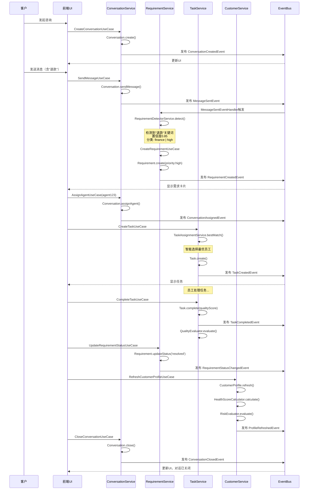
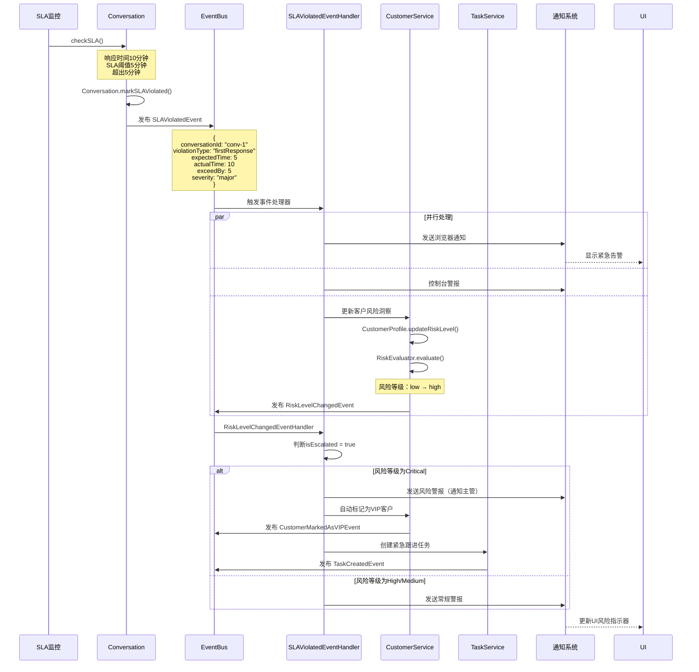
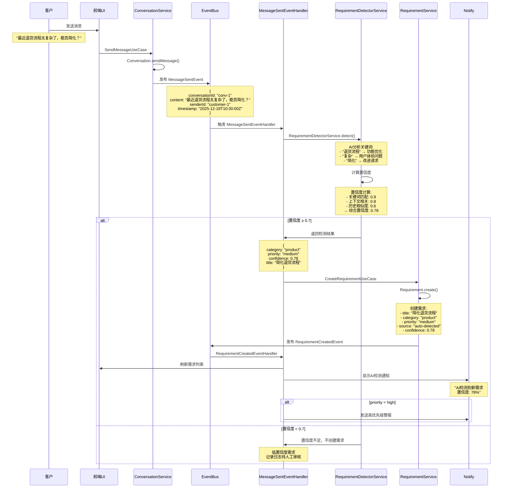

# 智能售后工作台项目概述与场景分析

> 文档创建日期：2025-12-18
> 项目版本：v0.1.0
> 文档用途：项目全景概述、业务场景分析、时序图详解

---

## 一、项目定位

### 1.1 基本信息

**项目名称**：智能售后工作台（After-sales Intelligence Platform）

**项目类型**：企业级B2B SaaS售后管理平台

**核心定位**：为售后团队提供一站式智能工作台解决方案，集成多渠道对话管理、客户360度画像、需求自动采集、任务质检管理和AI辅助决策。

**目标用户**：
- 售后客服团队
- 客户成功经理
- 产品经理（需求收集）
- 质检人员
- 团队主管和管理层

### 1.2 当前状态

- **版本**：v0.1.0（开发阶段）
- **完成度**：73/100
- **代码质量**：3.3/5.0
- **架构模式**：DDD（领域驱动设计）+ 分层架构 + 事件驱动

### 1.3 核心价值主张

1. **智能化**：AI驱动的需求识别、智能任务分配、质量评估
2. **统一化**：多渠道统一管理，一站式工作台
3. **全景化**：客户360度画像，实时数据聚合
4. **自动化**：事件驱动的自动化流程
5. **企业级**：完整的监控、审计、权限管理

---

## 二、核心业务场景

### 场景1：多渠道客户咨询管理

#### 业务痛点
- 客户通过飞书、企业QQ、微信、邮件等多渠道咨询，信息分散
- 响应不及时，容易遗漏消息
- 无法统一管理和追踪对话历史
- SLA管理困难

#### 解决方案
- **统一接入**：整合所有IM渠道到一个工作台
- **实时推送**：WebSocket实时消息推送
- **SLA监控**：自动计算响应时间，告警机制
- **全文搜索**：对话历史快速检索

#### 关键功能
| 功能 | 描述 | Use Case |
|------|------|----------|
| 创建对话 | 客户发起咨询，创建对话记录 | CreateConversationUseCase |
| 发送/接收消息 | 实时消息交互 | SendMessageUseCase |
| 分配客服 | 智能或手动分配客服 | AssignAgentUseCase |
| 关闭对话 | 标记对话已解决并关闭 | CloseConversationUseCase |
| SLA告警 | 响应时间超标自动告警 | SLAViolatedEvent |

#### 业务指标
- 首次响应时间（First Response Time）
- 平均解决时间（Average Resolution Time）
- 客服并发对话数
- SLA达标率

---

### 场景2：客户360度画像与风险预警

#### 业务痛点
- 客户信息分散在CRM、合同系统、服务记录中
- 无法快速了解客户全貌
- 高价值客户流失风险难以预测
- 手动整理客户数据效率低

#### 解决方案
- **实时聚合**：自动从多个系统聚合客户数据
- **健康度评分**：基于互动频率、满意度、问题数量计算
- **风险评估**：AI自动评估客户流失风险
- **VIP识别**：自动识别高价值客户

#### 关键功能
| 功能 | 描述 | Use Case |
|------|------|----------|
| 获取客户画像 | 查看客户完整信息 | GetCustomerProfileUseCase |
| 刷新客户数据 | 从外部系统同步最新数据 | RefreshCustomerProfileUseCase |
| 添加服务记录 | 记录每次服务详情 | AddServiceRecordUseCase |
| 查看互动历史 | 查看所有互动记录 | GetCustomerInteractionsUseCase |
| 风险告警 | 风险等级变化时自动告警 | RiskLevelChangedEvent |

#### 客户画像包含内容
```
┌─────────────────────────────────────┐
│        客户360度画像                │
├─────────────────────────────────────┤
│ 基本信息                            │
│ - 姓名、联系方式、公司             │
│ - SLA等级（银牌/金牌/钻石）        │
│                                     │
│ 互动数据                            │
│ - 总对话数、总消息数               │
│ - 最近互动时间                     │
│ - 互动频率趋势                     │
│                                     │
│ 健康度指标                          │
│ - 满意度评分                       │
│ - 问题数量                         │
│ - 健康分数（0-100）                │
│                                     │
│ 风险洞察                            │
│ - 风险等级（低/中/高）             │
│ - 风险因素列表                     │
│ - VIP标记                          │
│                                     │
│ 服务记录                            │
│ - 历史服务详情                     │
│ - 承诺跟踪                         │
│ - 问题解决率                       │
└─────────────────────────────────────┘
```

---

### 场景3：AI智能需求识别与管理

#### 业务痛点
- 客户需求隐藏在大量对话中
- 人工整理需求效率低且易遗漏
- 需求分类和优先级判断主观性强
- 缺乏需求统计和分析

#### 解决方案
- **AI自动检测**：实时分析对话内容，识别需求关键词
- **智能分类**：自动分类（功能需求/问题反馈/性能需求）
- **优先级评估**：基于关键词和置信度自动评估优先级
- **需求流转**：pending → approved → resolved 状态管理

#### 关键功能
| 功能 | 描述 | Use Case |
|------|------|----------|
| AI需求检测 | 从对话中自动识别需求 | RequirementDetectorService |
| 创建需求 | 手动或自动创建需求卡片 | CreateRequirementUseCase |
| 更新需求状态 | 需求状态流转管理 | UpdateRequirementStatusUseCase |
| 需求统计 | 需求分布和趋势分析 | - |

#### AI检测规则示例
```javascript
关键词映射规则：
- "退款" | "refund" | "退货"     → finance | high
- "升级" | "upgrade" | "新功能"  → product | medium
- "Bug" | "错误" | "故障"       → technical | urgent
- "慢" | "卡" | "性能"          → technical | high

置信度计算：
- 关键词匹配度 × 0.4
- 上下文相关性 × 0.3
- 客户历史需求相似度 × 0.3
→ 置信度 ≥ 0.7 自动创建需求
```

---

### 场景4：任务自动派发与质检

#### 业务痛点
- 任务分配不合理，负载不均衡
- 质检流程人工化，效率低
- 缺乏数据支持的质量改进建议
- 任务进度不透明

#### 解决方案
- **智能分配**：基于技能匹配和工作量自动分配
- **质量评分**：多维度质量评估（响应质量、解决质量、专业性）
- **AI建议**：生成改进建议
- **实时追踪**：任务进度可视化

#### 关键功能
| 功能 | 描述 | Use Case |
|------|------|----------|
| 创建任务 | 关联对话或需求创建任务 | CreateTaskUseCase |
| 智能分配 | AI选择最优负责人 | TaskAssignmentService |
| 完成任务 | 完成并提交质量评分 | CompleteTaskUseCase |
| 质量检测 | 自动检测质量问题 | QualityEvaluator |

#### 智能分配算法
```
TaskAssignmentService.bestMatch():
  1. 技能匹配度评分（任务类型 vs 员工技能）
  2. 当前工作负载评分（待处理任务数）
  3. 历史完成质量评分
  4. 客户匹配度（是否曾服务过该客户）

  综合得分 = 技能匹配 × 0.4 + 负载均衡 × 0.3 + 质量历史 × 0.2 + 客户熟悉度 × 0.1
  → 选择得分最高的员工
```

---

### 场景5：知识库智能推荐

#### 业务痛点
- 知识分散在多个文档中
- 客服难以快速找到合适的解决方案
- 缺乏知识使用效果反馈
- 知识库更新不及时

#### 解决方案
- **集成TaxKB**：接入税务知识库
- **智能推荐**：基于对话内容推荐相关知识
- **全文搜索**：快速检索知识
- **自动提取**：从对话中提取解决方案补充知识库

#### 关键功能
| 功能 | 描述 | Use Case |
|------|------|----------|
| 搜索知识 | 全文搜索知识库 | SearchKnowledgeUseCase |
| 上传文档 | 上传新的知识文档 | UploadDocumentUseCase |
| 智能推荐 | AI推荐相关知识 | KnowledgeRecommender |
| 使用统计 | 知识使用效果分析 | - |

---

## 三、核心业务流程时序图

### 3.1 流程1：完整的客户咨询→需求→任务→解决流程



**流程说明**：

1. **客户发起咨询** → 创建Conversation聚合，发布ConversationCreatedEvent
2. **发送消息** → MessageSentEvent触发AI需求检测
3. **AI需求检测** → RequirementDetectorService分析关键词，置信度≥0.7自动创建需求
4. **分配客服** → ConversationAssignedEvent
5. **创建任务** → TaskAssignmentService智能选择最优员工
6. **完成任务** → QualityEvaluator评估完成质量
7. **更新需求** → 标记需求已解决
8. **刷新客户画像** → 更新健康度和风险等级
9. **关闭对话** → ConversationClosedEvent

---

### 3.2 流程2：SLA违规 → 风险升级 → 自动处理流程



**流程说明**：

1. **SLA监控检测** → 响应时间超过阈值
2. **发布SLAViolatedEvent** → 包含违规详情（超出时间、严重程度）
3. **并行处理**：
   - 发送浏览器通知（紧急告警）
   - 控制台显示警报
   - 更新客户风险等级
4. **风险等级变更** → 触发RiskLevelChangedEvent
5. **风险升级处理**：
   - Critical级别：自动标记VIP + 创建紧急任务
   - High/Medium级别：发送常规警报
6. **UI更新** → 显示风险指示器

---

### 3.3 流程3：AI智能需求检测流程



**流程说明**：

1. **客户发送消息** → "最近退货流程太复杂了，能否简化？"
2. **MessageSentEvent发布** → 触发MessageSentEventHandler
3. **AI需求检测**：
   - 关键词提取：退货流程、复杂、简化
   - 需求分类：product（产品需求）
   - 优先级评估：medium
   - 置信度计算：0.78
4. **判断置信度**：
   - ≥0.7：自动创建需求
   - <0.7：记录日志，待人工审核
5. **创建需求** → 标记source为"auto-detected"
6. **RequirementCreatedEvent** → 刷新UI + 显示AI通知
7. **高优先级需求** → 额外发送警报

---

## 四、技术架构

### 4.1 架构模式

**DDD分层架构 + 事件驱动**

```
┌─────────────────────────────────────────────┐
│         Presentation Layer                  │
│  ┌──────────┐  ┌──────────┐  ┌──────────┐  │
│  │Controller│  │ViewModel │  │   DTO    │  │
│  └──────────┘  └──────────┘  └──────────┘  │
└─────────────────┬───────────────────────────┘
                  │ HTTP Request/Response
┌─────────────────▼───────────────────────────┐
│         Application Layer                   │
│  ┌──────────┐  ┌──────────┐  ┌──────────┐  │
│  │ Use Case │  │  Service │  │   DTO    │  │
│  └──────────┘  └──────────┘  └──────────┘  │
└─────────────────┬───────────────────────────┘
                  │ 业务逻辑编排
┌─────────────────▼───────────────────────────┐
│         Domain Layer（核心）                 │
│  ┌──────────┐  ┌──────────┐  ┌──────────┐  │
│  │Aggregate │  │  Entity  │  │  Value   │  │
│  │  Root    │  │          │  │  Object  │  │
│  └──────────┘  └──────────┘  └──────────┘  │
│  ┌──────────┐  ┌──────────┐                │
│  │  Domain  │  │  Domain  │                │
│  │  Service │  │  Event   │                │
│  └──────────┘  └──────────┘                │
└─────────────────┬───────────────────────────┘
                  │ 依赖倒置
┌─────────────────▼───────────────────────────┐
│       Infrastructure Layer                  │
│  ┌──────────┐  ┌──────────┐  ┌──────────┐  │
│  │Repository│  │ EventBus │  │  Cache   │  │
│  └──────────┘  └──────────┘  └──────────┘  │
│  ┌──────────┐  ┌──────────┐  ┌──────────┐  │
│  │ Database │  │  Redis   │  │   API    │  │
│  └──────────┘  └──────────┘  └──────────┘  │
└─────────────────────────────────────────────┘
```

**核心原则**：
- **依赖倒置**：外层依赖内层，内层不依赖外层
- **领域驱动**：核心业务逻辑集中在Domain Layer
- **清晰分层**：每层职责单一，边界清晰
- **事件驱动**：聚合之间通过事件通信

---

### 4.2 核心技术栈

#### 后端技术栈

| 技术 | 版本 | 说明 |
|------|------|------|
| 运行时 | Node.js 18+ LTS | JavaScript运行环境 |
| 语言 | TypeScript 5.x | 类型安全的JavaScript超集 |
| 框架 | Fastify 4.x | 高性能Web框架 |
| 数据库 | PostgreSQL 15.x | 关系型数据库 |
| 缓存 | Redis 7.x | 内存数据库 |
| ORM | TypeORM 0.3.x | TypeScript ORM |
| 测试 | Vitest | 单元/集成测试框架 |
| 监控 | Prometheus + Grafana | 性能监控和可视化 |

**技术选型理由**：
- **Fastify**：比Express快3倍以上，内置validation和serialization
- **TypeScript**：强类型检查，提升代码质量和可维护性
- **PostgreSQL**：强大的ACID特性，支持复杂查询
- **Redis**：高性能缓存，支持发布订阅

#### 前端技术栈

| 技术 | 版本 | 说明 |
|------|------|------|
| 框架 | Vanilla JavaScript (ES2021+) | 轻量级，无框架依赖 |
| 样式 | Tailwind CSS v3 | 工具类CSS框架 |
| 图表 | Chart.js v4.4 | 数据可视化库 |
| 构建 | Vite v5.0 | 极速开发体验 |
| 测试 | Vitest + Playwright | 单元测试 + E2E测试 |
| 代码质量 | ESLint + Prettier | 代码检查和格式化 |

**技术选型理由**：
- **Vanilla JS**：避免框架依赖，减少bundle size
- **Tailwind CSS**：快速构建UI，保持一致性
- **Vite**：极快的热更新，优秀的开发体验

#### 基础设施

| 服务 | 版本 | 说明 |
|------|------|------|
| 容器化 | Docker + Docker Compose | 7个服务容器编排 |
| CI/CD | GitHub Actions | 自动化测试和部署 |
| 监控 | Prometheus | 指标采集 |
| 可视化 | Grafana | 监控面板 |
| AgentScope | FastAPI | AI服务桥接 |

---

### 4.3 事件驱动架构

#### 事件总线架构

```
┌──────────────────────────────────────────────┐
│              聚合根 (Aggregate Root)          │
│  ┌────────────┐  ┌────────────┐             │
│  │Conversation│  │  Customer  │             │
│  │            │  │  Profile   │             │
│  └─────┬──────┘  └─────┬──────┘             │
└────────┼────────────────┼────────────────────┘
         │                │
         │ 发布领域事件   │
         ▼                ▼
    ┌─────────────────────────────┐
    │       EventBus（单例）       │
    │   订阅者管理 + 事件分发      │
    └──────────┬──────────────────┘
               │ 分发事件
      ┌────────┼────────┐
      │        │        │
      ▼        ▼        ▼
┌──────────┐ ┌──────────┐ ┌──────────┐
│ Handler1 │ │ Handler2 │ │ Handler3 │
│          │ │          │ │          │
│需求检测  │ │风险评估  │ │通知发送  │
└──────────┘ └──────────┘ └──────────┘
```

#### 6个活跃事件处理器

1. **MessageSentEventHandler**
   - 触发：客户发送消息后
   - 职责：使用RequirementDetectorService检测需求关键词
   - 输出：置信度≥0.7时自动创建需求

2. **ConversationClosedEventHandler**
   - 触发：对话关闭后
   - 职责：添加客户互动记录，判断SLA违规
   - 输出：ProfileRefreshedEvent

3. **SLAViolatedEventHandler**
   - 触发：对话响应时间超过SLA阈值
   - 职责：发送浏览器通知，更新客户风险
   - 输出：RiskLevelChangedEvent

4. **ProfileRefreshedEventHandler**
   - 触发：客户画像刷新后
   - 职责：发送自定义DOM事件，刷新UI
   - 输出：customer-profile-updated事件

5. **RiskLevelChangedEventHandler**
   - 触发：客户风险等级变化
   - 职责：判断风险升级，发送警报，自动标记VIP
   - 输出：风险警报通知

6. **RequirementCreatedEventHandler**
   - 触发：需求创建后
   - 职责：刷新需求列表UI，显示AI检测通知
   - 输出：requirement-created DOM事件

---

## 五、5大核心领域模型

### 领域1：Conversation Domain（对话领域）

#### 聚合根
`Conversation` - 代表一次完整的客户对话

#### 实体
- `Message` - 对话中的消息
- `Participant` - 对话参与者

#### 值对象
- `Channel` - 通道类型（email | phone | chat | ticket）
- `SLAInfo` - SLA信息（deadline、status）

#### 核心能力
```typescript
class Conversation extends AggregateRoot {
  // 创建对话
  static create(customerId, channel, initialMessage): Conversation
    → 发布 ConversationCreatedEvent

  // 发送消息
  sendMessage(senderId, content): Message
    → 发布 MessageSentEvent

  // 分配客服
  assignAgent(agentId): void
    → 发布 ConversationAssignedEvent

  // 关闭对话
  close(resolution): void
    → 发布 ConversationClosedEvent

  // 检查SLA
  checkSLA(): void
    → 如果违规，发布 SLAViolatedEvent
}
```

#### 领域服务
- **SLACalculatorService**：计算SLA状态（normal | warning | violated）

#### 领域事件
- ConversationCreatedEvent
- MessageSentEvent
- ConversationAssignedEvent
- ConversationClosedEvent
- SLAViolatedEvent

---

### 领域2：Customer Domain（客户领域）

#### 聚合根
`CustomerProfile` - 客户360度画像

#### 值对象
- `ContactInfo` - 联系信息
- `Metrics` - 客户指标（满意度、问题数量）
- `SLAInfo` - SLA等级信息
- `Interaction` - 互动记录
- `ServiceRecord` - 服务记录

#### 核心能力
```typescript
class CustomerProfile extends AggregateRoot {
  // 刷新客户档案
  refresh(): void
    → 发布 ProfileRefreshedEvent

  // 添加服务记录
  addServiceRecord(record): void
    → 发布 ServiceRecordAddedEvent

  // 更新承诺进度
  updateCommitmentProgress(commitmentId, progress): void
    → 发布 CommitmentProgressUpdatedEvent

  // 添加互动记录
  addInteraction(interaction): void
    → 发布 InteractionAddedEvent

  // 标记VIP
  markAsVIP(): void
    → 发布 CustomerMarkedAsVIPEvent

  // 更新风险等级
  updateRiskLevel(newLevel): void
    → 发布 RiskLevelChangedEvent
}
```

#### 领域服务
- **HealthScoreCalculator**：计算客户健康分数（基于满意度、互动频率、问题数量）
- **RiskEvaluator**：评估客户流失风险等级（low | medium | high）

#### 领域事件
- ProfileRefreshedEvent
- ServiceRecordAddedEvent
- CommitmentProgressUpdatedEvent
- InteractionAddedEvent
- CustomerMarkedAsVIPEvent
- RiskLevelChangedEvent

---

### 领域3：Requirement Domain（需求领域）

#### 聚合根
`Requirement` - 客户需求

#### 值对象
- `Priority` - 优先级（low | medium | high | urgent）
- `RequirementSource` - 需求来源（conversation | manual | system）

#### 核心能力
```typescript
class Requirement extends AggregateRoot {
  // 创建需求
  static create(data): Requirement
    → 发布 RequirementCreatedEvent

  // 更新状态
  updateStatus(newStatus): void
    → 发布 RequirementStatusChangedEvent

  // 更改优先级
  changePriority(newPriority): void
    → 发布 RequirementPriorityChangedEvent

  // 解决需求
  resolve(): void

  // 忽略需求
  ignore(): void

  // 取消需求
  cancel(): void
}
```

#### 领域服务
- **RequirementDetectorService**：从对话消息中检测需求关键词
  - 检测规则：refund/return → finance-high | upgrade/feature → product-medium | bug/issue → technical-urgent

#### 领域事件
- RequirementCreatedEvent
- RequirementStatusChangedEvent
- RequirementPriorityChangedEvent

---

### 领域4：Task Domain（任务领域）

#### 聚合根
`Task` - 任务

#### 值对象
- `TaskPriority` - 任务优先级
- `QualityScore` - 质量评分

#### 核心能力
```typescript
class Task extends AggregateRoot {
  // 创建任务
  static create(data): Task
    → 发布 TaskCreatedEvent

  // 启动任务
  start(): void
    → 发布 TaskStartedEvent

  // 完成任务
  complete(qualityScore): void
    → 发布 TaskCompletedEvent

  // 取消任务
  cancel(): void
    → 发布 TaskCancelledEvent

  // 重新分配
  reassign(newAssigneeId): void
    → 发布 TaskReassignedEvent
}
```

#### 领域服务
- **TaskAssignmentService**：选择最优分配人（基于技能匹配和工作量）
- **QualityEvaluator**：评估任务完成质量

#### 领域事件
- TaskCreatedEvent
- TaskStartedEvent
- TaskCompletedEvent
- TaskCancelledEvent
- TaskReassignedEvent

---

### 领域5：Knowledge Domain（知识库领域）

#### 聚合根
`KnowledgeItem` - 知识项

#### 值对象
- `KnowledgeCategory` - 知识分类

#### 核心能力
```typescript
class KnowledgeItem extends AggregateRoot {
  // 创建知识项
  static create(data): KnowledgeItem
    → 发布 KnowledgeItemCreatedEvent

  // 更新知识项
  update(data): void
    → 发布 KnowledgeItemUpdatedEvent

  // 删除知识项
  delete(): void
    → 发布 KnowledgeItemDeletedEvent

  // 归档
  archive(): void
}
```

#### 领域服务
- **KnowledgeRecommender**：根据对话/需求推荐相关知识

#### 领域事件
- KnowledgeItemCreatedEvent
- KnowledgeItemUpdatedEvent
- KnowledgeItemDeletedEvent

---

## 六、数据库设计

### 6.1 核心表结构

#### conversations（对话表）
```sql
CREATE TABLE conversations (
    id VARCHAR PRIMARY KEY,
    customer_id VARCHAR NOT NULL,
    agent_id VARCHAR,
    channel VARCHAR(50) NOT NULL,  -- email/phone/chat/ticket
    status VARCHAR(50) NOT NULL,   -- open/closed
    priority VARCHAR(50) NOT NULL, -- low/normal/high
    sla_deadline TIMESTAMP,
    sla_status VARCHAR(50),        -- normal/warning/violated
    created_at TIMESTAMP NOT NULL,
    updated_at TIMESTAMP NOT NULL,
    closed_at TIMESTAMP
);
```

#### messages（消息表）
```sql
CREATE TABLE messages (
    id VARCHAR PRIMARY KEY,
    conversation_id VARCHAR NOT NULL REFERENCES conversations(id),
    sender_id VARCHAR NOT NULL,
    sender_type VARCHAR(50) NOT NULL, -- customer/agent
    content TEXT NOT NULL,
    timestamp TIMESTAMP NOT NULL,
    created_at TIMESTAMP NOT NULL
);
```

#### customer_profiles（客户画像表）
```sql
CREATE TABLE customer_profiles (
    id VARCHAR PRIMARY KEY,
    customer_id VARCHAR UNIQUE NOT NULL,
    name VARCHAR(255) NOT NULL,
    email VARCHAR(255),
    phone VARCHAR(50),
    sla_tier VARCHAR(50),          -- 银牌/金牌/钻石
    is_vip BOOLEAN DEFAULT FALSE,
    risk_level VARCHAR(50),        -- low/medium/high
    health_score INTEGER,          -- 0-100
    satisfaction_score FLOAT,
    total_interactions INTEGER DEFAULT 0,
    total_issues INTEGER DEFAULT 0,
    last_interaction_at TIMESTAMP,
    created_at TIMESTAMP NOT NULL,
    updated_at TIMESTAMP NOT NULL
);
```

#### requirements（需求表）
```sql
CREATE TABLE requirements (
    id VARCHAR PRIMARY KEY,
    customer_id VARCHAR NOT NULL,
    conversation_id VARCHAR REFERENCES conversations(id),
    title VARCHAR(500) NOT NULL,
    description TEXT,
    category VARCHAR(100) NOT NULL, -- finance/product/technical
    priority VARCHAR(50) NOT NULL,  -- low/medium/high/urgent
    status VARCHAR(50) NOT NULL,    -- pending/approved/resolved/ignored/cancelled
    source VARCHAR(50) NOT NULL,    -- conversation/manual/system
    confidence FLOAT,               -- AI检测置信度
    created_by VARCHAR(255),
    created_at TIMESTAMP NOT NULL,
    updated_at TIMESTAMP NOT NULL
);
```

#### tasks（任务表）
```sql
CREATE TABLE tasks (
    id VARCHAR PRIMARY KEY,
    conversation_id VARCHAR REFERENCES conversations(id),
    requirement_id VARCHAR REFERENCES requirements(id),
    title VARCHAR(500) NOT NULL,
    type VARCHAR(100) NOT NULL,     -- follow_up/requirement/quality_issue
    assigned_to VARCHAR(255),
    status VARCHAR(50) NOT NULL,    -- pending/in_progress/completed/cancelled
    priority VARCHAR(50) NOT NULL,
    due_date TIMESTAMP,
    quality_score INTEGER,          -- 0-100
    created_at TIMESTAMP NOT NULL,
    updated_at TIMESTAMP NOT NULL,
    completed_at TIMESTAMP
);
```

#### knowledge_articles（知识库表）
```sql
CREATE TABLE knowledge_articles (
    id VARCHAR PRIMARY KEY,
    title VARCHAR(500) NOT NULL,
    content TEXT NOT NULL,
    category VARCHAR(100) NOT NULL,
    tags TEXT[],
    source VARCHAR(100),           -- conversation/manual
    is_archived BOOLEAN DEFAULT FALSE,
    created_by VARCHAR(255),
    created_at TIMESTAMP NOT NULL,
    updated_at TIMESTAMP NOT NULL
);
```

#### audit_logs（审计日志表）
```sql
CREATE TABLE audit_logs (
    id SERIAL PRIMARY KEY,
    entity_type VARCHAR(100) NOT NULL,
    entity_id VARCHAR NOT NULL,
    action VARCHAR(100) NOT NULL,
    user_id VARCHAR(255),
    changes JSONB,
    timestamp TIMESTAMP NOT NULL
);
```

---

## 七、API设计

### 7.1 API概览

- **版本**：v1
- **认证**：Bearer Token
- **权限模型**：RBAC
- **总计**：31个API端点

### 7.2 对话管理API（7个）

```
POST   /api/conversations          创建对话
GET    /api/conversations          获取对话列表
GET    /api/conversations/:id      获取对话详情
POST   /api/conversations/:id/messages   发送消息
POST   /api/conversations/:id/assign     分配客服
POST   /api/conversations/:id/close      关闭对话
POST   /api/conversations/:id/analyze    AI分析对话
```

### 7.3 客户管理API（6个）

```
GET    /api/customers/:id/profile        获取客户画像
POST   /api/customers/:id/refresh        刷新客户数据
POST   /api/customers/:id/service-records 添加服务记录
GET    /api/customers/:id/interactions   获取互动历史
POST   /api/customers/:id/interactions   添加互动记录
POST   /api/customers/:id/mark-vip       标记VIP
```

### 7.4 需求管理API（5个）

```
POST   /api/requirements                 创建需求
GET    /api/requirements                 获取需求列表
GET    /api/requirements/:id             获取需求详情
PATCH  /api/requirements/:id/status      更新需求状态
DELETE /api/requirements/:id             删除需求
```

### 7.5 任务管理API（7个）

```
POST   /api/tasks                        创建任务
GET    /api/tasks                        获取任务列表
GET    /api/tasks/:id                    获取任务详情
POST   /api/tasks/:id/assign             分配任务
PATCH  /api/tasks/:id/complete           完成任务
PATCH  /api/tasks/:id/status             更新任务状态
POST   /api/tasks/:id/reassign           重新分配任务
```

### 7.6 知识库API（5个）

```
POST   /api/knowledge                    创建知识项
GET    /api/knowledge                    获取知识列表
GET    /api/knowledge/:id                获取知识详情
PATCH  /api/knowledge/:id                更新知识项
DELETE /api/knowledge/:id                删除知识项
GET    /api/knowledge/search             搜索知识
POST   /api/knowledge/upload             上传文档
```

---

## 八、项目进度与计划

### 8.1 当前完成度

| 模块 | 完成度 | 状态 | 说明 |
|------|--------|------|------|
| 后端核心 | ✅ 95% | 生产就绪 | 5大核心上下文100%完成，31个API端点 |
| 前端架构 | ⚠️ 65% | 部分完成 | DDD架构完整，部分UI交互待完善 |
| 测试覆盖 | ❌ 40% | 不足 | 需提升至80%+ |
| 外部集成 | ⚠️ 30% | 待配置 | TaxKB、IM、AI服务需集成 |
| 基础设施 | ✅ 85% | 生产就绪 | Docker完整，监控待完善 |

### 8.2 已完成工作

**后端侧**：
- ✅ DDD分层架构完整
- ✅ 5个核心领域模型实现
- ✅ 31个API端点实现
- ✅ TypeORM数据库映射
- ✅ 数据库迁移脚本
- ✅ 事件总线实现
- ✅ 仓储层实现

**前端侧**：
- ✅ DDD领域模型架构
- ✅ 统一API层
- ✅ XSS防护和安全存储
- ✅ 核心工具函数库
- ✅ 权限管理系统
- ✅ Vite构建配置

**基础设施**：
- ✅ Docker Compose（7个服务）
- ✅ PostgreSQL + Redis + Prometheus + Grafana
- ✅ GitHub Actions CI/CD
- ✅ 测试框架配置

### 8.3 待完成工作

**高优先级**：
- ❌ 提升测试覆盖率到80%+
- ❌ 前端UI交互完善
- ❌ 飞书IM集成
- ❌ AI服务集成（OpenAI/Azure）
- ❌ TaxKB知识库配置

**中优先级**：
- ❌ 权限系统细节完善
- ❌ 监控告警配置
- ❌ 灰度发布计划
- ❌ 性能优化

---

## 九、关键文档导航

### 9.1 架构设计文档

| 文档 | 路径 | 内容 |
|------|------|------|
| 架构总览 | `/docs/ARCHITECTURE_SUMMARY.md` | 整体架构、设计决策、关键流程 |
| 分层架构 | `/docs/architecture/LAYERED_ARCHITECTURE.md` | 四层架构详解、跨层通信 |
| DDD战略设计 | `/docs/architecture/DDD_STRATEGIC_DESIGN.md` | 7个上下文、聚合设计 |
| 领域事件 | `/docs/architecture/DOMAIN_EVENTS.md` | 31个事件详细定义 |
| 事件驱动架构 | `/docs/EVENT_DRIVEN_ARCHITECTURE.md` | 6个处理器、3个场景时序图 |

### 9.2 开发文档

| 文档 | 路径 | 内容 |
|------|------|------|
| 快速启动 | `/QUICK_START.md` | 环境搭建、启动命令 |
| API设计 | `/docs/API_DESIGN.md` | 31个API端点详解 |
| 技术方案 | `/docs/TECHNICAL_SOLUTIONS.md` | 技术选型、实现方案 |
| 后端README | `/backend/README.md` | 后端开发说明 |

### 9.3 进度文档

| 文档 | 路径 | 内容 |
|------|------|------|
| 生产就绪计划 | `/PRODUCTION_READINESS_PLAN.md` | 三阶段投产计划 |
| 实施进度 | `/IMPLEMENTATION_PROGRESS.md` | 当前进度跟踪 |

---

## 十、快速启动

### 10.1 Docker一键启动（推荐）

```bash
# 1. 克隆项目
git clone <repository-url>
cd After-sales

# 2. 启动所有服务
docker-compose up -d

# 3. 查看日志
docker-compose logs -f backend

# 4. 访问服务
# 前端: http://localhost:3000
# 后端: http://localhost:8080
# Grafana: http://localhost:3001
```

### 10.2 本地开发环境

```bash
# 1. 安装依赖
npm install
cd backend && npm install

# 2. 启动数据库
docker-compose up -d postgres redis

# 3. 配置环境变量
cp backend/.env.example backend/.env
# 编辑 backend/.env 配置数据库连接

# 4. 运行数据库迁移
cd backend
npm run migration:run

# 5. 启动后端服务
npm run dev

# 6. 启动前端服务（新终端）
cd ..
npm run dev
```

### 10.3 端口映射

| 服务 | 容器端口 | 主机端口 | 访问地址 |
|------|---------|----------|----------|
| 前端 | 3000 | 3000 | http://localhost:3000 |
| 后端 | 8080 | 8080 | http://localhost:8080 |
| PostgreSQL | 5432 | 5432 | - |
| Redis | 6379 | 6379 | - |
| Prometheus | 9090 | 9090 | http://localhost:9090 |
| Grafana | 3000 | 3001 | http://localhost:3001 |
| AgentScope | 5000 | 5000 | http://localhost:5000 |

---

## 十一、总结

### 11.1 项目亮点

1. **DDD架构**：清晰的领域边界，5大独立领域模型
2. **事件驱动**：22个领域事件，松耦合架构
3. **AI智能化**：需求自动识别、智能任务分配、质量评估
4. **360度画像**：实时聚合客户全景数据
5. **企业级**：完整的监控、审计、权限管理

### 11.2 核心竞争力

- **智能化**：AI驱动的自动化流程
- **统一化**：多渠道统一管理
- **可扩展**：事件驱动架构，易于扩展新功能
- **高性能**：Fastify + Redis + PostgreSQL
- **可维护**：DDD清晰分层，职责单一

### 11.3 适用场景

- B2B SaaS企业售后管理
- 客户成功管理平台
- 多渠道客服工作台
- 需求管理和产品反馈平台
- 质检和绩效管理系统

---

**文档版本**：1.0
**创建日期**：2025-12-18
**维护者**：开发团队
