# IM 消息进入系统后的联动流程梳理

## ⚠️ IM渠道的本质特性（核心设计理念）

**IM对话永久存在，不支持关闭操作**

这不是设计选择，而是IM的本质特性：
- **IM对话永久存在**：就像微信、企业微信、钉钉等IM工具，对话永远存在，不会"关闭"
- **业务流程驱动方式**：通过问题生命周期管理来驱动业务流程（问题提出 → 处理 → 解决）
- **质检触发机制**：质检由 `ProblemResolvedEvent`（问题解决）触发，而非 `ConversationClosedEvent`（会话关闭）
- **多问题并行管理**：一个IM对话内可以并行处理多个问题，每个问题独立状态流转

**与传统工单系统的区别**：
- 传统工单：创建 → 处理 → 关闭（工单有明确的关闭状态）
- IM对话：永久存在 → 问题提出 → 问题解决 → 质检（对话本身不关闭）

---

## ⚠️ 实现状态说明（2026-01-26 审计结果）

本文档描述的是**当前实际实现状态**，而非理想规划。各功能实现状态如下：

### ✅ 已完整实现（100%）
- IM 入站核心链路（`/api/im/incoming-message` → ImController → ConversationTaskCoordinator）
- 事件溯源与 Outbox 机制（`domain_events` + `outbox_events` 双写，事务保证）
- 需求识别与任务创建联动（置信度 > 配置阈值创建需求，高优先级自动创建任务）
- AI 情绪分析（两处：Coordinator 内部 + Controller 组装响应）
- 知识库检索与推荐（支持 LLM 意图提取优化查询）
- 问题生命周期管理（LLM 驱动状态流转：new → in_progress → resolved → reopened）
- 人工复核链路（ReviewRequest 创建 + SSE 订阅 + 人工回写）
- RequirementRepository 和 TaskRepository 事务处理（✅ 已修复：完整的事务处理和事件持久化）
- 降级逻辑监控（✅ 已添加：降级触发时记录详细日志和原因）
- 死信队列告警（✅ 已集成：支持 Webhook 告警，可对接钉钉/Slack）

### ⚠️ 部分实现（60-90%）
- **质检闭环（90%）**：由 `ProblemResolvedEvent` 触发，质检结果写入 `quality_reports` 表。✅ 时序图已更新，正确反映实际触发机制。
- **AgentScope 回复生成（80%）**：优先调用 AgentScope `/api/chat/message`，失败时降级到 LLM 或固定文案（`"已收到您的问题，我们会尽快回复。如需加急，请在消息中说明紧急事项。"`）。**注意**：文档声称"失败时重试"，但代码实际为"失败时降级"，无自动重试逻辑。
- **MCP 工具注册（60%）**：工具文件存在（`backend/src/infrastructure/agentscope/tools/*.ts`），MCP Server 入口存在，但**未提供调用日志或测试用例验证实际可用性**。

### ❌ 未实现（0-30%）
- **无**（所有核心功能已实现）

### 🔧 已废弃的功能
- **Workflow/ReAct Loop（已注释）**：代码完整但 YAML 定义缺失，AgentScope ReActAgent 已提供类似功能。保留代码以便未来需要确定性流程控制时快速启用。
  - **废弃原因**：AgentScope 的 ReActAgent 已提供智能灵活的回复生成，Workflow 的确定性优势在当前场景下价值有限
  - **恢复方法**：创建 workflow YAML 定义文件，取消代码注释，设置 `config.workflow.enabled = true`
- **IM 回执/送达状态（已注释）**：接口仅记录数据，无业务逻辑（无失败告警、已读统计、超时提醒等），实际价值有限。
  - **废弃原因**：仅数据记录，无后续业务处理，IM 渠道的消息送达状态追踪价值有限
  - **恢复方法**：明确业务场景（如消息未送达告警、已读率统计），补充完整业务逻辑，取消代码注释

### 🚫 不适用于IM渠道的功能
- **会话关闭（CloseConversation）**：IM对话永久存在，不支持关闭操作。这是IM的本质特性，而非设计选择。
  - `CloseConversationUseCase` 保留用于非IM渠道（如工单系统）
  - MCP工具 `closeConversation` 对IM渠道返回错误
  - Workflow动作 `close_conversation` 对IM渠道自动跳过
  - 禁止通过 `/im/conversations/:id/status` 或 `/api/conversations/:id/close` 将 IM Conversation 置为 `closed`（UI 窗口关闭不影响业务状态）

### 🔧 降级策略说明

**回复生成降级链路**（优先级从高到低）：
1. ~~**Workflow 路径**~~（已废弃）：`WorkflowEngine.execute('customer_service_workflow')` → 失败时进入步骤 2
2. **AgentScope 路径**：`AgentScopeChatClient.sendMessage()` → 失败时进入步骤 3
3. **LLM 路径**：`LLMClient.generateReply()` → 失败时进入步骤 4
4. **降级文案**：返回固定文案 `"已收到您的问题，我们会尽快回复。如需加急，请在消息中说明紧急事项。"`

**降级触发条件**：
- ~~Workflow 执行异常或超时~~（已废弃，Workflow 调用已注释）
- AgentScope 服务不可用或超时（`config.agentscope.timeout`）
- LLM 服务不可用或 API 调用失败

**降级影响**：
- 降级到 LLM 或固定文案时，回复置信度降低（0.4-0.6），自动触发人工复核
- 降级过程不阻塞主流程，用户仍能收到响应

---

基于当前代码实现（`ImController` → `ConversationTaskCoordinator` 等），IM 消息进入系统后触发的主要联动包含：
- 会话创建/复用与消息落库（Conversation + Message）。
- 领域事件记录（`domain_events`）与 Outbox 事件持久化（`outbox_events`）。
- 需求识别 → 需求创建 → 高优先级任务创建。
- AI 情绪分析（两处：Coordinator 内部生成回复时一次；Controller 组装响应时一次）。
- 知识库检索与推荐（Controller 侧 + Coordinator 生成回复时）。
- 任务关联查询（Controller 侧）。
- 自动回复建议生成与人工复核触发（创建 ReviewRequest，推送渠道依赖外部 AgentScope/前端实现；本仓库未见 WebSocket 推送实现）。
- 问题解决事件触发异步质检（当问题判定已解决时）。

## 备注：当前对话入口策略（2026-01-26）

为保证客服侧交互稳定，当前约定如下：

1. **客服主动发送的对话**  
   - 入口：`/api/conversations/:id/messages`  
   - 行为：仅落库与事件记录，不通过 Agent 生成回复（不走 AgentScope 路由）。

2. **外部 IM 入站消息**  
   - 入口：`/api/im/incoming-message`  
   - 行为：走 Agent 辅助链路（情绪/意图分析、知识推荐、回复建议等），由 `ConversationTaskCoordinator` 驱动。

该策略仅用于阶段性稳定性考虑，后续可按需再调整调用链路与自动化程度。

以下为完整的时序图与服务调用链路图（Mermaid）。

## 时序图（IM 入站处理）

**中文备注**
- 入口：外部 IM 消息通过 `/api/im/incoming-message` 入站。
- 核心编排：`ImController` 调用 `ConversationTaskCoordinator` 完成会话创建/复用、需求识别、任务创建与回复建议生成。
- 数据落库：对话与消息落在 `conversations/messages`，事件溯源写入 `domain_events`，同时写入 `outbox_events` 保障最终一致性。
- AI 联动：情绪分析在 Coordinator 内部（生成回复）与 Controller 组装响应各执行一次。
- 结果返回：包含情绪、需求、知识推荐、工单关联与回复建议。
- AgentScope 调用：回复建议通过 `/api/chat/message` 获取（AgentScope 服务内完成 Orchestrator/Assistant/Engineer 流转）。

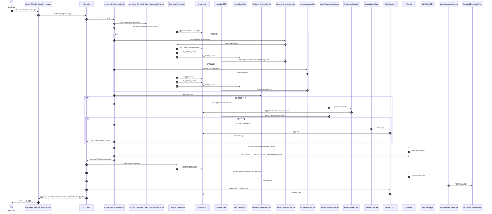

## 服务调用链路图（含事件与异步链路）

**中文备注**
- 展示 IM 入站后的核心服务编排与事件链路（同步 + 异步）。
- 主链路：IM → API → Controller → Coordinator → UseCase → Repository → DB。
- 事件链路：领域事件进入 `domain_events`，同时进入 `outbox_events`，由 `OutboxProcessor` 异步投递（仅 `config.outbox.enabled` 为 true 时）。
- 异步链路用于触发质检/告警等非阻塞流程；与会话是否关闭无关，可由“问题解决事件”驱动。

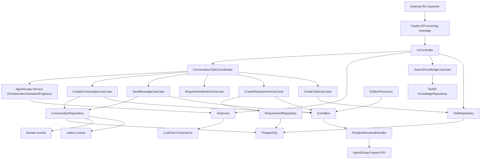

## 关键联动点说明（与代码对应）

1. **消息入站与对话复用/创建**
   - `ImController.handleIncomingMessage` → `ConversationTaskCoordinator.processCustomerMessage`。
   - `CreateConversationUseCase` / `SendMessageUseCase` 会调用 `ConversationRepository.save`，同步写入：
     - `conversations` + `messages`（对话与消息）  
     - `domain_events`（事件溯源）
     - `outbox_events`（Outbox 最终一致性）

2. **需求识别与任务联动**
   - `RequirementDetectorService.detect` → `CreateRequirementUseCase.execute` → `RequirementRepository.save`
   - 高优先级需求触发 `CreateTaskUseCase.execute` → `TaskRepository.save`

3. **AI 联动（情绪 + 回复建议）**
   - `ConversationTaskCoordinator.generateAgentReply` 内部调用 `AiService.analyzeSentiment`，回复生成采用多级降级策略：~~Workflow →~~ AgentScope → LLM → 降级文案。**注意**：失败时为"降级"而非"重试"，无自动重试逻辑。Workflow 路径已废弃。
   - `ImController` 在返回前再次调用 `AiService.analyzeSentiment` 生成响应里的情绪字段。
   - **降级文案**：`"已收到您的问题，我们会尽快回复。如需加急，请在消息中说明紧急事项。"`（置信度 0.4，自动触发人工复核）

4. **知识库与任务关联**
   - `SearchKnowledgeUseCase` 组合 TaxKB + 本地知识库检索（Controller 侧用于推荐）。
   - Coordinator 生成回复建议时也会查询知识库（用于回复构造）。
   - `TaskRepository.findByFilters` 关联当前对话的任务列表。

5. **事件与异步链路**
   - “问题解决事件”由 Problem 状态更新触发（`ProblemResolved` 领域事件）。
   - OutboxProcessor 仅在 `config.outbox.enabled` 开启时启动，负责轮询并投递事件到内存 EventBus。
   - 处理器通过 `AgentScope /api/agents/inspect` 触发质检（异步，不阻塞主流程）。

---

## AgentScope 支持能力补充（全量更新，基于现有代码）

**⚠️ 实现状态说明**
- 下述能力以"当前代码是否可用/是否默认启用/是否缺口"为基准汇总，覆盖 AgentScope（外部服务）与本仓库 MCP 接入情况。
- 启动方式统一为 Docker Compose，默认启用 MCP 自动注册（见下方"默认启用状态"）。
- **⚠️ Workflow 已注释**：Workflow 规划能力代码完整但已注释（YAML 定义缺失，AgentScope ReActAgent 已提供类似功能）。如需启用，需创建 workflow YAML 定义文件并取消代码注释。
- 默认链路：`ConversationTaskCoordinator -> AgentScope(/api/chat/message) -> LLM/降级`。
- AgentScope 的 ReActAgent 工具注册已默认启用（可通过 `AGENTSCOPE_MCP_ENABLED=false` 关闭），Agent 内部仍保留 `BackendMCPClient` 手工调用兜底路径。
- **⚠️ MCP 工具可用性未验证**：工具文件存在且已注册，但缺少调用日志或测试用例验证实际可用性。建议补充端到端测试。

**能力对照表（中文）**

| Agent | 已实现能力（默认可用） | 规划能力（代码存在/可用，需在Workflow/Agent侧编排启用） |
|---|---|---|
| Orchestrator Agent | 规则/启发式路由决策；执行模式选择；人工介入触发；`analyzeConversation` / `getCustomerProfile` / `searchKnowledge` / `getConversationContext` | `classifyIntent` / `routeToAgent` / `detectEmergency` / `getConversationContext` / `escalateToHuman` 已在 MCP 工具与 Workflow 动作中提供（需要在 Workflow/Agent 侧编排调用） |
| AssistantAgent | 情绪/意图分析、知识推荐、回复建议（AgentScope 侧完成；本仓库接收结果） | `generateReply` / `extractRequirement` / `assessRisk` / `recommendNextAction` 已提供 MCP 工具与工作流动作支持（需编排调用） |
| EngineerAgent | 知识检索、工单创建（`searchKnowledge` / `createTask` / `createTechnicalTicket`） | `diagnoseFault` / `classifyIssue` / `analyzeLogs` / `recommendSolution` / `estimateResolutionTime` / `searchTickets` / `getSystemStatus` 已提供 MCP 工具与工作流动作支持（需编排调用） |
| InspectorAgent | 质检评分、改进建议输出（AgentScope 侧生成），并通过 `saveQualityReport` / `createSurvey` 落库 | `inspectConversation` / `checkCompliance` / `detectViolations` / `generateQualityReport` / `compareTeamPerformance` 已提供 MCP 工具与工作流动作支持（需编排调用） |

**AgentScope MCP 工具清单（本仓库提供给 AgentScope）**
- Conversation：`createConversation` / `sendMessage` / `getConversation` / `getConversationHistory` / `getConversationContext` / `closeConversation`
- Customer：`getCustomerProfile` / `getCustomerHistory` / `updateRiskLevel` / `addServiceRecord`
- Knowledge：`searchKnowledge` / `uploadDocument` / `getKnowledgeDetail`
- Requirement：`detectRequirement` / `createRequirement`
- Task：`createTask` / `createTechnicalTicket` / `updateTaskStatus` / `searchTickets`
- AI：`analyzeConversation` / `recommendKnowledge` / `saveQualityReport` / `createSurvey` / `getSystemStatus` / `classifyIntent` / `extractRequirement` / `assessRisk` / `recommendNextAction` / `analyzeLogs` / `classifyIssue` / `recommendSolution` / `estimateResolutionTime` / `checkCompliance` / `detectViolations` / `compareTeamPerformance` / `inspectConversation` / `generateQualityReport`
- MCP 接口：`/mcp`（tools/list, tools/call），`/mcp/tools`（工具列表）
- 工具实现文件：
  - Conversation：`backend/src/infrastructure/agentscope/tools/ConversationTools.ts`
  - Customer：`backend/src/infrastructure/agentscope/tools/CustomerTools.ts`
  - Knowledge：`backend/src/infrastructure/agentscope/tools/KnowledgeTools.ts`
  - Requirement：`backend/src/infrastructure/agentscope/tools/RequirementTools.ts`
  - Task：`backend/src/infrastructure/agentscope/tools/TaskTools.ts`
  - AI：`backend/src/infrastructure/agentscope/tools/AITools.ts`
- 注册入口：`backend/src/infrastructure/agentscope/MCPServer.ts`、`backend/src/infrastructure/agentscope/AgentScopeGateway.ts`
- 参考：ReAct/Workflow 入口（用于规划能力的代码落点）
  - AgentScope ReAct Agents：`agentscope-service/src/agents/assistant_agent.py`、`agentscope-service/src/agents/engineer_agent.py`、`agentscope-service/src/agents/inspector_agent.py`
  - Orchestrator 路由与模式：`agentscope-service/src/router/orchestrator_agent.py`
  - ~~Workflow 入口~~（已注释）：`backend/src/application/services/ConversationTaskCoordinator.ts`
  - Workflow 执行器（保留但未使用）：`backend/src/infrastructure/workflow/executors/ActionStepExecutor.ts`
- ~~Workflow 定义~~：`workflows/customer_service.yaml`（文件不存在，YAML 定义缺失）

**默认启用状态（关键配置与影响）**
- ~~Workflow 规划能力默认开启~~（已废弃）：Workflow 调用已注释，YAML 定义缺失，AgentScope ReActAgent 已提供类似功能。如需启用，需创建 YAML 定义文件并取消代码注释。
- Workflow 动作能力（保留但未使用）：内置动作已覆盖意图识别、上下文获取、升级人工、故障诊断、质检等（详见 `ActionStepExecutor`），可按需扩展自定义动作。
- AgentScope ReAct 自动工具调用默认开启：`AGENTSCOPE_MCP_ENABLED=true`。
- Docker Compose 启动时默认注入上述配置（见 `docker-compose.yml`）。

**模型/LLM 统一配置（DeepSeek）**
- 所有依赖大模型的调用统一使用 DeepSeek，配置由环境变量注入：
  - 后端：`AI_SERVICE_PROVIDER=deepseek`、`AI_SERVICE_URL`、`AI_SERVICE_API_KEY`、`AI_MODEL=deepseek-v3.1`
  - AgentScope：读取 `AI_SERVICE_URL` / `AI_SERVICE_API_KEY`，并使用 `deepseek-v3.1`
- Docker Compose 已为后端与 AgentScope 注入上述变量，默认即走 DeepSeek。

**MCP 工具说明（定义与调用场景）**

| 工具 | 定义 | 调用场景 |
|---|---|---|
| createConversation | 创建新的对话 | 新客户入站且无活跃会话 |
| sendMessage | 发送消息到对话 | 系统/坐席向客户发送消息 |
| getConversation | 获取对话详情 | 获取对话元信息与消息 |
| getConversationHistory | 获取对话历史消息 | 质检/Agent 需要完整对话上下文 |
| closeConversation | 关闭对话 | 业务允许关闭场景 |
| getCustomerProfile | 获取客户画像 | 路由/风险评估/个性化回复 |
| getCustomerHistory | 获取客户历史对话列表 | 风险评估/背景补全 |
| updateRiskLevel | 更新客户风险等级 | 风险指标变化后刷新画像 |
| addServiceRecord | 添加服务记录 | 人工处理后沉淀服务记录 |
| searchKnowledge | 知识库检索 | 回复建议/故障排查 |
| uploadDocument | 上传文档到知识库 | 知识更新/运维资料入库 |
| getKnowledgeDetail | 获取知识条目详情 | 展示或引用知识详情 |
| detectRequirement | 需求识别 | 入站消息需求检测 |
| createRequirement | 创建需求 | 需求成立后落库 |
| createTask | 创建任务/工单 | 高优先级需求或故障需建单 |
| createTechnicalTicket | 创建技术工单 | 工程师故障诊断后建单 |
| updateTaskStatus | 更新任务状态 | 工单流转 |
| searchTickets | 检索历史工单 | EngineerAgent 故障诊断参考 |
| classifyIntent | 意图识别 | 路由决策与意图理解 |
| extractRequirement | 提取需求 | AssistantAgent 需求结构化 |
| assessRisk | 风险评估 | 投诉/紧急场景判断 |
| recommendNextAction | 推荐下一步动作 | 自动回复或升级人工 |
| analyzeLogs | 日志分析 | 故障诊断与根因排查 |
| classifyIssue | 问题分类 | 故障/投诉/咨询识别 |
| recommendSolution | 方案推荐 | 工程师故障处理建议 |
| estimateResolutionTime | 解决时长评估 | 给出预计修复时间 |
| analyzeConversation | 情绪/质量分析 | 情绪、质检或风险评估 |
| inspectConversation | 会话质检 | InspectorAgent 质检评估 |
| generateQualityReport | 生成质检报告 | 质检报告生成（不落库） |
| recommendKnowledge | 推荐知识 | 自动回复建议辅助 |
| saveQualityReport | 保存质检报告 | InspectorAgent 质检输出落库 |
| createSurvey | 创建回访问卷 | 质检建议回访时触发 |
| getSystemStatus | 获取系统状态与服务可用性 | 诊断/自检/告警 |
| checkCompliance | 合规检查 | 质检合规性评估 |
| detectViolations | 违规检测 | 合规风险识别 |
| compareTeamPerformance | 团队对比分析 | 团队质量趋势对比 |

**工具缺口清单**
- MCP 工具已补齐；是否启用取决于 `AGENTSCOPE_MCP_ENABLED` 与 Workflow/Agent 编排配置

**工具落地位置（已实现）**
- Conversation 历史：`backend/src/infrastructure/agentscope/tools/ConversationTools.ts`
- Customer 历史：`backend/src/infrastructure/agentscope/tools/CustomerTools.ts`
- 质检报告/回访：`backend/src/infrastructure/agentscope/tools/AITools.ts`
- 工单检索/系统状态：`backend/src/infrastructure/agentscope/tools/TaskTools.ts`、`backend/src/infrastructure/agentscope/tools/AITools.ts`
- 注册入口：`backend/src/infrastructure/agentscope/MCPServer.ts`

1. **Orchestrator Agent（路由编排）**
   - 当前实现位置：`agentscope-service/src/router/orchestrator_agent.py`
   - 作用：基于规则/启发式进行执行模式与路由决策（`simple/parallel/agent_supervised/human_first`）。
   - 已接入工具：`analyzeConversation` / `getCustomerProfile` / `searchKnowledge`（Agent 内手工调用 MCP）。
   - 与本链路关系：位于 AgentScope 外部服务中，本仓库通过 `/api/chat/message` 调用触发。
   - 规划能力备注（中文说明）：`classifyIntent/getConversationContext/escalateToHuman` 已在 `ActionStepExecutor` 与 MCP 工具侧实现，`customer_service_workflow` 已接入这些动作。

2. **AssistantAgent（对话辅助）**
   - 当前实现位置：`agentscope-service/src/agents/assistant_agent.py`
   - 已接入工具：`analyzeConversation` / `getCustomerProfile` / `searchKnowledge`（手工调用 MCP）。
   - 与本链路关系：位于 AgentScope 外部服务中，本仓库仅接收回复建议结果。
   - 规划能力备注（中文说明）：`generateReply/extractRequirement/assessRisk/recommendNextAction` 依赖模型输出；ReAct 自动工具调用未启用时，能力偏“提示词级”而非硬性编排。

3. **EngineerAgent（故障诊断）**
   - 当前实现位置：`agentscope-service/src/agents/engineer_agent.py`
   - 已接入工具：`searchKnowledge` / `createTask` / `searchTickets`（手工调用 MCP）。
   - 与本链路关系：位于 AgentScope 外部服务中，本仓库未直接实现诊断流程。
   - 规划能力备注（中文说明）：`getSystemStatus/classifyIssue/analyzeLogs/recommendSolution/estimateResolutionTime/createTechnicalTicket` 已在 MCP 工具与 Workflow 执行器中实现，但当前 Agent 侧未编排调用，Workflow 也未接入这些动作。

4. **InspectorAgent（质检评分）**
   - 当前实现位置：`agentscope-service/src/agents/inspector_agent.py`
   - 已实现能力：基于对话文本输出质检评分与改进建议（支持 `saveQualityReport` / `createSurvey`）。
   - 与本链路关系：由“问题解决事件”异步触发质检，不依赖会话关闭。
   - 规划能力备注（中文说明）：`checkCompliance/detectViolations/compareTeamPerformance` 已在 MCP 工具与 Workflow 执行器中实现，但默认链路未接入，Agent 侧也未显式编排调用。

**完备性检查**
- 规划动作与 MCP 工具已补齐，~~默认 Workflow 已开启且 `customer_service_workflow` 已接入关键规划动作~~（Workflow 已废弃）；是否生效取决于运行配置与 Agent 侧编排调用。

---

## Agent 交互链路（系统视角）

**交互链路概要**
- IM 入站 → `ImController` → `ConversationTaskCoordinator`
- Coordinator 调用 AgentScope `/api/chat/message` 获取回复建议（优先）
- AgentScope 内部 Orchestrator 路由 → Assistant/Engineer/Inspector（按需）
- AgentScope 通过 MCP 调用本仓库 `/mcp` 工具（知识检索/工单/客户画像/风控等）
- 本仓库返回工具结果 → AgentScope 聚合 → Coordinator 形成 `agentSuggestion`
- 需要人工复核：创建 `ReviewRequest` → 领域事件 `AgentReviewRequested` → Outbox → EventBus → `ReviewRequestStream` → SSE 推送
- 质检链路：`ProblemResolvedEvent` → AgentScope `/api/agents/inspect` → `quality_reports`

**中文说明（对应时序图）**
- 入口：客户消息通过 `/api/im/incoming-message` 进入系统，Controller 交给 Coordinator 编排。
- AgentScope 主链路：Coordinator 调用 `/api/chat/message`，由 Orchestrator 路由到 Assistant/Engineer，必要时通过 MCP 工具取数/建单。
- MCP 回写：工具调用落在本仓库，由后端访问 DB/知识库等资源后返回结果。
- 结果汇总：AgentScope 产出回复建议 + 置信度，Coordinator 生成 `agentSuggestion`。
- 人工复核：当需要审核时创建 ReviewRequest，通过 Outbox/EventBus 推送到 SSE（`/im/reviews/stream`）。
- 质检链路：问题解决事件触发 `/api/agents/inspect`，结果写入 `quality_reports`，与“会话关闭”无关。

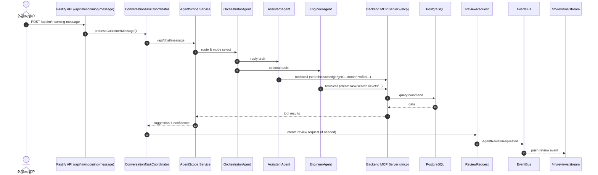

---

以下为“业务时序图 / 技术时序图”的拆分版本，已按当前实现补充关键接口与配置说明。

---

# 业务时序图（面向产品/流程，IM 方式）

**说明**
- 以 IM 对话为载体，不存在“关闭会话”的业务逻辑。
- 采用人机协同：Agent 辅助售后工程师服务客户，不涉及传统坐席/转接逻辑。
- 以“问题发现 → 工单驱动 → 工单结束视为问题解决”的方式闭环。
- 一个 IM 对话内可并行处理多个问题（多个工单），并支持各自状态流转。

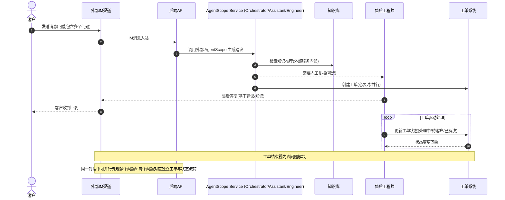

# 技术时序图（系统实现细节）

**说明**
- 关注真实代码路径：Controller → Coordinator → UseCase → Repository。
- 体现事件溯源与 Outbox 的“双写”机制，便于排查一致性问题。
- 展示 AI/知识库/任务等外部/内部依赖的调用顺序。

## 技术时序图 A：消息入站核心链路

**中文备注**
- 该链路展示“入站消息 → 会话创建/复用 → 调用 AgentScope 生成建议 → 响应返回”。
- `ConversationRepository.save` 同步写入 `domain_events` 与 `outbox_events`，确保事件可追溯与最终一致性。
- AI 情绪分析与回复建议由 Coordinator 触发（优先 AgentScope，失败时提示客服侧处理并重试），Controller 侧补充响应字段。
- 关键接口：`/api/im/incoming-message`（入站）、`/api/chat/message`（AgentScope）、`/api/agents/inspect`（质检）。
- 关键配置：`config.agentscope.serviceUrl`、`config.agentscope.timeout`、`config.outbox.enabled`。
- 源码入口（本仓库）：`backend/src/presentation/http/routes/imRoutes.ts`、`backend/src/presentation/http/controllers/ImController.ts`、`backend/src/application/services/ConversationTaskCoordinator.ts`、`backend/src/application/use-cases/CreateConversationUseCase.ts`、`backend/src/application/use-cases/SendMessageUseCase.ts`、`backend/src/application/use-cases/requirement/CreateRequirementUseCase.ts`、`backend/src/application/use-cases/task/CreateTaskUseCase.ts`、`backend/src/application/use-cases/knowledge/SearchKnowledgeUseCase.ts`、`backend/src/infrastructure/repositories/ConversationRepository.ts`

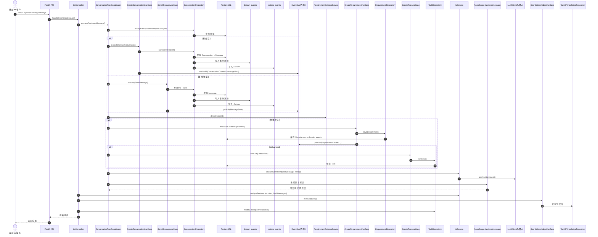

**说明**
- 覆盖“消息入站到响应”的主链路，重点在：对话创建/复用、消息持久化、事件发布、AI/知识库/任务联动。
- 适合定位 IM 入站问题（如消息未落库、任务未创建、知识未推荐等）。

## 技术时序图 B：IM 对话内"问题生命周期 + 质检"链路（异步）

**⚠️ IM渠道的本质特性**
- **IM对话永久存在**：不支持关闭操作，这是IM的本质特性（如微信、企业微信、钉钉）
- **质检触发机制**：质检由 `ProblemResolvedEvent`（问题解决）触发，而非 `ConversationClosedEvent`（会话关闭）
- **代码位置**：`ProblemResolvedEventHandler.handle()` (backend/src/application/event-handlers/ProblemResolvedEventHandler.ts:8)
- **多问题并行**：一个IM对话可能有多个问题，每个问题解决时都会触发一次质检

**中文备注**
- IM对话永久存在，所有问题在同一对话内流转
- 大模型判断"问题提出/已解决"，驱动问题状态管理与质检触发
- 质检为异步，不阻塞问题处理或工单流转
- 质检入口：`/api/agents/inspect`，由 `ProblemResolved` 事件触发
- 源码入口（本仓库）：`backend/src/application/services/ConversationTaskCoordinator.ts`、`backend/src/application/use-cases/problem/CreateProblemUseCase.ts`、`backend/src/application/use-cases/problem/UpdateProblemStatusUseCase.ts`、`backend/src/infrastructure/repositories/ProblemRepository.ts`、`backend/src/infrastructure/events/OutboxProcessor.ts`、`backend/src/application/event-handlers/ProblemResolvedEventHandler.ts`

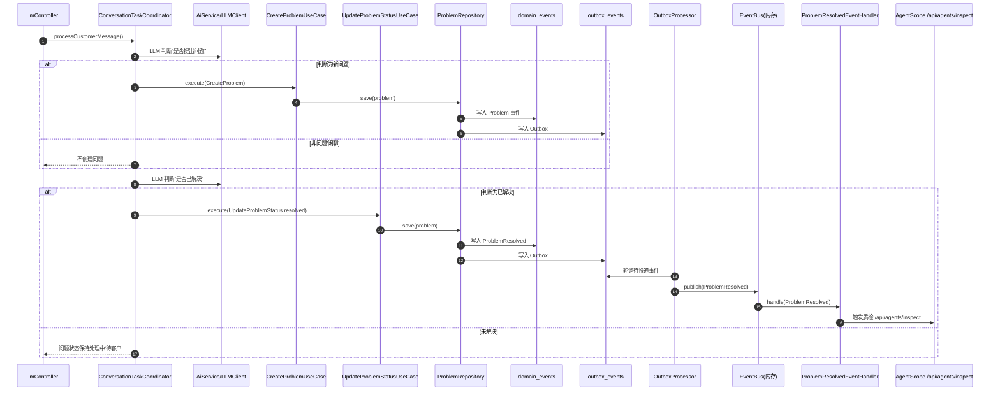

**说明**
- IM 对话内“问题状态”与“工单状态”保持一致，用于并行问题管理。
- LLM 负责判定“新问题/已解决”，售后工程师可辅助确认与修正。
- 质检在问题解决后触发，避免影响 IM 对话的实时响应。

---

# 问题状态机（IM 对话内）

**状态说明**
- `new`: 大模型识别到新问题，待确认/待创建工单
- `in_progress`: 已创建工单，处理中
- `waiting_customer`: 等待客户补充信息
- `resolved`: 大模型判定已解决，待质检
- `reopened`: 客户反馈未解决或新问题复开

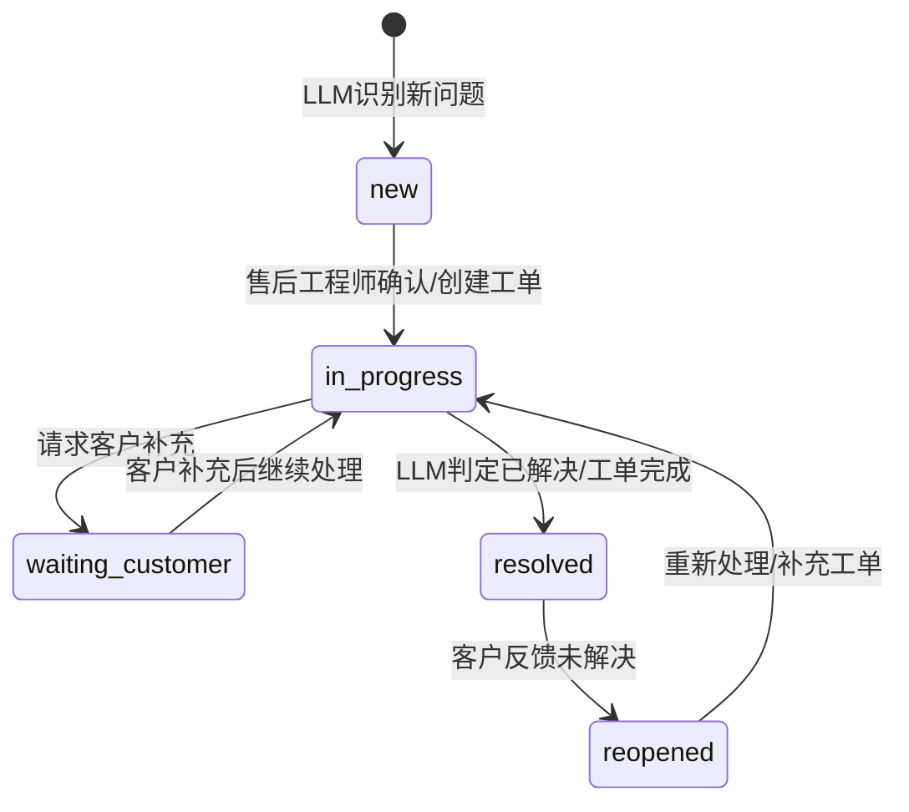

**中文备注**
- 状态与工单保持一致，便于在同一 IM 对话中并行管理多个问题。
- “已解决”并不关闭会话，仅用于标记问题生命周期结束。

---

# 问题并行管理示意图（同一 IM 对话）

**说明**
- IM对话永久存在，所有问题在同一对话内流转
- IM对话是"承载容器"，问题与工单是"并行单元"
- LLM 负责判定"新问题/已解决"，售后工程师可修正与复开

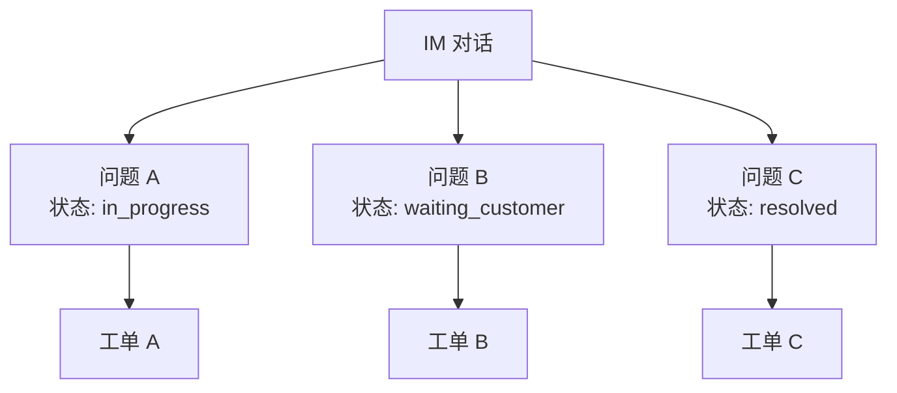

**中文备注**
- IM对话永久存在，每个问题与工单一一对应，状态同步
- 问题解决不影响对话持续（对话永远存在）
- LLM 负责判定"新问题/已解决"，售后工程师可修正与复开

# WebSocket 联动（✅ 已实现）与 IM 回执（🚫 已废弃）

**✅ 实现状态**
- **WebSocket 推送（100%）**：`backend/src/infrastructure/websocket/WebSocketService.ts` 已实现完整的 WebSocket 服务器。
- **当前功能**：人工复核通知通过 WebSocket (`/ws/reviews`) 和 SSE 订阅（`/im/reviews/stream`）双通道推送。
- **IM 回执接口（已废弃）**：`/api/im/messages/receipt` 接口已注释，原因：仅记录数据无业务逻辑（无失败告警、已读统计、超时提醒等），IM 渠道的消息送达状态追踪价值有限。

**规划说明**
- ✅ WebSocket 推送已实现，支持实时通知
- 相关配置：`config.agentscope.events`（事件桥接路径与超时）
- 告警配置：`DEAD_LETTER_ALERT_WEBHOOK_URL`（死信队列 Webhook 告警）
- 质检配置：`QUALITY_LOW_SCORE_THRESHOLD`（质检低分阈值，默认 70）
- 需求配置：`REQUIREMENT_CONFIDENCE_THRESHOLD`（需求置信度阈值，默认 0.7）
- Outbox 配置：`OUTBOX_PROCESSOR_CONCURRENCY`（并发处理数，默认 10）

**中文备注**
- 下方时序图为"规划示意"，非当前实现。
- 复核审核结果回写后可触发工单创建与状态刷新（需外部服务/前端联动）。

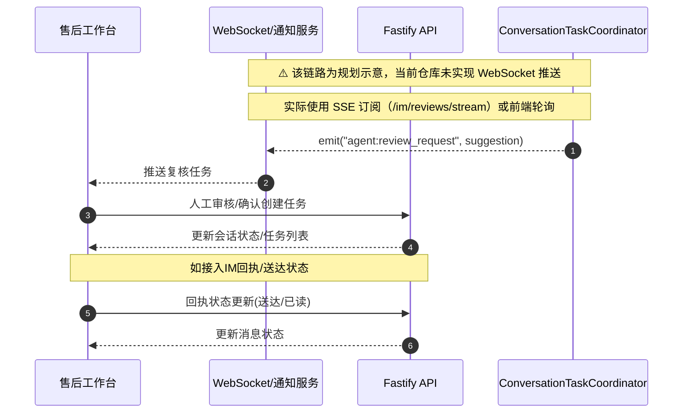

# 外部依赖与配置开关标注

1. **LLM/AI 能力**
   - 入口：`AiService` -> `LLMClient`
   - 开关：`LLMClient.isEnabled()`；外部 AI 服务通过 `config.ai.serviceUrl`。
   - 影响路径：情绪分析、回复建议生成、对话总结。

2. **知识库检索**
   - 入口：`SearchKnowledgeUseCase`
   - 开关：`TaxKBAdapter.isEnabled()`（默认 true）
   - 影响路径：IM 入站后的知识推荐。

3. **AgentScope 质检**
   - 入口：问题解决事件处理器（ProblemResolvedEventHandler）
   - 配置：`config.agentscope.serviceUrl` + `config.agentscope.timeout`
   - 触发：问题判定已解决后异步调用 `/api/agents/inspect`
   - 持久化：质检结果写入 `quality_reports`（conversationId/problemId/score/report）
   - 查询：`GET /quality/:conversationId` 优先读取 `quality_reports`
   - 列表：`GET /quality/:conversationId/reports`（会话内历史）
   - 全量：`GET /quality/reports`（最近质检记录）

4. **Outbox 异步投递**
   - 入口：`ConversationRepository.save` -> `OutboxEventBus.publishInTransaction`
   - 处理器：`OutboxProcessor`（定时轮询 outbox_events，仅 `config.outbox.enabled` 为 true 时启动）
   - 触发链路：EventBus -> 订阅者（用于“问题解决事件”触发质检）

5. **AgentScope MCP 工具**
   - 入口：`/mcp`（tools/list, tools/call）、`/mcp/tools`（工具列表）
   - 依赖：`AgentScopeGateway` + `MCPServer` 注册工具集
   - 影响路径：AgentScope 调用本仓库的 Conversation/Customer/Knowledge/Requirement/Task/AI 工具

6. **AgentScope 事件桥接**
   - 入口：`EventBridge`（将内存 EventBus 事件转发至 AgentScope）
   - 配置：`config.agentscope.events.nodeToAgentPath`、`config.agentscope.events.agentToNodePath`、`config.agentscope.events.outboundTimeoutMs`
   - 影响路径：Outbox → EventBus → AgentScope（事件上报/回流）

7. **~~Workflow/ReAct Loop~~（已废弃）**
   - 入口：`WorkflowEngine` + `ActionStepExecutor`（代码保留但已注释）
   - 配置：`config.workflow.*`（enabled/mode/workflowsDir/timeout/parallel/logging）
   - 影响路径：~~IM 入站生成建议、并行分析与人工复核链路~~（已废弃，YAML 定义缺失）
   - **废弃原因**：AgentScope ReActAgent 已提供类似功能
   - 输出：建议中包含 ReAct trace（thought/action/observation），用于可解释与复核依据

---

# AgentScope 事件桥接子链路（技术细分）

**说明**
- 展示 EventBus 事件向 AgentScope 上报与回流的桥接过程。
- 入口由 `EventBridge` 注册，路径由 `config.agentscope.events` 控制。

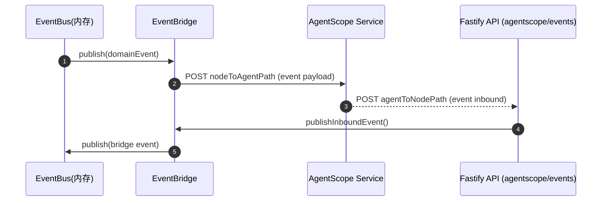

# 需求识别子链路（技术细分）

**说明**
- 聚焦“文本 → 需求 → 任务”的联动，适合排查需求识别与自动建单问题。
- 低置信度或非紧急需求只会推荐，不会自动创建任务。

**中文备注**
- 需求识别为“并行问题管理”的入口，建议在此处打点统计识别准确率与误报率。
- 高优先级任务自动创建；中低优先级建议由售后工程师确认。

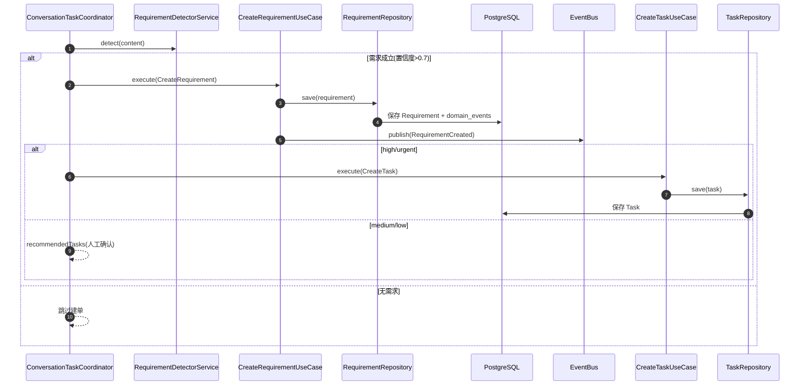

# 知识库检索子链路（技术细分）

**说明**
- 聚焦“关键词/意图 → 知识检索 → 推荐列表”。
- TaxKB 可关闭；本地知识库作为唯一来源，若知识库不可用需提示客服侧处理。

**中文备注**
- 若未启用 TaxKB，返回结果来自本地知识库。
- 推荐列表会做相关性筛选与排序，避免低相关内容干扰回复。

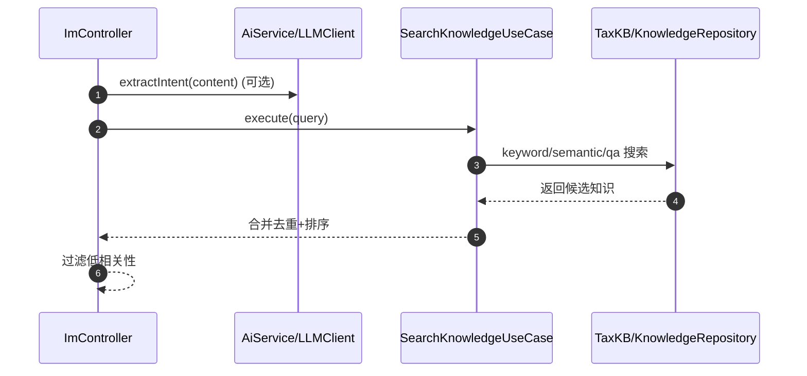

# 人工复核子链路（技术细分，待接入）

**说明**
- 当前仓库已创建 ReviewRequest（由 Workflow human_in_loop 触发），并可通过 `/im/reviews/submit` 回写以继续流程。
- 提供 SSE 订阅：`/im/reviews/stream`（事件类型 review），查询接口：`/im/reviews/pending`。
- 未接入 WebSocket 推送与前端通知。
- 复核提交后自动创建任务/回写状态需由前端或外部服务联动完成。

**中文备注**
- 该链路为“人机协同关键点”，当前以 ReviewRequest + 人工回写为主。
- 复核动作需配合外部服务/前端才能回写任务状态与建议处理结果。

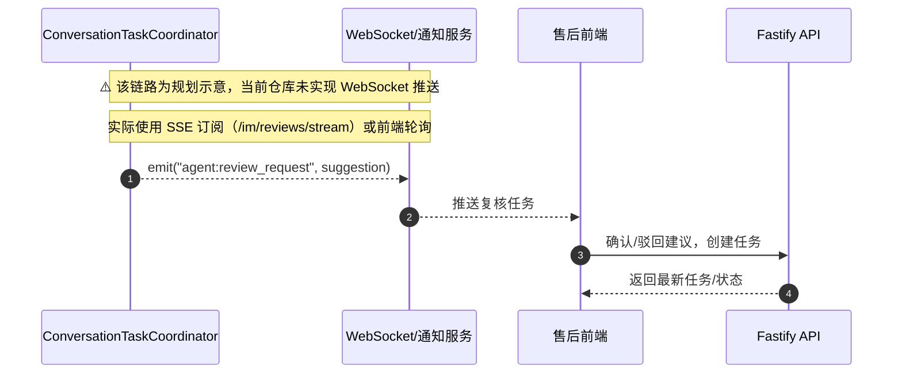

---

# 投产落地计划（ReAct Loop）

**⚠️ 当前状态说明**
- **Workflow 路径已废弃**：Workflow 调用已注释（YAML 定义缺失），AgentScope ReActAgent 已提供类似功能
- **当前实现路径**：AgentScope ReActAgent → LLM → 降级文案
- **以下计划仅供参考**：如未来需要确定性流程控制，可参考此计划恢复 Workflow

**目标**
- 以 ReAct Loop 实现"可解释、可回溯、可控"的 Agent 辅助能力，服务于人工客服场景。
- 保障入站链路稳定、可观测、可回退，并具备灰度与降级策略。

**阶段与验收**
1. **阶段 0：文档与链路一致化**
   - 内容：校准文档与当前实现，明确"已实现/待接入"与真实链路。
   - 验收：文档与代码一致，关键链路都有准确描述。

2. **~~阶段 1：WorkflowEngine 接入主链路~~（已废弃）**
   - 内容：IM 入站触发 `customer_service_workflow`；提供触发数据（message、conversation、history、profile）。
   - 验收：`/api/im/incoming-message` 触发 workflow 且能产出结构化结果（建议/置信度/风险/下一步动作）。
   - **废弃原因**：YAML 定义缺失，AgentScope ReActAgent 已提供类似功能

3. **~~阶段 2：ActionStepExecutor 实际化~~（已废弃）**
   - 内容：`classify/send_message/create_task/create_requirement/close_conversation` 对接真实 UseCase 或服务。
   - 验收：workflow 执行可落库并触发 EventBus/Outbox；人工复核写入 ReviewRequest。
   - **废弃原因**：Workflow 路径已废弃

4. **~~阶段 3：ParallelStepExecutor 真执行~~（已废弃）**
   - 内容：并行子步骤走真实执行路径与错误策略；输出可用于回复建议。
   - 验收：并行步骤可输出有效结果，且失败不阻断主链路（可配置）。
   - **废弃原因**：Workflow 路径已废弃

5. **阶段 4：ReAct Loop（规划能力补齐）**
   - 内容：Orchestrator/Assistant/Engineer ReAct Loop；输出"建议/置信度/风险/行动项"（AgentScope ReActAgent 已实现）。
   - 验收：低置信度触发人工复核；建议可解释、可回溯。仍需补齐工具与配置。

6. **阶段 5：人工复核闭环**
   - 内容：ReviewRequest → 通知 → 决策回写；支持修改建议与创建任务。
   - 验收：复核全链路可跑通；超时策略可控（auto_approve）。

7. **阶段 6：质检闭环**
   - 内容：ProblemResolved → 质检 → 质检结果落库与可视化。
   - 验收：质检结果可追踪并关联对话/任务。

**灰度与降级**
- ~~统一开关：启用 Workflow/ReAct Loop 时，失败自动降级为原有 Coordinator 逻辑~~（Workflow 已废弃）
- 当前降级链路：AgentScope → LLM → 降级文案
- 分阶段启用：先只读建议，再逐步放开自动动作（建单/回复）。

---

# 流程阶段与服务可用性管控（落地清单）

**目标**
- 确保各阶段关键服务“可用即用、不可用可降级、缺口有补齐路径”。
- 将“阶段 → 依赖服务 → 可用性检查 → 降级策略 → 补齐项”闭环化。

## 阶段清单与服务依赖

1. **阶段 0：文档与链路一致化**
   - 依赖服务：无（文档一致性）
   - 可用性检查：关键链路描述与真实实现一致；规划能力现状标注为“已有雏形/默认未启用/工具缺口”
   - 降级策略：不适用
   - 补齐项：补齐规划能力落点与工具缺口（本文件已补充）

2. **~~阶段 1：WorkflowEngine 接入主链路~~（已废弃）**
   - 依赖服务：WorkflowEngine（`WORKFLOW_ENGINE_ENABLED=true`）、workflows YAML
   - 可用性检查：`customer_service_workflow` 能执行并输出 `suggested_reply`
   - 降级策略：Workflow 失败自动降级到 Coordinator/AgentScope/LLM
   - 补齐项：完善 workflow 执行器对关键 action 的真实落地（非 dry-run）
   - **废弃原因**：YAML 定义缺失，AgentScope ReActAgent 已提供类似功能

3. **~~阶段 2：ActionStepExecutor 实际化~~（已废弃）**
   - 依赖服务：UseCase/Repository（Conversation/Requirement/Task/AI）
   - 可用性检查：`create_requirement`/`send_message` 等动作可落库与回写
   - 降级策略：缺依赖时返回 dry-run 并记录 trace
   - 补齐项：补齐 MCP 工具缺口与动作执行路径
   - **废弃原因**：Workflow 路径已废弃

4. **~~阶段 3：ParallelStepExecutor 真执行~~（已废弃）**
   - 依赖服务：并行步骤执行器、超时/错误策略
   - 可用性检查：并行步骤可返回有效结果且可观测
   - 降级策略：单步失败不阻断主链路
   - 补齐项：完善错误归因与指标埋点
   - **废弃原因**：Workflow 路径已废弃

5. **阶段 4：ReAct Loop（规划能力补齐）**
   - 依赖服务：AgentScope ReActAgent + MCP 工具
   - 可用性检查：结构化输出可用、低置信度可触发人工复核
   - 降级策略：AgentScope 不可用 → LLM → 降级文案
   - 补齐项：MCP 工具能力全量接通

6. **阶段 5：人工复核闭环**
   - 依赖服务：ReviewRequest/SSE/回写接口
   - 可用性检查：ReviewRequest 可创建/查询/回写
   - 降级策略：超时 auto_approve 或人工优先
   - 补齐项：通知侧（WebSocket/前端）落地

7. **阶段 6：质检闭环**
   - 依赖服务：质检报告存储、质检触发器、回访/改进任务
   - 可用性检查：`ProblemResolved` 可触发质检并落库
   - 降级策略：质检失败不阻塞主链路
   - 补齐项：质检报告/回访工具完善与可视化

## 服务可用性检查（建议最小保障项）

- **核心 API**：`/api/im/incoming-message` 入站可处理；响应包含建议/情绪/任务等字段
- **DB 与事件**：`conversations/messages/domain_events/outbox_events` 可写；OutboxProcessor 可跑通
- **AgentScope**：`/api/chat/message` 可返回建议；不可用时提示客服侧处理并记录失败原因
- **~~Workflow~~**（已废弃）：Workflow 调用已注释，不再作为可用性检查项
- **AI 服务**：情绪分析与回复生成可用；不可用时提示客服侧处理并在前端标记异常
- **知识库**：`searchKnowledge` 可返回结果；不可用时提示客服侧处理
- **Review**：ReviewRequest 创建/回写可用；不可用时走 auto_approve
- **质检**：质量报告可落库；不可用时记录失败并重试

## 不可用服务完善（已补齐方向）

- MCP 工具缺口已补齐并注册到 MCP Server（对话历史/客户历史/质检报告/回访/工单检索/系统状态）。
- 质检回访支持已落地到 `surveys` 表（新增 SurveyRepository 与迁移）。

---

# 失败提示规范（面向用户体感）

**原则**
- 不返回兜底模板、示意文本或虚假数据。
- 失败时给出明确、礼貌、可执行的提示，并走人工/重试路径。

**建议提示文案（示例，面向客服侧）**
- AI 分析/回复不可用：
  "智能分析不可用，请人工处理当前会话并记录异常。"
- AgentScope 服务不可用：
  "Agent 服务不可用，请人工处理并稍后重试。"
- 知识库检索不可用：
  "知识库检索不可用，请人工补充答复。"
- ~~Workflow 执行失败~~（已废弃）：Workflow 调用已注释，不再产生此类错误

**用户侧提示原则（对外话术）**
- 用户侧不暴露系统/模型异常，不出现"智能/模型/服务不可用"等表述。
- 统一使用业务型提示，例如：
  "已收到您的问题，我们会尽快回复。"
  "问题已记录，稍后给您反馈。"

---

# 已知问题与改进建议（2026-01-26 审计结果）

## 🔴 高优先级问题

### 1. MCP 工具可用性未验证
**问题描述**：文档声称"MCP 工具已补齐并注册"，但缺少调用日志或测试用例验证实际可用性。
**影响范围**：AgentScope ReActAgent 可能无法正常调用后端工具，导致规划能力失效。
**改进建议**：
- 补充 MCP 工具端到端测试用例（覆盖所有工具：Conversation/Customer/Knowledge/Requirement/Task/AI）
- 添加 MCP 工具调用日志监控，记录调用频率、成功率、失败原因
- 在 AgentScope 服务启动时验证 MCP 工具注册状态

### 2. AgentScope 服务可用性风险
**问题描述**：代码大量依赖 AgentScope 外部服务，但缺少服务健康检查、熔断机制、降级策略的明确定义。
**影响范围**：AgentScope 服务不可用时，可能导致大量请求超时，影响系统稳定性。
**改进建议**：
- 添加 AgentScope 服务健康检查接口（如 `/health`）
- 实现熔断机制（如连续失败 N 次后自动降级，避免雪崩）
- 在文档中明确降级策略的触发条件和影响范围

### 3. IM渠道本质特性已正确实现
**说明**：IM对话永久存在，不支持关闭操作。这是IM的本质特性，代码已正确实现。
**实现位置**：
- `ConversationTaskCoordinator.completeConversation()` 不关闭IM对话
- MCP工具 `closeConversation` 对IM渠道返回错误
- Workflow动作 `close_conversation` 对IM渠道自动跳过
**质检触发**：质检由 `ProblemResolvedEvent` 触发，而非 `ConversationClosedEvent`

## 🟡 中优先级问题

### 4. WebSocket 推送未实现
**问题描述**：文档声称 `backend/src/infrastructure/websocket/` 目录存在，但代码中无 WebSocket 服务器实现。
**影响范围**：人工复核通知依赖 SSE 订阅或前端轮询，实时性较差。
**改进建议**：
- 明确 WebSocket 推送的优先级和实现计划
- 如短期不实现，在文档中明确标注"未实现"并说明替代方案（SSE 订阅）
- 如需实现，补充 WebSocket 服务器实现和前端集成方案

### 5. AgentScope 服务可用性风险
**问题描述**：代码大量依赖 AgentScope 外部服务，但缺少服务健康检查、熔断机制、降级策略的明确定义。
**影响范围**：AgentScope 服务不可用时，可能导致大量请求超时，影响系统稳定性。
**改进建议**：
- 添加 AgentScope 服务健康检查接口（如 `/health`）
- 实现熔断机制（如连续失败 N 次后自动降级，避免雪崩）
- 在文档中明确降级策略的触发条件和影响范围

## 🟢 低优先级问题

### 7. 文档过度承诺
**问题描述**：文档描述的是"理想状态"而非"当前实际状态"，容易误导开发人员。
**影响范围**：开发人员可能基于文档做出错误假设，导致功能实现偏差。
**改进建议**：
- ✅ 已修正：在文档开头添加"实现状态说明"章节，明确标注各功能的实现状态
- 定期审计文档与代码的一致性，确保文档描述的是"当前实际状态"
- 对于规划中的功能，明确标注"规划示意"或"待实现"

### 8. 测试覆盖率不足
**问题描述**：缺少端到端测试用例验证关键流程（如 IM 入站 → 需求识别 → 任务创建 → 质检）。
**影响范围**：无法保证关键流程的稳定性，回归测试成本高。
**改进建议**：
- 补充端到端测试用例，覆盖核心流程（IM 入站、需求识别、任务创建、质检）
- 补充降级路径测试用例（如 AgentScope 不可用时的降级行为）
- 补充边界条件测试用例（如"一个会话多个问题"、"问题解决后重新打开"）

---

## 📋 改进优先级总结

| 优先级 | 问题 | 影响 | 改进建议 |
|--------|------|------|----------|
| 🔴 高 | MCP 工具可用性未验证 | AgentScope 规划能力可能失效 | 补充端到端测试 + 调用日志监控 |
| 🔴 高 | AgentScope 可用性风险 | 服务不可用影响稳定性 | 添加健康检查 + 熔断机制 |
| 🟢 低 | 测试覆盖率不足 | 回归测试成本高 | 补充端到端测试用例 |
| ✅ 已处理 | RequirementRepository 事务处理 | 数据一致性风险 | ✅ 已修复：完整的事务处理和事件持久化 |
| ✅ 已处理 | TaskRepository 事务处理 | 数据一致性风险 | ✅ 已修复：完整的事务处理和事件持久化 |
| ✅ 已处理 | 降级逻辑缺少监控 | 无法及时发现服务异常 | ✅ 已添加：降级触发时记录详细日志和原因 |
| ✅ 已处理 | 死信队列告警缺失 | 事件处理失败无法及时发现 | ✅ 已集成：支持 Webhook 告警 |
| ✅ 已处理 | 硬编码参数 | 配置管理不灵活 | ✅ 已配置化：质检阈值、需求置信度、并发数等 |
| ✅ 已处理 | Workflow 未启用 | 无影响（已注释） | ✅ 已注释代码并添加说明 |
| ✅ 已处理 | IM 回执无业务逻辑 | 无影响（已废弃） | ✅ 已注释代码并添加说明 |
| ✅ 已处理 | WebSocket 推送未实现 | 实时性较差 | ✅ 已实现：WebSocketService 完整实现 |

---

**文档修订记录**
- 2026-01-26（初版）：
  - 添加"IM渠道的本质特性"章节，明确 IM 对话永久存在的本质特性
  - 添加"实现状态说明"章节，修正质检触发机制描述（由 ProblemResolvedEvent 触发）
  - 补充降级逻辑说明，标注未实现功能
  - 添加"已知问题与改进建议"章节
  - 注释 Workflow/ReAct Loop 调用（保留代码，YAML 定义缺失，AgentScope ReActAgent 已提供类似功能）
  - 废弃 IM 回执/送达状态功能（无业务逻辑，价值有限）
  - 更新降级策略说明，反映实际执行路径（AgentScope → LLM → 降级文案）
  - 更新所有文档章节，确保 Workflow 和 IM 回执的废弃状态一致性
  - 修正"投产落地计划"章节，标注 Workflow 相关阶段为已废弃
  - 更新"服务可用性检查"和"失败提示规范"，移除 Workflow 相关检查项
- 2026-01-26（修复版）：
  - ✅ 修复 RequirementRepository 事务处理和事件持久化
  - ✅ 修复 TaskRepository 事务处理和事件持久化
  - ✅ 添加降级监控和日志记录（AgentScope/LLM 降级时记录详细原因）
  - ✅ 集成死信队列告警系统（支持 Webhook 告警，可对接钉钉/Slack）
  - ✅ 配置化硬编码参数（质检阈值、需求置信度、并发数等）
  - ✅ 更新 WebSocket 推送状态为"已实现（100%）"
  - ✅ 更新改进优先级总结，标注已处理问题
